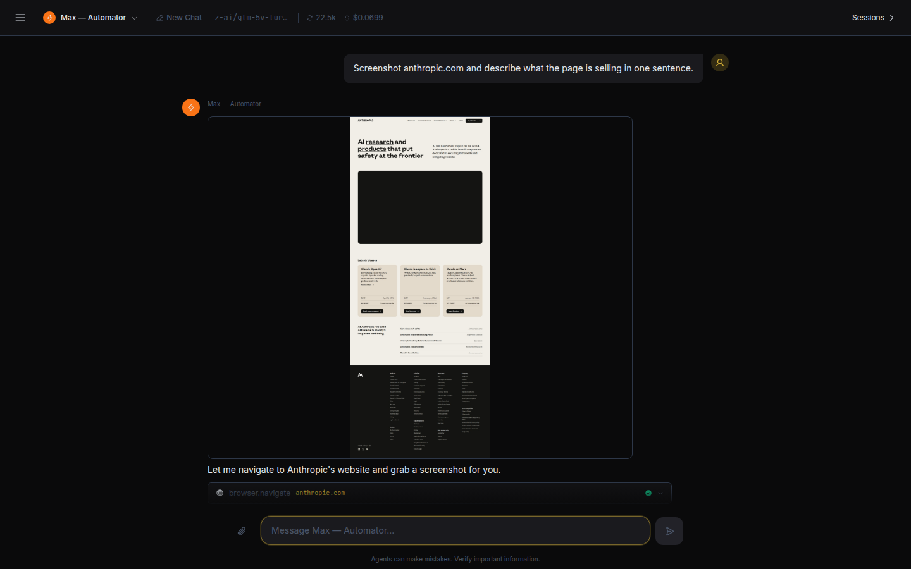
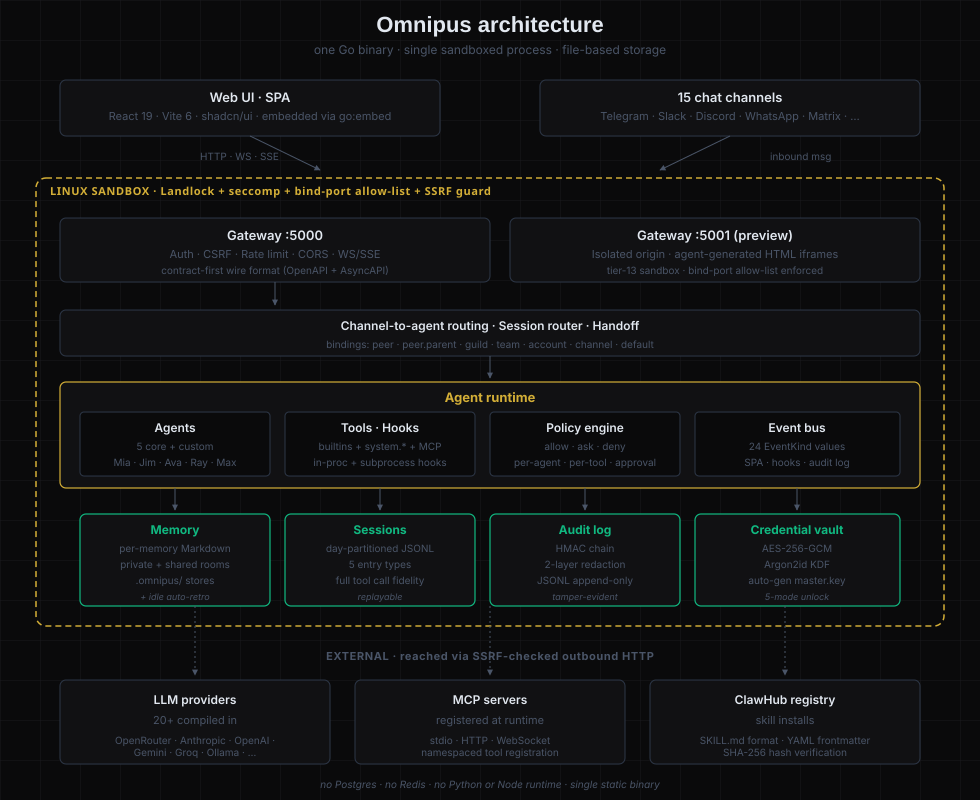

<div align="center">


<h1>Omnipus</h1>

<h3>A team of AI agents you actually own.</h3>

<p>Five named agents that hand off to each other, remember what happened, and run inside a kernel-level sandbox. One Go binary. No database. No SaaS. No telemetry. Boot it on a $10 VPS and you're done.</p>

<p>
  
  
  
  <a href="https://omnipus.ai"></a>
</p>


</div>

---

## Meet the team

Five named coworkers ship with every install. Identity is locked (no silent knock-offs); you control their model and tool policy.

| Agent | Role | Best at |
|---|---|---|
| **Mia** | Coach & Guide | Onboarding new users, routing requests to the right teammate by intent — not by name. |
| **Jim** | General Purpose | Hands-on implementation: writing code, creating files, scoping projects, coordinating across agents. |
| **Ava** | Agent Builder | Interviews you, then creates a brand-new custom agent — persona, tools, prompt — in seconds. |
| **Ray** | Researcher | Deep research with citations. Web search, fetch, synthesis. Refuses to bluff when evidence is thin. |
| **Max** | Automator | Browser automation. Plan-then-execute multi-step flows with approval gates. |

Need more? Ava builds unlimited custom agents and Omnipus runs them all in the same binary.

---

## See it work

Four live screenshots, captured against the running gateway.

**Mia routes by intent.** Tell her what you need — "I need an agent to help me build a marketing website" — and she picks the right teammate, says why, and hands off in 12 ms. The receiving agent picks up in the same transcript. No copy-paste.


**Ray researches with sources.** Web searches fan out, results synthesise into a numbered list with citations. He won't fake an answer.


**Max sees the web.** `browser.navigate` → `browser.screenshot` chained in one turn. The image streams back through the media pipeline and renders inline.



**Ava builds an agent live.** Tell her what you need, watch her call `system.agent.create`, get a summary card. New agent shows up in the roster instantly.


---

## What you actually get

- **A team of agents, not a chatbot.** Five named coworkers with locked identity and editable model/tool policy. Hand-off transfers control mid-conversation in the same transcript — no copy-paste, no re-explaining. Sub-agents, task delegation, shared transcript, per-agent budgets.
- **Channel-to-agent routing.** Inbound messages from Telegram, Slack, Discord, WhatsApp, and 11 other platforms route to specific agents by channel, account, guild, team, or peer. The default agent (Mia) routes by intent — give her the goal and she picks the right teammate. → [docs/routing.md](docs/routing.md)
- **Memory the agent maintains itself.** When a conversation goes quiet, Omnipus writes a retro. When it ends, it writes another. When the gateway restarts, it catches up on the ones it missed. `recall_memory` searches across long-term notes, last-session summaries, and 30 days of retros in one query. No vector DB, no embeddings, no extra services. → [docs/memory.md](docs/memory.md)
- **Full transparency by default.** Every tool call, every LLM request, every cancel, every agent event lands in a day-partitioned JSONL transcript on disk, replayable any time. Live event stream (24 typed event kinds) feeds the UI, subprocess hooks, and the HMAC-chained audit log. → [docs/observability.md](docs/observability.md)
- **Kernel-level sandbox.** Landlock + seccomp applied to the gateway process *before* `net.Listen` on Linux 5.13+. Three-tier per-tool policy (allow/ask/deny). SSRF guard wired into every outbound HTTP tool. AES-256-GCM credential vault with Argon2id KDF. → [docs/operations/sandbox-config.md](docs/operations/sandbox-config.md)
- **15 chat channels** compiled in: Telegram, Discord, Slack, WhatsApp, Matrix, Line, Feishu, DingTalk, Google Chat, IRC, WeCom, Weixin, QQ, OneBot, plus Web Chat. → [pkg/channels/README.md](pkg/channels/README.md)
- **Skills, hooks, and MCP.** Install reusable skill bundles from ClawHub; register MCP servers at runtime; subscribe subprocess hooks to the live event stream. → [docs/skills.md](docs/skills.md) · [docs/hooks/README.md](docs/hooks/README.md)
- **20+ LLM providers.** OpenRouter, Anthropic, OpenAI, Google Gemini, DeepSeek, Qwen, Moonshot, Groq, Cerebras, Mistral, MiniMax, Ollama, vLLM, Azure, GitHub Copilot, NVIDIA, Volcengine, ModelScope, Zhipu, and more. Fallback chains, multi-key rotation, streaming, vision. → [docs/providers.md](docs/providers.md)

---

## Install

Three supported paths. Pick the one that matches your host, then jump to [First boot](#first-boot).

| Path | When to use | Browser tools (`browser.*`, `web_serve`) |
|---|---|---|
| [Native binary](#native-binary-recommended) | Bare-metal / VPS / WSL2; you own the host kernel | ✅ — Chromium auto-downloads on first `browser.*` call |
| [Docker, minimal image](#docker-minimal-image) | Lowest-overhead deploy; chat + channels only, no browsing | ❌ — see [limitations](#minimal-image-limitations) |
| [Docker, heavy image](#docker-heavy-image) | Full feature parity inside a container | ✅ — apk Chromium pre-baked |

### Native binary (recommended)

```bash
curl -sSL https://raw.githubusercontent.com/elicify-ai/omnipus/main/scripts/install.sh | sh
omnipus gateway
# open http://localhost:5000
```

What the script does, in one paragraph: detects your OS + arch (`uname -s` / `uname -m`), downloads `omnipus_<OS>_<arch>.tar.gz` from the latest GitHub Release, verifies the SHA256 against the published `checksums.txt`, extracts a single ~30 MB self-contained Go binary (SPA embedded via `go:embed`, no shared-lib runtime), and installs to `/usr/local/bin/omnipus`. POSIX `sh` — no bash-isms, works on Alpine, BusyBox, macOS, Ubuntu.

Customise via environment:

| Variable | Default | Purpose |
|---|---|---|
| `OMNIPUS_VERSION` | `latest` Release | Pin a tag, e.g. `OMNIPUS_VERSION=v0.1.0` |
| `OMNIPUS_INSTALL_DIR` | `/usr/local/bin` | Use `$HOME/.local/bin` if you don't have sudo |
| `OMNIPUS_REPO` | `elicify-ai/omnipus` | Override only for forks |

**Browser tools.** On first `browser.navigate` / `browser.screenshot` / `web_serve` call, the gateway looks for `google-chrome`/`chromium`/`chromium-browser` on `$PATH`. If none is present, it downloads a managed Chromium under `$OMNIPUS_HOME/browser/chromium/` (Chrome for Testing, ~150 MB, one-time). The download path needs glibc, so on Alpine hosts install `chromium` via `apk` first; the PATH lookup then resolves and the managed download is skipped.

**Supported platforms in v0.1:** Linux amd64, Linux arm64, macOS arm64. Other targets are tracked in [docs/operations/platform-support.md](docs/operations/platform-support.md).

### Docker, minimal image

```bash
docker run -d \
  -p 127.0.0.1:5000:5000 \
  -p 127.0.0.1:5001:5001 \
  -v "$PWD/data:/root/.omnipus" \
  ghcr.io/elicify-ai/omnipus:latest
```

Or with compose: `curl -O https://raw.githubusercontent.com/elicify-ai/omnipus/main/docker/docker-compose.yml && docker compose up`.

The published image (`ghcr.io/elicify-ai/omnipus:latest`) is built from [`docker/Dockerfile`](docker/Dockerfile): an Alpine multi-stage build that produces a **~71 MB** runtime image with only `ca-certificates`, `tzdata`, and `curl` on top of the Go binary. Same SPA, same channels, same memory + sessions + audit log as the native install.

#### Minimal image limitations

The minimal image **deliberately excludes Chromium** to keep the artefact small. This means:

- `browser.navigate` / `browser.screenshot` / `browser.read_content` / `browser.console_logs` / `browser.action` and the entire `web_serve` dev-server preview flow **will not work** out of the box.
- The auto-download fallback in `pkg/tools/browser/manager.go` will fetch a managed Chromium from Chrome for Testing — but the binary is **glibc-linked** and the runtime is **Alpine (musl)**, so `exec` fails with a misleading `no such file or directory` (the missing ELF interpreter is `/lib64/ld-linux-x86-64.so.2`, not the binary itself).
- The Max agent will gracefully fall back to `web_fetch` for read-only tasks and explain the missing capability to the user.

If you need browser tools inside Docker, use the heavy image below.

### Docker, heavy image

```bash
docker build -t omnipus:heavy -f docker/Dockerfile.heavy .
docker run -d \
  -p 127.0.0.1:5000:5000 \
  -p 127.0.0.1:5001:5001 \
  -v "$PWD/data:/home/omnipus/.omnipus" \
  omnipus:heavy
```

Built from [`docker/Dockerfile.heavy`](docker/Dockerfile.heavy): same three-stage SPA + Go build as the minimal image, but the runtime stage adds `chromium`, `python3`, `py3-pip`, `uv` / `uvx`, `git`, `jq`, and a global `agent-browser` npm install. About **1.08 GB** on disk in exchange for first-class browser tools and Python MCP server support out of the box.

Heavy image is not currently published to GHCR — build it yourself per the snippet above. (Tracked: ship it from the same release pipeline.)

### From source (contributors)

```bash
git clone https://github.com/elicify-ai/omnipus.git
cd omnipus
make build        # builds SPA + Go binary in one step
./build/omnipus gateway
```

Requires Go 1.26+ and Node 24+. `make build` runs `spa-embed` first so `go:embed` picks up the latest Vite output.

### First boot

Two ports open: **5000** for SPA + API, **5001** for sandboxed agent preview iframes. The onboarding wizard runs on first visit: Welcome → Provider → API Key → Model → Admin Account → Done.

A 256-bit AES key auto-generates at `~/.omnipus/master.key` (mode `0600`). **Back it up** — losing it means losing every encrypted credential. For headless deployments, pre-provision via `OMNIPUS_KEY_FILE` or `OMNIPUS_MASTER_KEY`. → [docs/credential_encryption.md](docs/credential_encryption.md)

---

## Documentation

User-facing guides, grouped by what you're trying to do:

| Topic | Where to go |
|---|---|
| **Getting started** | This README + [docs/README.md](docs/README.md) index |
| **Memory system** | [docs/memory.md](docs/memory.md) |
| **Channel-to-agent routing** | [docs/routing.md](docs/routing.md) |
| **Session history & event stream** | [docs/observability.md](docs/observability.md) |
| **Skills & MCP** | [docs/skills.md](docs/skills.md) · [docs/tools_configuration.md](docs/tools_configuration.md) |
| **Channels (per-channel guides)** | [pkg/channels/README.md](pkg/channels/README.md) |
| **Hooks (subprocess + in-process)** | [docs/hooks/README.md](docs/hooks/README.md) |
| **Tools reference (full catalog)** | [docs/tools-reference.md](docs/tools-reference.md) |
| **LLM providers** | [docs/providers.md](docs/providers.md) |
| **Sandbox: config & status** | [docs/operations/sandbox-config.md](docs/operations/sandbox-config.md) |
| **Sandbox: known limitations** | [docs/operations/sandbox-limitations.md](docs/operations/sandbox-limitations.md) |
| **Reverse proxy & TLS** | [docs/operations/reverse-proxy.md](docs/operations/reverse-proxy.md) |
| **Docker** | [docs/docker.md](docs/docker.md) |
| **Credential vault** | [docs/credential_encryption.md](docs/credential_encryption.md) |
| **Configuration reference** | [docs/configuration.md](docs/configuration.md) |
| **Platform support** | [docs/operations/platform-support.md](docs/operations/platform-support.md) |
| **Troubleshooting** | [docs/troubleshooting.md](docs/troubleshooting.md) |
| **Debug & log spelunking** | [docs/debug.md](docs/debug.md) |

Browse the full index at [docs/README.md](docs/README.md).

---

## Architecture



Single Go binary. File-based JSON/JSONL storage at `~/.omnipus/`. No Postgres, no Redis. WhatsApp uses pure-Go SQLite (`modernc.org/sqlite`) in its own session namespace.

---

## Tech stack

**Backend:** Go 1.26+ · `chromedp` · `whatsmeow` · `discordgo` · `telebot` · `slack-go` · `golang.org/x/sys/unix` (Landlock, seccomp).

**Frontend:** TypeScript · React 19 · Vite 6 · shadcn/ui (Radix + Tailwind v4) · AssistantUI · Phosphor Icons · Zustand · TanStack Query/Router.

---

## Status

Pre-1.0, active development on [`feature/iframe-preview-tier13`](https://github.com/elicify-ai/omnipus/tree/feature/iframe-preview-tier13). Single Go binary with the SPA embedded via `go:embed` — that's the product. MIT-licensed, community-focused, no telemetry.

---

## Contributing

Issues, PRs, discussions — all welcome. Browse [open issues](https://github.com/elicify-ai/omnipus/issues) for live work, or jump straight to [SUPPORT.md](SUPPORT.md) for the channel that matches your question. See [CONTRIBUTING.md](CONTRIBUTING.md) for the development setup, [CODE_OF_CONDUCT.md](CODE_OF_CONDUCT.md) for community expectations, and [SECURITY.md](SECURITY.md) for vulnerability reporting. External PRs need a one-time [Contributor License Agreement](CLA.md); the Omnipus name and logo are reserved per the [trademark policy](TRADEMARKS.md). For internal context — BRDs, ADRs, in-flight specs, future designs — see the [For contributors](docs/README.md#for-contributors) section of the docs index.

## License

MIT · [omnipus.ai](https://omnipus.ai)
