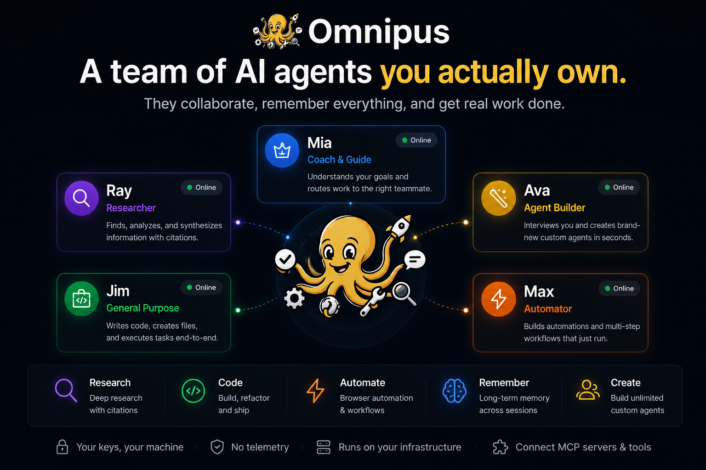

<div align="left">


<p>Research. Code. Write. Automate. Browse. Analyze. — five named agents that hand off to each other and remember what you discussed.</p>

<p>Or have <b>Ava build entirely new agents</b> for tasks nobody's imagined yet. <b>You run the team. Ava grows the team.</b></p>

<p>It all runs on your own machine — no cloud account, no subscription, no data leaving your box except the calls to the AI model you choose.</p>

<p><b>New here?</b> → <a href="docs/getting-started.md">Get started in 10 minutes</a> · <a href="docs/concepts.md">How it works</a> · <a href="docs/using-omnipus-ui.md">Use the web app</a> · <a href="docs/using-omnipus-cli.md">Use the terminal</a></p>

<p>
  
  
  
  <a href="https://omnipus.ai"></a>
</p>

</div>

---

## What can Omnipus do?

People install Omnipus to get things done, not to study the architecture. Out of the box, your team can:

✓ **Build applications** with a team of coding agents

✓ **Research a topic** and get back a cited report

✓ **Create a custom expert agent** in minutes — no prompt engineering

✓ **Automate browser workflows** with approval gates

✓ **Remember decisions** across sessions and projects

✓ **Run entirely on your own machine** — your keys, no telemetry

---

## What you actually get

### A team, not a chatbot

Five named agents who hand work to each other in the same conversation — Mia hears your request, picks the right teammate, and passes control over.

No copy-paste, no re-explaining.

→ [How handoffs work](docs/concepts.md#meet-the-team)

### They delegate and parallelize

Agents can plan work and assign tasks to each other — track it all on the Command Center board — and break a big job into parallel subagents that report back.

→ [The Command Center board](docs/using-omnipus-ui.md#command-center)

### Memory that learns

When a conversation winds down, Omnipus writes a recap *and* records the lessons learned — what went well, what to improve.

The recap carries into your next session automatically, and the lessons are kept for recall, so your team builds on past work instead of starting cold.

→ [Auto-recap at session close](docs/memory.md#what-happens-at-session-close-auto-recap)

### Agents that know your preferences

Tell them once in Settings → Profile ("be concise", "I use Python", your timezone) and every agent keeps it in mind.

→ [Tell your agents your preferences](docs/using-omnipus-ui.md#tell-your-agents-your-preferences)

### Reach them anywhere

Use the web app, the terminal, or wire your agents into Telegram, Discord, Slack, WhatsApp, and 9 other chat platforms — voice notes and images included.

→ [Channels](docs/channels.md)

### You stay in control

Agents ask permission before running anything sensitive (Allow / Deny / Always), and every action is logged so you can see exactly what happened.

→ [When an agent asks permission](docs/using-omnipus-ui.md#when-an-agent-asks-permission)

### Extend it

Install reusable **skills**, connect **MCP** servers, and let Ava build brand-new custom agents for you on demand.

→ [Skills quick start](docs/skills.md#quick-start)

### Your keys, your machine

API keys are encrypted on disk, nothing phones home, and there's no telemetry.

Pick from 35+ AI providers — including fully-local options like Ollama.

→ [LLM providers](docs/providers.md#providers)

<details>
<summary><b>For the technically curious</b> — what's under the hood</summary>

**Single Go binary** — ~30 MB, with the web app embedded. No database, no Redis; file-based storage at `~/.omnipus/`.

**Kernel-level sandbox** — Landlock + seccomp on Linux 5.13+, a three-tier per-tool policy (allow/ask/deny), and an SSRF guard on every outbound HTTP tool. → [Sandbox modes](docs/operations/sandbox-config.md#modes)

**Encrypted credential vault** — AES-256-GCM with an Argon2id KDF. → [Cryptographic design](docs/credential_encryption.md#cryptographic-design)

> Note: the "Credential encryption" link in the First-boot section currently points to a doc that does not exist yet — the target will be re-aimed in a follow-up by another agent.

**Full audit trail** — every tool call, LLM request, and agent event lands in a replayable on-disk transcript that feeds the UI, subprocess hooks, and a tamper-evident audit log. → [Session transcript](docs/observability.md#session-transcript)

**13 in-process chat channels and 35+ LLM providers** — with fallback chains, multi-key rotation, streaming, and vision. → [Channels](docs/channels.md) · [Providers](docs/providers.md#providers)

**Channel-to-agent routing** — binds inbound messages to specific agents by channel, account, guild, team, or peer. → [Inbound bindings](docs/routing.md#inbound-bindings)

</details>

---

## Meet the team

Five named coworkers ship with every install.

Their identity is locked — no silent knock-offs — but you control each one's model and tool policy.

| Agent | Role | Best at |
|---|---|---|
| **Mia** | Coach & Guide | Onboarding new users, routing requests to the right teammate by intent — not by name. |
| **Jim** | General Purpose | Hands-on implementation: writing code, creating files, scoping projects, coordinating across agents. |
| **Ava** | Agent Builder | Interviews you, then creates a brand-new custom agent — persona, tools, prompt — in seconds. |
| **Ray** | Researcher | Deep research with citations. Web search, fetch, synthesis. Refuses to bluff when evidence is thin. |
| **Max** | Automator | Browser automation. Plan-then-execute multi-step flows with approval gates. |

Need more? Ava builds unlimited custom agents, and Omnipus runs them all in the same binary.

---

## See it work

Four live screenshots, captured against the running gateway.

### Mia routes by intent

Tell her what you need — "I need an agent to help me build a marketing website" — and she picks the right teammate, says why, and hands off in 12 ms.

The receiving agent picks up in the same transcript. No copy-paste.


### Ray researches with sources

Web searches fan out, and the results synthesise into a numbered list with citations.

He won't fake an answer.


### Max sees the web

`browser.navigate` → `browser.screenshot`, chained in one turn.

The image streams back through the media pipeline and renders inline.


### Ava builds an agent live

Tell her what you need, watch her call `system.agent.create`, and get a summary card.

The new agent shows up in the roster instantly.


---

## Install

Find your platform below. Most people want the one-line install; Windows and Intel-Mac users run Omnipus in Docker for now.

| Your system | Do this |
|---|---|
| **Linux** (x86-64 or ARM64) | [One-line install](#linux-and-macos-apple-silicon) |
| **macOS** (Apple Silicon — M1/M2/M3/M4) | [One-line install](#linux-and-macos-apple-silicon) |
| **macOS** (Intel) | [Run in Docker](#windows-and-intel-macos) — no native binary yet |
| **Windows** | [Run in Docker](#windows-and-intel-macos) — native app in progress |

Once it's running, continue to [First boot](#first-boot).

### Linux and macOS (Apple Silicon)

```bash
curl -sSL https://raw.githubusercontent.com/elicify-ai/omnipus/main/scripts/install.sh | sh
omnipus start
# open http://localhost:5000
```

The same command works on Linux (x86-64 or ARM64) and Apple-Silicon Macs — it auto-detects your system and downloads the right build. (On macOS you may need to approve the binary the first time under System Settings → Privacy & Security.)

Under the hood, the script detects your OS and architecture (`uname -s` / `uname -m`), downloads the matching `omnipus_<OS>_<arch>.tar.gz` from the latest GitHub Release, and verifies its SHA256 against the published `checksums.txt`.

It then extracts a single ~30 MB self-contained Go binary (SPA embedded via `go:embed`, no shared-lib runtime) to `/usr/local/bin/omnipus`.

It's plain POSIX `sh` — no bash-isms — so it runs on Alpine, BusyBox, macOS, and Ubuntu.

Customise via environment:

| Variable | Default | Purpose |
|---|---|---|
| `OMNIPUS_VERSION` | `latest` Release | Pin a tag, e.g. `OMNIPUS_VERSION=v0.1.0` |
| `OMNIPUS_INSTALL_DIR` | `/usr/local/bin` | Use `$HOME/.local/bin` if you don't have sudo |
| `OMNIPUS_REPO` | `elicify-ai/omnipus` | Override only for forks |

**Browser tools.** On the first `browser.navigate` / `browser.screenshot` / `web_serve` call, the gateway looks for `google-chrome` / `chromium` / `chromium-browser` on `$PATH`. If one is found it's used as-is; if not, a managed Chromium is downloaded to `$OMNIPUS_HOME/browser/chromium/` (Chrome for Testing, ~150 MB, one-time).

That download needs glibc, so on Alpine hosts install `chromium` via `apk` first — the PATH lookup then resolves and the managed download is skipped.

**Supported platforms in v0.1:** Linux amd64, Linux arm64, macOS arm64 (Apple Silicon). Other targets are tracked in [platform support](docs/operations/platform-support.md).

### Windows and Intel macOS

We don't ship a native binary for these platforms yet, so the smooth path is Docker.

**Windows** — a native Windows app is on the roadmap and actively being worked on. Until it ships, run Omnipus in Docker.

**Intel Macs** — there's no prebuilt Intel binary in v0.1 (it's deferred to v0.1.1). Use Docker, or [build from source](#from-source-contributors).

For both, we recommend the **full (heavy) Docker image**: it bundles browser automation and Python MCP support, so you get complete feature parity — nothing is missing. The build-and-run commands are in [Docker, heavy image](#docker-heavy-image) just below. If you only need chat and channels and don't care about in-app browsing, the smaller [published image](#docker-minimal-image) starts with a single `docker run`.

### Docker, minimal image

```bash
docker run -d \
  -p 127.0.0.1:5000:5000 \
  -p 127.0.0.1:5001:5001 \
  -v "$PWD/data:/root/.omnipus" \
  ghcr.io/elicify-ai/omnipus:latest
```

Or with compose: `curl -O https://raw.githubusercontent.com/elicify-ai/omnipus/main/docker/docker-compose.yml && docker compose up`.

The published image (`ghcr.io/elicify-ai/omnipus:latest`) is built from [`docker/Dockerfile`](docker/Dockerfile): an Alpine multi-stage build that produces a **~71 MB** runtime image with only `ca-certificates`, `tzdata`, and `curl` on top of the Go binary.

Same SPA, same channels, same memory + sessions + audit log as the native install.

#### Minimal image limitations

The minimal image **deliberately excludes Chromium** to keep the artefact small. As a result:

All `browser.*` tools (`navigate`, `screenshot`, `read_content`, `console_logs`, `action`) and the entire `web_serve` preview flow **will not work** out of the box.

The auto-download fallback in `pkg/tools/browser/manager.go` does fetch a managed Chromium from Chrome for Testing — but that binary is **glibc-linked** while the runtime is **Alpine (musl)**, so `exec` fails with a misleading `no such file or directory`. (The missing piece is the ELF interpreter `/lib64/ld-linux-x86-64.so.2`, not the binary itself.)

The Max agent gracefully falls back to `web_fetch` for read-only tasks and explains the missing capability to the user.

If you need browser tools inside Docker, use the heavy image below.

### Docker, heavy image

```bash
docker build -t omnipus:heavy -f docker/Dockerfile.heavy .
docker run -d \
  -p 127.0.0.1:5000:5000 \
  -p 127.0.0.1:5001:5001 \
  -v "$PWD/data:/home/omnipus/.omnipus" \
  omnipus:heavy
```

Built from [`docker/Dockerfile.heavy`](docker/Dockerfile.heavy): the same three-stage SPA + Go build as the minimal image, but the runtime stage adds `chromium`, `python3`, `py3-pip`, `uv` / `uvx`, `git`, `jq`, and a global `agent-browser` npm install.

About **1.08 GB** on disk, in exchange for first-class browser tools and Python MCP server support out of the box.

Heavy image is not currently published to GHCR — build it yourself per the snippet above. (Tracked: ship it from the same release pipeline.)

### From source (contributors)

```bash
git clone https://github.com/elicify-ai/omnipus.git
cd omnipus
make build        # builds SPA + Go binary in one step
./build/omnipus start
```

Requires Go 1.26+ and Node 24+. `make build` runs `spa-embed` first so `go:embed` picks up the latest Vite output.

### First boot

Two ports open: **5000** serves the SPA + API, and **5001** serves sandboxed agent preview iframes.

The onboarding wizard runs on first visit: Welcome → Provider → API Key → Model → Admin Account → Done.

A 256-bit AES key auto-generates at `~/.omnipus/master.key` (mode `0600`).

**Back it up** — losing it means losing every encrypted credential.

For headless deployments, pre-provision the key via `OMNIPUS_KEY_FILE` or `OMNIPUS_MASTER_KEY`. → [Credential encryption](docs/credential_encryption.md#environment-variables)

### Headless onboarding (no browser)

If you can't open `localhost:5000` — Docker host, remote VPS, CI runner — finish onboarding from the shell instead. Secrets are read from stdin so they never appear in `ps`:

```bash
printf '%s\n%s\n' "$OPENROUTER_API_KEY" "$ADMIN_PASSWORD" | \
  omnipus onboard --non-interactive \
    --provider openrouter \
    --api-key-stdin \
    --model 'z-ai/glm-5v-turbo' \
    --admin-username admin \
    --admin-password-stdin

omnipus start
```

`omnipus onboard --help` lists every flag (`--provider`, `--api-key`, `--api-key-stdin`, `--model`, `--admin-username`, `--admin-password`, `--admin-password-stdin`, `--non-interactive`).

It applies the same end-state mutations as the SPA wizard — config, credentials, admin user, state — so you can log in immediately with the credentials you just passed.

---

## Documentation

**[→ Full documentation index](docs/README.md)** — every guide, grouped by what you're trying to do.

New here? Start with:

- [Your first 10 minutes](docs/getting-started.md) — install → first chat → handoff → build an agent
- [How Omnipus works](docs/concepts.md) — agents, sessions, memory, channels, skills (plain English)
- [Using the web app](docs/using-omnipus-ui.md) · [Using the terminal](docs/using-omnipus-cli.md)
- [Channels](docs/channels.md) — connect Telegram / Discord / Slack / … and choose which agent answers each

---

## Architecture


Single Go binary. File-based JSON/JSONL storage at `~/.omnipus/`. No Postgres, no Redis.

WhatsApp uses pure-Go SQLite (`modernc.org/sqlite`) in its own session namespace.

---

## Tech stack

**Backend:** Go 1.26+ · `chromedp` · `whatsmeow` · `discordgo` · `telego` · `slack-go` · `golang.org/x/sys/unix` (Landlock, seccomp).

**Frontend:** TypeScript · React 19 · Vite 8 · shadcn/ui (Radix + Tailwind v4) · AssistantUI · Phosphor Icons · Zustand · TanStack Query/Router.

---

## Status

Pre-1.0 and moving fast:

| Release | Status | Scope |
|---|---|---|
| **v0.1** | ✅ Complete | Stabilized gateway, iframe preview, sandbox hardening |
| **v0.2** | ✅ Complete | Security hardening |
| **v0.3 / 1.0** | 🚧 In design | The "Rooms" redesign of memory, projects, and tasks |

A single Go binary with the web app embedded *is* the product — MIT-licensed, community-focused, no telemetry. See the [roadmap](ROADMAP.md).

---

## Contributing

Issues, PRs, and discussions are all welcome.

| If you want to… | Go to |
|---|---|
| Find live work | [open issues](https://github.com/elicify-ai/omnipus/issues) |
| Ask a question | [SUPPORT.md](SUPPORT.md) |
| Set up to build | [CONTRIBUTING.md](CONTRIBUTING.md) |
| Understand community expectations | [CODE_OF_CONDUCT.md](CODE_OF_CONDUCT.md) |
| Report a vulnerability | [SECURITY.md](SECURITY.md) |
| Sign the CLA (before your first PR) | [Contributor License Agreement](CLA.md) |
| Dig into internal context — BRDs, ADRs, specs, designs | [internal documentation](docs/internal/README.md) |

The Omnipus name and logo are reserved per the [trademark policy](TRADEMARKS.md).

## License

MIT · [omnipus.ai](https://omnipus.ai)
