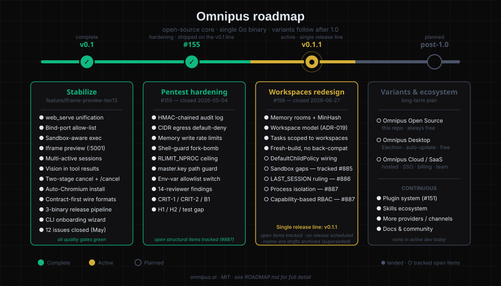

# Omnipus Roadmap

A single open-source Go binary today. The long-term plan also includes an Electron desktop wrapper and a hosted Cloud / SaaS variant, both sharing the same Go core. This roadmap tracks the Open Source release plan; the Desktop and Cloud variants will fork from a stable 1.0 release of the core.

---

> **Release-line note (2026-09-25):** Omnipus ships a single release line, **v0.1.1** — the separate v0.2 / v0.3 releases are retired (founder decision 2026-09-25). Where this document still says v0.2 or v0.3, it is either historical record (kept deliberately) or a pointer to a tracked issue; nothing is scheduled against a v0.2/v0.3 label anymore.

---

## Where we are today

| Release | Status | Headline |
|---|---|---|
| **v0.1** | ✅ Shipped — merged to `main` via #157 | Stabilized branch; iframe preview + kernel bind-port allow-list + sandbox-aware exec + `web_serve` unification all shipped |
| **v0.1.1** | 🚧 Current — the single release line | Founder decision 2026-09-25: no separate v0.2/v0.3 releases; v0.1.1 carries the landed #156 workspaces work (memory rooms, workspace model, tasks) and the tracked open items |
| **v1.0 — Feature Parity** | 🟡 In progress | Close the gap between the CLI and the web UI so a terminal/headless user can do (nearly) everything a browser user can — tracked by epic [#211](https://github.com/elicify-ai/omnipus/issues/211) |
| **Post-1.0** | 📋 Planned | Desktop variant (Electron wrapper), Cloud / SaaS variant (hosted with team features) |

---

## v0.1 — Stabilize the gateway and ship a real binary ✅

**Branch:** `feature/iframe-preview-tier13` (260+ commits ahead of `main`)

Everything in v0.1 shipped and tested (merged to `main` via #157). Highlights:

- **`web_serve` tool unification** — single HTTP-serve implementation across preview + Tier-1/3 workspace tools
- **Kernel-enforced bind-port allow-list** — Landlock NET_BIND_TCP rules limit the gateway to its configured ports
- **Sandbox-aware `exec`** — `workspace.shell` passes through the active sandbox context
- **Iframe preview (tier-13)** — second listener on `gateway.preview_port` (default 5001) serves agent-generated HTML on an isolated origin, with `Content-Security-Policy` + `frame-ancestors` headers built from `gateway.public_url` / `gateway.preview_origin`
- **Multi-active sessions** — ChatGPT-style multi-session model with `session_id`-keyed routing
- **Vision support** — image media passed to LLM tool results, with retry-without-image on rejection
- **Two-stage cancel system** — graceful → hard → detached, with `/cancel` registered across 12 channels and a CLI double-Escape shortcut
- **Auto-Chromium install** — browser tools provision their own Chromium on first use
- **Contract-first wire formats** — OpenAPI + AsyncAPI as source of truth, generated Go + TS types both sides, runtime Zod validation at SPA edge
- **3-binary release pipeline** — Linux amd64 + arm64 + macOS arm64; `install.sh` + Docker (GHCR) + GitHub Releases
- **CLI onboarding wizard** — `omnipus onboard` is now interactive (was a print-only stub)
- **Backlog burn-down** — 12 GitHub issues closed in May 2026, including 7 with code-cited regression tests (#159–#165) and 5 verified-fixed-on-branch (#39 moot, #57, #78, #109, #122)

**Quality gates on every PR:** `typecheck`, `wire-types-lint`, `verify-contracts`, `golangci-lint`, `govulncheck`, `go test ./...`, `vitest`, `playwright`, `perf-smoke`, `security`. All green.

---

## Security hardening (#155) — shipped on the v0.1 line ✅

**Issue:** [#155](https://github.com/elicify-ai/omnipus/issues/155) — closed 2026-05-04

Shipped on `main` as part of `#157` (`feat(v0.1+v0.2): iframe preview, web_serve unification, sandbox hardening, audit subsystem`). Every item from the original list landed:

| Item | Status | Where |
|---|---|---|
| Env-var allowlist switch | ✅ | `pkg/sandbox/hardened_exec.go::allowedChildEnvKeys` |
| `master.key` permission verification (0600 + path-guard) | ✅ | secrets-subtree path-guard for `master.key` + `credentials.json` |
| Shell-guard hardening (whitespace fork-bomb regex + RLIMIT_NPROC) | ✅ | `dc2d0f2` |
| Internal-CIDR egress blocking | ✅ | default-deny for RFC-1918 + link-local on sandboxed children |
| HMAC chain on audit log | ✅ | `83193e2` — tamper-evident, append-only JSONL |
| Per-agent + per-IP rate limit on memory writes | ✅ | `a7da565` — `MemoryRateLimiter` |
| 14-reviewer security review findings | ✅ | `ba8ec56` (CRIT-1, CRIT-2, B1, H1, H2, test gap) |

Items that **required architectural change** (process isolation, capability-based RBAC) were deferred — tracked as [#887](https://github.com/elicify-ai/omnipus/issues/887); no release scheduled.

---

## The workspaces redesign (#156) — landed, decided-against, and re-homed

**Issue:** [#156](https://github.com/elicify-ai/omnipus/issues/156) — closed 2026-06-27.

The issue's "Rooms" redesign closed with part of its scope landed in a different shape, part decided against, and part still open — the open parts are tracked, not dropped:

| #156 item | State | Where |
|---|---|---|
| Memory redesign | ✅ Landed (different shape) | `pkg/memrooms/` — memory rooms + MinHash similarity; greenfield, no migration (founder ruling 2026-09-15) |
| Tasks redesign | ✅ Landed (different shape) | `pkg/task/` scoped to workspaces (the per-room TaskStore was removed) |
| Workspace topology | ✅ Landed (different shape) | ADR-019 / ADR-046 workspaces model |
| Sandbox redesign (per-agent Landlock profiles) | ❌ Decided against | ADR-035 removed per-agent sandbox profiles; today: one policy ceiling + per-agent tool-policy tightening (ADR-077) |
| Projects UI redesign | 🟡 Superseded shape | The rooms-era UI plan is superseded; the Command Center surface was deleted (see "Retired surfaces" in root `CLAUDE.md`) |
| `DefaultChildPolicy` production wiring | ❌ Open — tracked | [#884](https://github.com/elicify-ai/omnipus/issues/884) — built but unwired (pentest C1/C2 kernel path-guard) |
| Structural sandbox findings (cross-agent FS + namespace isolation) | ❌ Open — tracked | [#885](https://github.com/elicify-ai/omnipus/issues/885) |
| LAST_SESSION.md / retrospectives replacement | ❌ Open — tracked | [#886](https://github.com/elicify-ai/omnipus/issues/886) |
| Process isolation + capability-based RBAC | ❌ Open — tracked | [#887](https://github.com/elicify-ai/omnipus/issues/887) |

The five rooms-era design documents in `docs/internal/_archive/design-2026-05-rooms-era/` are superseded pre-ADR background (retired Rooms/5-core vocabulary) — do **not** implement from them without checking the archived concept (`docs/internal/_archive/preview-doc-v03-concept/`) and the ADRs.

---

## v1.0 — CLI ↔ UI feature parity 🟡

**Epic:** [#211](https://github.com/elicify-ai/omnipus/issues/211) — tracked under the **Feature Parity** milestone.

The CLI is already strong at setup, running the gateway, secrets, skills, scheduling, model/auth, and terminal chat — but several surfaces are web-app only today. The 1.0 goal is to let a terminal/headless user do (nearly) everything a browser user can. The current gaps are summarised for users in [`docs/using-omnipus-cli.md`](docs/using-omnipus-cli.md) ("What the CLI can't do (yet)").

Child issues by priority:

| Priority | Gap | Issue |
|---|---|---|
| P1 | Manage custom agents (create/edit/delete/list) | [#201](https://github.com/elicify-ai/omnipus/issues/201) |
| P1 | Task board / Command Center commands | [#202](https://github.com/elicify-ai/omnipus/issues/202) |
| P1 | Connect & manage chat channels (beyond WeChat) | [#203](https://github.com/elicify-ai/omnipus/issues/203) |
| P2 | Add/test providers after first-run | [#208](https://github.com/elicify-ai/omnipus/issues/208) |
| P2 | Manage MCP servers | [#204](https://github.com/elicify-ai/omnipus/issues/204) |
| P2 | Richer terminal chat (attachments, streaming, slash commands) | [#205](https://github.com/elicify-ai/omnipus/issues/205) |
| P3 | List / resume / delete sessions | [#206](https://github.com/elicify-ai/omnipus/issues/206) |
| P3 | Set user preferences (USER.md) | [#207](https://github.com/elicify-ai/omnipus/issues/207) |
| P3 | User / role / device management (admin) | [#209](https://github.com/elicify-ai/omnipus/issues/209) |
| P3 | Routing, retention & sandbox settings | [#210](https://github.com/elicify-ai/omnipus/issues/210) |

The CLI leads on: `omnipus onboard` (first-run setup), `omnipus start` (server), `omnipus credentials rotate` (vault re-encryption), and `omnipus audit verify` (log integrity). These stay CLI-first.

---

## Post-1.0 — Variants and ecosystem 📋

Long-term, the Go core ships as three product variants:

- **Omnipus Open Source** (this repo) — single Go binary with embedded SPA. MIT, community-focused, no telemetry. Always free.
- **Omnipus Desktop** — Electron wrapper around the same binary, with native menus, auto-update, and a polished installer for non-technical users. Free.
- **Omnipus Cloud / SaaS** — hosted variant with team features (multi-user organisations, billing, managed infrastructure, SSO). Commercial.

Variants share the Go core, the `@omnipus/ui` React components, and the same agent runtime. They differ only in distribution and the team-features layer. **None of these are in active development today** — the focus is shipping a strong 1.0 of the open-source core first.

---

## Continuous workstreams

Some work doesn't fit a release box and runs in parallel:

- **Plugin system ([#151](https://github.com/elicify-ai/omnipus/issues/151))** — unified plugin model for agents, tools, channels, and skills. Currently scoping; channel-installer prototype exists in an unpushed branch
- **Channel parity** — `/cancel` registration on remaining channels, signature verification audit ([#162](https://github.com/elicify-ai/omnipus/issues/162) closed), ongoing per-platform polish
- **Skills ecosystem** — ClawHub registry + progressive skill disclosure ([#152](https://github.com/elicify-ai/omnipus/issues/152) pending), `omnipus doctor` warning for `skill_trust=allow_all` ([#99](https://github.com/elicify-ai/omnipus/issues/99) pending)
- **Web search providers** — currently 7 (Perplexity → Brave → SearXNG → Tavily → DuckDuckGo → Baidu → GLM); additional providers via [#47](https://github.com/elicify-ai/omnipus/issues/47)
- **Documentation** — the README is marketing-first; `docs/` is operator-friendly; contributor artifacts (BRD, ADRs, specs, future designs) are grouped under [docs/README.md#for-contributors](docs/README.md#for-contributors)

---

## Routing new work

New work is sized first — small / standard / feature (see "Change sizes and the review gate" in root `CLAUDE.md`). There is no release-phase routing anymore:

| Work type | Routing |
|---|---|
| Pentest finding that doesn't need structural change | Hotfix line |
| Pentest finding that needs structural change | Tracked issue — no release scheduled until the founder rules where it lands |
| Memory / projects / tasks / sandbox topology | Tracked issue — re-homed per the #156 table above |
| Plugin system | Continuous — track in [#151](https://github.com/elicify-ai/omnipus/issues/151) |
| Other feature | Flag the scope question explicitly before starting |

---

## What is not on this roadmap

The following items are **not** current priorities and were explicitly removed from upstream lineage:

- Edge AI / sub-64MB embedded boards
- Android device control
- AI-Native OS interaction paradigms

These may be reconsidered after 1.0 ships.
