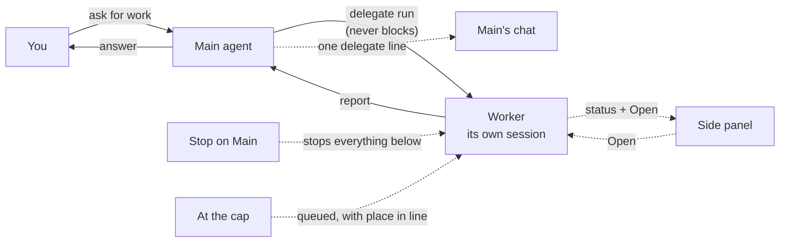

# Editorial decisions

Agents do the work in Omnipus. Four ship with the product, and you can create your own from the Agents screen.

## What it is

Open **Agents** in the sidebar and the roster has three sections:

- **Built-in roster** — the four agents Omnipus ships with. They are locked, and Mia is the initial default.
- **Main agents** — chat colleagues you create yourself.
- **Sub-agent workers** — workers you create yourself. They never chat with you; other agents delegate work to them.

A filter above the roster narrows the list to one [workspace](workspaces.md) team.

## When you would use it

- You want to change who answers when no agent is named. Set the default.
- You want a colleague with a fixed job and personality. Create a Main agent.
- You want focused labor behind your main agents. Create a worker.
- You already run a command-line agent tool and want Omnipus to delegate to it. Create an external worker.

## The base agents

The four built-in agents cover the everyday jobs.

| Agent | Role | What it is for |
|---|---|---|
| Mia | Assistant | Your everyday starting point. Answers questions and connects you with the right specialist. |
| Jim | Planner and Orchestrator | Turns a complex goal into tasks, delegates them to the right agents, and tracks the work to completion. |
| Ava | Builder | Interviews you about what you need, then creates a custom agent with the personality and tools you asked for. |
| Ray | Scout | Research. Digs into a topic, reads multiple sources, and reports back with citations. |

All four can hand the conversation to another agent when you ask them to. Ava is also a shortcut for creating agents: skip the form and describe what you want to her in chat.

## How to set your default agent

Omnipus picks the default when a conversation has no specific agent assigned.

1. Open **Agents** in the sidebar.
2. Find the card of the agent you want as the default.
3. Click **Set as default** on the card. The star moves to that agent.

Any chat colleague can hold the star, built-in or one you created. Workers never can.

A connector can also name its own default, which wins there. See [connectors](connectors.md).

## How to create your own agent

You create one of three types. The create buttons sit in the section headers of the roster.

| Type | Runs on | Works for | You can chat with it |
|---|---|---|---|
| Main | The Omnipus engine | You, directly | Yes |
| Subagent | The Omnipus engine | Other agents, through delegation | No |
| Subagent (External) | An external command-line tool | Other agents, through delegation | No |

1. Click **+ New Main** or **+ New Subagent** in its section header. For an external worker, click **+ Add Subagent (External)** and pick the command-line tool from the menu; entries for tools not installed on the host are greyed out.
2. Fill in **Identity**: name, color, icon, and model. For workers, the description is required — it is what other agents read to decide when to delegate to this one.
3. Fill in **Personality**: the soul, the agent's persona prompt, is required for every type.
4. Main and Subagent have a third step, **Tools**, for tool permissions, skills, and fallback models. An external worker has no Tools step — it brings its own.
5. Create the agent. Its card appears in its section.

To change an agent, open its card. The edit slide-over saves as you type. Its tabs are **Basics**, **Personality**, **Tools**, **Skills**, and **Advanced**; an external worker shows **Runtime** instead of Tools and Skills. **Delete agent** asks you to confirm.

## Workers and delegation

A worker is just a session that another agent owns and steers. The delegating agent hands the worker a task and keeps working; the worker runs in its own session, with its own tools, its own transcript, and a chat you can open to watch it live.

What this looks like in practice:

- The worker's voice never reaches your chat. The delegating agent's chat shows only the one line the `delegate` tool call produces. A worker's steps, narration, and output do not appear there.
- The delegating agent can keep many workers running. Each one shows up in the **side panel** as a row with a one-line status that updates as the worker reports progress, and an **Open** button you can click to open that worker's session and watch it work.
- The worker reports only to the agent that delegated it, never to the person. It uses a separate `message_parent` channel plus the steering surface (`status`, `steer`, `follow_up`), and nothing else.
- The delegating agent never blocks. The tool returns as soon as the worker is launched and dispatched, and the agent carries on. When it needs the worker's answer, the worker wakes it on completion.
- **Stop on a session stops everything below it.** A Stop on the main agent stops every worker it delegated, including any queued for a slot.
- When too many workers are already running, the next one is **queued** — the parent's tool result tells it its place in line, and queued workers start in order as slots free. There is no blocking wait, and `delegate cancel` drops a queued worker.

The exact caps on all of this — how deep a chain may go, how many may run at once, and how long a child may run — live on the Performance tab; see [settings](settings.md#delegation-limits) for the values and their defaults.

A worker has its own settings — its model, its tools, its limits. The delegating agent hands over the task; the worker supplies everything else. Delegation itself is a per-workspace decision: which agent may delegate to which is set on that [workspace](workspaces.md) **Team** tab, and that rule applies only there.

An **external worker** runs on a command-line tool installed on the same machine as Omnipus: Claude Code, Codex, or OpenCode. Its model is a free-text name passed straight to that tool. Omnipus checks the connection — that the tool's program is present and answers — automatically before it saves changes to an external worker, and refuses the save if the check fails. To try the worker by hand, open it and use **Send a test message** on its **Runtime** tab; this runs a real request through the tool, so it spends a small amount of usage.

Two things to watch with external workers:

- The tool choice is fixed when you create the worker. To move to a different tool, create a new worker. The path to the tool's program stays editable.
- Omnipus tool permissions do not reach inside the external tool. It uses its own tools and its own safety settings; the allow, ask, and deny rules govern Omnipus [tools](tools.md) only.

## How to set up a heartbeat

A heartbeat is a scheduled check-in for one agent in one workspace. The same agent can have a different heartbeat, or none, in each workspace. Workers cannot have heartbeats.

1. Open the workspace **Team** tab and open the agent from there. The edit slide-over now shows a **Heartbeat** tab.
2. Open **Heartbeat** and switch **Enable heartbeat** on.
3. Set **Interval (minutes)** to five or more.
4. Write the **Heartbeat body**, which is the prompt the agent receives at each check-in. For example: "Check the inbox and start a task for anything new."
5. Click **Save heartbeat**. The agent now runs the prompt on that interval in a dedicated heartbeat session.

If nothing needs attention, the agent records an all-clear. Heartbeat sessions stay at the top of the sidebar session list. Scheduled task work is a different feature; the [calendar](calendar.md) page covers it.

## Limits and things to watch

- The built-in roster is locked. Name, description, persona, color, icon, and skills cannot change. Model and limits stay editable; tool permissions are read-only — create a custom agent to change those.
- Workers are invisible to chat. They have no voice, no heartbeat, and can never be the default.
- A worker with no delegation edge does nothing. Wire the edge on the workspace Team tab.
- An external worker depends on its tool being installed. If the tool is missing, the create menu shows it greyed out.
- Editing autosaves. A red save indicator means the last change failed; correct the field it names and the next change saves.

## Related pages

- [Workspaces](workspaces.md) — where teams live and delegation trust is set
- [Connectors](connectors.md) — per-connector default agents and routing
- [Tools](tools.md) — the allow, ask, and deny rules for Omnipus tools
- [Skills](skills.md) — reusable playbooks an agent picks up
- [Calendar](calendar.md) — scheduled task work, separate from heartbeats
