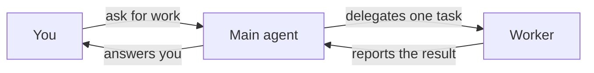

# Agents

Agents are who does the work in Omnipus. Four of them ship with the product, you can create your own, and the Agents screen in the sidebar is where you meet all of them.

## What it is

Open **Agents** in the sidebar and the roster has three sections:

- **Built-in roster** — the four agents Omnipus ships with. They are locked, they sit first, and Mia is the default on a fresh install.
- **Main agents** — chat colleagues you create yourself.
- **Sub-agent workers** — workers you create yourself. They never chat with you; other agents delegate work to them.

A filter above the roster narrows the list to one [workspace](workspaces.md) team.

## When you would use it

- You want to change who answers when no agent is named. Set the default.
- You want a colleague with a fixed job and personality. Create a Main agent.
- You want focused labor behind your main agents. Create a worker.
- You already run a command-line agent tool and want Omnipus to delegate to it. Create an external worker.

## The base agents

The four built-in agents cover the everyday jobs.

| Agent | Role | What it is for |
|---|---|---|
| Mia | Assistant | Your everyday starting point. Answers questions and connects you with the right specialist. |
| Jim | Planner and Orchestrator | Turns a complex goal into tasks, delegates them to the right agents, and tracks the work to completion. |
| Ava | Builder | Interviews you about what you need, then creates a custom agent with the personality and tools you asked for. |
| Ray | Scout | Research. Digs into a topic, reads multiple sources, and reports back with citations. |

All four can hand the conversation to another agent when you ask them to. Ava is also a shortcut for creating agents: skip the form and describe what you want to her in chat.

## How to set your default agent

The default agent is who Omnipus picks when a conversation has no more specific agent assigned — a connector conversation that does not name one, for example.

1. Open **Agents** in the sidebar.
2. Find the card of the agent you want as the default.
3. Click **Set as default** on the card. The star moves to that agent.

Any chat colleague can hold the star, built-in or one you created. Workers never can.

A connector can also name its own default, which wins there. See [connectors](connectors.md).

## How to create your own agent

You create one of three types. The create buttons sit in the section headers of the roster.

| Type | Runs on | Works for | You can chat with it |
|---|---|---|---|
| Main | The Omnipus engine | You, directly | Yes |
| Subagent | The Omnipus engine | Other agents, through delegation | No |
| Subagent (External) | An external command-line tool | Other agents, through delegation | No |

1. Click **+ New Main** or **+ New Subagent** in its section header. For an external worker, click **+ Add Subagent (External)** and pick the command-line tool from the menu; entries for tools not installed on the host are greyed out.
2. Fill in **Identity**: name, color, icon, and model. For workers, the description is required — it is what other agents read to decide when to delegate to this one.
3. Fill in **Personality**: the soul, the agent's persona prompt, is required for every type.
4. Main and Subagent have a third step, **Tools**, for tool permissions, skills, and fallback models. An external worker has no Tools step — it brings its own.
5. Create the agent. Its card appears in its section.

To change an agent later, open its card. The edit slide-over saves every change as you type; the footer shows when it last saved. The tabs are **Basics**, **Personality**, **Tools**, **Skills**, and **Advanced**; an external worker shows **Runtime** instead of Tools and Skills. **Delete agent** sits in the footer and asks you to confirm.

## Workers and delegation

A worker never appears in your chat. Another agent calls on it through delegation, hands it one task, and reports the result back to you.

The main agent keeps the conversation; the worker does one delegated task and reports back.

Two rules make delegation predictable:

- The worker runs with its own settings — its model, its tools, its limits. The delegating agent hands over the task; the worker supplies everything else.
- Delegation is a per-workspace decision. Which agent may delegate to which is set on that [workspace](workspaces.md) **Team** tab, and it applies only there.

An **external worker** runs on a command-line tool installed on the same machine as Omnipus: Claude Code, Codex, or OpenCode. Its model is a free-text name passed straight to that tool. The **Test run** button on its card checks the connection — that the tool's program is present and answers.

Two things to watch with external workers:

- The tool choice is fixed when you create the worker. To move to a different tool, create a new worker. The path to the tool's program stays editable.
- Omnipus tool permissions do not reach inside the external tool. It uses its own tools and its own safety settings; the allow, ask, and deny rules govern Omnipus [tools](tools.md) only.

## Heartbeats

A heartbeat is a scheduled check-in for one agent in one workspace. It is configured on the agent, so this page owns it.

1. Open the workspace **Team** tab and open the agent from there. The edit slide-over now shows a **Heartbeat** tab.
2. Turn the heartbeat on and set an interval of five minutes or more.
3. Write the message the agent receives at each check-in — for example, "check the inbox and start a task for anything new."

If nothing needs attention, the agent replies with a short all-clear. Scheduled task work is a different feature; the [calendar](calendar.md) page covers it.

## Limits and things to watch

- The built-in roster is locked. Name, description, persona, color, icon, and skills cannot change. Model and limits stay editable; tool permissions are read-only — create a custom agent to change those.
- Workers are invisible to chat. They have no voice, no heartbeat, and can never be the default.
- A worker with no delegation edge does nothing. Wire the edge on the workspace Team tab.
- An external worker depends on its tool being installed. If the tool is missing, the create menu shows it greyed out.
- Editing autosaves. A red save indicator means the last change failed; correct the field it names and the next change saves.

## Related pages

- [Workspaces](workspaces.md) — where teams live and delegation trust is set
- [Connectors](connectors.md) — per-connector default agents and routing
- [Tools](tools.md) — the allow, ask, and deny rules for Omnipus tools
- [Skills](skills.md) — reusable playbooks an agent picks up
- [Calendar](calendar.md) — scheduled task work, separate from heartbeats
