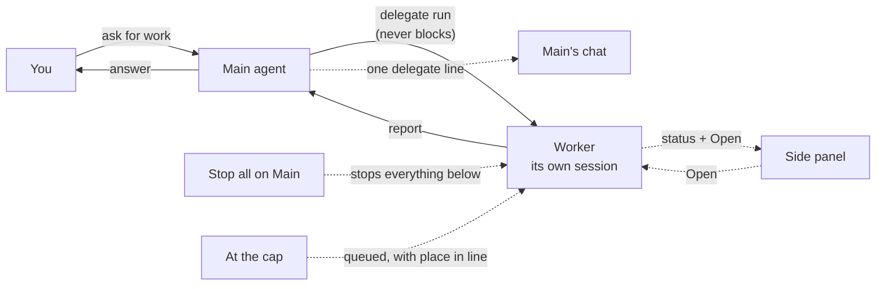

# Agents

Agents do the work in Omnipus. Four ship with the product, and you can create your own from the Agents screen.

## What it is

Open **Agents** in the sidebar and the roster has three sections:

- **Built-in roster** — the four agents Omnipus ships with. They are locked, and Mia is the initial default.
- **Main agents** — chat colleagues you create yourself.
- **Sub-agent workers** — workers you create yourself. They never chat with you; other agents delegate work to them.

A filter above the roster narrows the list to one [workspace](workspaces.md) team.

## When you would use it

- You want to change who answers when no agent is named. Set the default.
- You want a colleague with a fixed job and personality. Create a Main agent.
- You want focused labor behind your main agents. Create a worker.
- You already run a command-line agent tool and want Omnipus to delegate to it. Create an external worker.

## The base agents

The four built-in agents cover the everyday jobs.

| Agent | Role | What it is for |
|---|---|---|
| Mia | Assistant | Your everyday starting point. Answers questions and connects you with the right specialist. |
| Jim | Planner and Orchestrator | Turns a complex goal into tasks, delegates them to the right agents, and tracks the work to completion. |
| Ava | Builder | Interviews you about what you need, then creates a custom agent with the personality and tools you asked for. |
| Ray | Scout | Research. Digs into a topic, reads multiple sources, and reports back with citations. |

All four can hand the conversation to another agent when you ask them to. Ava is also a shortcut for creating agents: skip the form and describe what you want to her in chat.

## How to set your default agent

Omnipus picks the default when a conversation has no specific agent assigned.

1. Open **Agents** in the sidebar.
2. Find the card of the agent you want as the default.
3. Click **Set as default** on the card. The star moves to that agent.

Any chat colleague can hold the star, built-in or one you created. Workers never can.

A connector can also name its own default, which wins there. See [connectors](connectors.md).

## How to create your own agent

You create one of three types. The create buttons sit in the section headers of the roster.

| Type | Runs on | Works for | You can chat with it |
|---|---|---|---|
| Main | The Omnipus engine | You, directly | Yes |
| Subagent | The Omnipus engine | Other agents, through delegation | No |
| Subagent (External) | An external command-line tool | Other agents, through delegation | No |

1. Click **+ New Main** or **+ New Subagent** in its section header. For an external worker, click **+ Add Subagent (External)** and pick the command-line tool from the menu; entries for tools not installed on the host are greyed out.
2. Fill in **Identity**: name, color, icon, and model. For workers, the description is required — it is what other agents read to decide when to delegate to this one.
3. Fill in **Personality**: the soul, the agent's persona prompt, is required for every type.
4. Main and Subagent have a third step, **Tools**, for tool permissions, skills, and fallback models. An external worker has no Tools step — it brings its own.
5. Create the agent. Its card appears in its section.

To change an agent, open its card. The edit slide-over saves as you type. Its tabs are **Basics**, **Personality**, **Tools**, **Skills**, and **Advanced**; an external worker shows **Runtime** instead of Tools and Skills. **Delete agent** asks you to confirm.

## How to lower one agent's tool-call limit

Every agent may make at most a set number of tool calls in one turn. The global limit lives in Settings, Performance; see [settings](settings.md#tool-calls-per-turn). One agent can have its own lower limit, for example a worker you want to keep on a short leash. An agent's own limit can equal or be lower than the global limit, never higher.

1. Open the agent's card and go to the **Advanced** tab.
2. Under **Execution**, type a number into **Max tool calls per turn**. It saves by itself.
3. The line under the field says where the agent's limit comes from:

| The line reads | Meaning |
|---|---|
| Using the global limit (200) | The agent has no own value and follows the global limit. |
| Lowered for this agent: 50 (global limit 200) | The agent's own value, 50, applies. |
| Own value 500 is above the global limit (200) and has no effect | See "An old higher value" below. |

4. To go back to the global limit, click **Use global limit** next to the field. That clears the agent's own value.

You can also set the value when you create the agent: open **Advanced** in the create form (on the **Tools** step for Main and Subagent, on the **Personality** step for an external worker). Leave it empty to follow the global limit.

A value above the global limit is not saved. On the profile, the field shows the refusal, which names the global limit and suggests raising it in Settings, Performance; your other changes on the profile still save. In the create form, creating the agent fails with the same message. Values must be whole numbers from 1 to 1000.

The same rules apply everywhere an agent is created or changed, including when you ask an agent in a chat to do it, as you would with Ava. The `create_agent` and `update_agent` tools refuse a value above the global limit or outside 1 to 1000, and sending an empty value (`null`) to `update_agent` clears the agent's own value.

**An old higher value.** Earlier releases let an agent's own limit be higher than the global one. Upgrading keeps that stored value untouched, but it no longer applies: the agent runs at the global limit, and its profile says the value has no effect. The gateway log lists every such agent in one warning at start-up. Type a lower value or click **Use global limit** to clear the warning. Lowering the global limit in Settings is the only thing that ever rewrites an agent's own value, and it asks you first.

A change applies from the agent's next turn; a turn already running keeps the limit it started with.

## Workers and delegation

A worker is just a session that another agent owns and steers. The delegating agent hands the worker a task and keeps working; the worker runs in its own session, with its own tools, its own transcript, and a chat you can open to watch it live.

```mermaid
flowchart LR
  You[You] -->|"ask for work"| Main[Main agent]
  Main -->|"delegate run<br/>(never blocks)"| Worker["Worker<br/>its own session"]
  Worker -->|"report"| Main
  Main -->|"answer"| You
  Main -.->|"one delegate line"| MainChat[Main's chat]
  Worker -.->|"status + Open"| Side[Side panel]
  Side -.->|"Open"| Worker
  StopAll["Stop all on Main"] -.->|"stops everything below"| Worker
  Queue["At the cap"] -.->|"queued, with place in line"| Worker
```

What this looks like in practice:

- The worker's voice never reaches your chat. The delegating agent's chat shows only the one line the `delegate` tool call produces. A worker's steps, narration, and output do not appear there.
- The delegating agent can keep many workers running. Each one shows up in the **side panel** as a row with a one-line status that updates as the worker reports progress, and an **Open** button you can click to open that worker's session and watch it work.
- The worker reports only to the agent that delegated it, never to the person. It uses a separate `message_parent` channel plus the steering surface (`status`, `steer`, `respond`, `redirect`, `resume`, `stop_all`), and nothing else.
- The delegating agent never blocks. The tool returns as soon as the worker is launched and dispatched, and the agent carries on. When it needs the worker's answer, the worker wakes it on completion.
- **Stop pauses only the current session.** One Stop-button press or `/stop` ends that session's current turn. It shows as **Stopped**, not failed. Its helpers keep working and send their results into its inbox. Work so far stays, the session is resumable on the same conversation and generation (the same round of work), and its goal stays active.
- **Stop all pauses the whole tree below that session.** `/cancel` is the explicit Stop-all confirmation: it stops the current session and every helper under it, including helpers queued for a slot. It never reaches a parent or a sibling, and it never clears a goal. The delegating agent's `stop_all` uses the same downward scope.
- **Redirect replaces one helper's current turn.** Open that helper's chat and type `/stop-redirect <instruction>`. It stops that helper first, then continues it with the new instruction; its helpers keep working. A stopped helper continues on the same conversation and generation. A finished helper has no turn to replace: use Resume for its next round. In a root chat, `/stop-redirect` refuses and tells you to open a helper's chat; the root's own `/stop` still works. A blank instruction returns usage and changes nothing. Store or control failures are shown, not reported as a successful redirect.
- **A message steers too.** A message into a working helper is delivered into its current turn and never stops it. A message into a stopped helper resumes it on the same conversation, and a message into a finished (done or failed) helper starts its next round.
- **No person-only wait.** When a helper needs a person, it asks its parent with an ordinary message and keeps working; the parent reaches you through ordinary chat text. There is no special pause and no 24-hour expiry — a helper never fails because a person was unavailable.
- When too many workers are already running, the next one is **queued** — the parent's tool result tells it its place in line, and queued workers start in order as slots free. There is no blocking wait, and `delegate stop_all` stops a queued worker.

If a helper is waiting for a slot, separate notifications that wake it are kept in arrival order for the same queued turn. When a slot opens, that turn receives every queued notification once; a later notification does not create another queued worker or replace the earlier input. Retrying the same notification ID does not add its text again. Reusing that ID with different content returns an error and keeps the original input. These inputs remain attached to the original queued execution; the concurrency limit still applies.

The exact caps on all of this — how deep a chain may go, how many may run at once, and how long a child may run — live on the Performance tab; see [settings](settings.md#delegation-limits) for the values and their defaults.

A worker has its own settings — its model, its tools, its limits. The delegating agent hands over the task; the worker supplies everything else. Delegation itself is a per-workspace decision: which agent may delegate to which is set on that [workspace](workspaces.md) **Team** tab, and that rule applies only there.

**The built-in Worker can delegate onward when permitted.** By default, a workspace seeded with Worker on its team gets a Worker → Worker edge for task and background `delegate` calls, capped at depth 3 or a lower configured limit. Custom workers get no outgoing edge automatically; to let one delegate to another team agent, add the edge on that workspace's Team tab and allow its `delegate` tool. Without an edge, the request is denied; an edge alone does not grant a denied tool. Only built-in Jim and Worker can have an edge to themselves.

An **external worker** runs on a command-line tool installed on the same machine as Omnipus: Claude Code, Codex, or OpenCode. Its model is a free-text name passed straight to that tool. Before it saves changes to an external worker, Omnipus checks the connection automatically: that the tool's program is present, that it answers, and that it is signed in. If the check fails, the save is refused. The check runs on the first save after you open the worker, and after that only when you change the path to the tool's program, or when the previous check failed — not on every save. It spends no model usage. To try the worker by hand, open it and use **Send a test message** on its **Runtime** tab; this runs a real request through the tool, so it spends a small amount of usage.

Two things to watch with external workers:

- The tool choice is fixed when you create the worker. To move to a different tool, create a new worker. The path to the tool's program stays editable.
- Omnipus tool permissions do not reach inside the external tool. It uses its own tools and its own safety settings; the allow, ask, and deny rules govern Omnipus [tools](tools.md) only.
- The tool-call limit does reach it. An external worker follows the same global **Max tool calls per turn**, and can have its own lower limit on its **Advanced** tab like any other agent. Omnipus passes the limit to the tool as its cap on agent turns: Claude Code receives it as `--max-turns`, and for Codex and OpenCode Omnipus counts the turns and stops the run when it goes past the cap. There is no separate built-in default for external workers.

## How to set up a heartbeat

A heartbeat is a scheduled check-in for one agent in one workspace. The same agent can have a different heartbeat, or none, in each workspace. Workers cannot have heartbeats.

1. Open the workspace **Team** tab and open the agent from there. The edit slide-over now shows a **Heartbeat** tab.
2. Open **Heartbeat** and switch **Enable heartbeat** on.
3. Set **Interval (minutes)** to five or more.
4. Write the **Heartbeat body**, which is the prompt the agent receives at each check-in. For example: "Check the inbox and start a task for anything new."
5. Click **Save heartbeat**. The agent now runs the prompt on that interval in a dedicated heartbeat session.

If nothing needs attention, the agent records an all-clear. Heartbeat sessions stay at the top of the sidebar session list. Scheduled task work is a different feature; the [calendar](calendar.md) page covers it.

## Limits and things to watch

- The built-in roster is locked. Name, description, persona, color, icon, and skills cannot change. Model and limits stay editable; tool permissions are read-only — create a custom agent to change those.
- Workers are invisible to chat. They have no voice, no heartbeat, and can never be the default.
- A worker with no delegation edge does nothing. Wire the edge on the workspace Team tab.
- An external worker depends on its tool being installed. If the tool is missing, the create menu shows it greyed out.
- An agent's own tool-call limit can only be lower than or equal to the global limit in Settings, Performance.
- Editing autosaves. A red save indicator means the last change failed; correct the field it names and the next change saves.

## Related pages

- [Workspaces](workspaces.md) — where teams live and delegation trust is set
- [Connectors](connectors.md) — per-connector default agents and routing
- [Tools](tools.md) — the allow, ask, and deny rules for Omnipus tools
- [Skills](skills.md) — reusable playbooks an agent picks up
- [Calendar](calendar.md) — scheduled task work, separate from heartbeats
