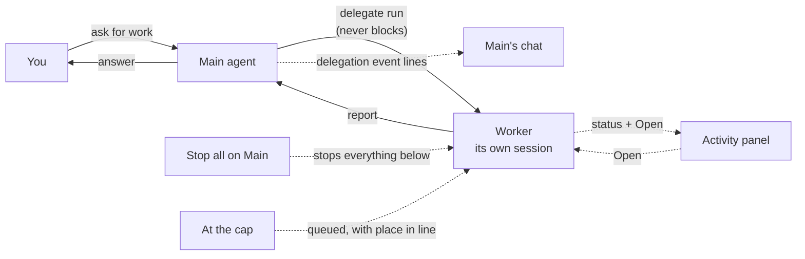

# Agents

Agents do the work in Omnipus. Omnipus ships four built-in chat colleagues—Mia, Jim, Ava and Admin—plus the native workers Planner, Researcher and General Purpose. Judge and Plan Supervisor are internal engine agents. You can create your own Main agents and workers from Agents.

## What it is

Open **Agents** in the sidebar and the roster has four sections:

- **Built-in roster** — Mia, Jim, Ava and Admin. Their identity and base instructions are protected, and Mia is the initial default.
- **Main agents** — chat colleagues you create yourself.
- **Sub-agent workers** — shipped and user-created workers. They are not chat colleagues; other agents delegate work to them, and you can assign workspace tasks to workers on the team.
- **System** — Judge and Plan Supervisor, internal engine agents that cannot be selected for chat or delegation.

A filter above the roster narrows the list to one [workspace](workspaces.md) team.

## When you would use it

- You want to change who answers when no agent is named. Set the default.
- You want a colleague with a fixed job and personality. Create a Main agent.
- You want focused labor behind your main agents. Create a worker.
- You already run a command-line agent tool and want Omnipus to delegate to it. Create an external worker.

## The base agents

The four built-in agents cover the everyday jobs.

| Agent | Role | What it is for |
|---|---|---|
| Mia | Assistant | Your everyday starting point. Answers questions and connects you with the right specialist. |
| Jim | Planner and Orchestrator | Turns a complex goal into tasks, delegates them to the right agents, and tracks the work to completion. |
| Ava | Builder | Interviews you about what you need, then creates a custom agent with the personality and tools you asked for. |
| Admin | Operator | Configures connectors, providers, channels, diagnostics and document dependencies. |

All four can hand the conversation to another agent when you ask them to. Ava is also a shortcut for creating agents: skip the form and describe what you want to her in chat.

## How to set your default agent

Omnipus picks the default when a conversation has no specific agent assigned.

1. Open **Agents** in the sidebar.
2. Find the card of the agent you want as the default.
3. Click **Set as default** on the card. The star moves to that agent.

Any chat colleague can hold the star, built-in or one you created. Workers never can.

A connector can also name its own default, which wins there. See [connectors](connectors.md).

## How to create your own agent

You create one of three types. The create buttons sit in the section headers of the roster.

| Type | Runs on | Works for | You can chat with it |
|---|---|---|---|
| Main | The Omnipus engine | You, directly | Yes |
| Subagent | The Omnipus engine | Other agents, through delegation | No |
| Subagent (External) | An external command-line tool | Other agents, through delegation | No |

1. Click **+ New Main** or **+ New Subagent** in its section header. For an external worker, click **+ Add Subagent (External)** and pick the command-line tool from the menu; entries for tools not installed on the host are greyed out.
2. Fill in **Identity**: name, color, and model. For workers, the description is required — it is what other agents read to decide when to delegate to this one.
3. Fill in **Personality**: the soul, the agent's persona prompt, is required for every type.
4. Main and Subagent have a third step, **Tools**, for tool permissions, skills, and fallback models. An external worker has no Tools step — it brings its own.
5. Create the agent. Its card appears in its section.

To change an agent, open its card. The edit slide-over saves as you type. Its tabs are **Basics**, **Personality**, **Tools**, **Skills**, and **Advanced**; an external worker shows **Runtime** instead of Tools and Skills. **Delete agent** asks you to confirm.

## How to delete an agent

**Delete agent** asks you to confirm twice: the first step explains that the agent and its chats, memory and related data are removed permanently, the second is the final confirmation. Dismissing either step deletes nothing. A locked core agent, a System Agent, and an agent that owns an active plan cannot be deleted — set another agent as the default, or stop/reassign the plan, first.

Deletion cleans the agent's own data first — its chats, its task assignments, and its references in workspaces — and removes the agent record last. If any part of that cleanup fails, the agent stays in the list and the message says it is only partly deleted; press **Delete agent** again to finish. Nothing is lost by retrying.

## How to lower one agent's tool-call limit

Every agent may make at most a set number of tool calls in one turn. The global limit lives in Settings, Performance; see [settings](settings.md#tool-calls-per-turn). One agent can have its own lower limit, for example a worker you want to keep on a short leash. An agent's own limit can equal or be lower than the global limit, never higher.

1. Open the agent's card and go to the **Advanced** tab.
2. Under **Execution**, type a number into **Max tool calls per turn**. It saves by itself.
3. The line under the field says where the agent's limit comes from:

| The line reads | Meaning |
|---|---|
| Using the global limit (200) | The agent has no own value and follows the global limit. |
| Lowered for this agent: 50 (global limit 200) | The agent's own value, 50, applies. |
| Own value 500 is above the global limit (200) and has no effect | See "An old higher value" below. |

4. To go back to the global limit, click **Use global limit** next to the field. That clears the agent's own value.

You can also set the value when you create the agent: open **Advanced** in the create form (on the **Tools** step for Main and Subagent, on the **Personality** step for an external worker). Leave it empty to follow the global limit.

A value above the global limit is not saved. On the profile, the field shows the refusal, which names the global limit and suggests raising it in Settings, Performance; your other changes on the profile still save. In the create form, creating the agent fails with the same message. Values must be whole numbers from 1 to 1000.

The same rules apply everywhere an agent is created or changed, including when you ask an agent in a chat to do it, as you would with Ava. The `create_agent` and `update_agent` tools refuse a value above the global limit or outside 1 to 1000, and sending an empty value (`null`) to `update_agent` clears the agent's own value.

**An old higher value.** Earlier releases let an agent's own limit be higher than the global one. Upgrading keeps that stored value untouched, but it no longer applies: the agent runs at the global limit, and its profile says the value has no effect. The gateway log lists every such agent in one warning at start-up. Type a lower value or click **Use global limit** to clear the warning. Lowering the global limit in Settings is the only thing that ever rewrites an agent's own value, and it asks you first.

A change applies from the agent's next turn; a turn already running keeps the limit it started with.

## Workers and delegation

A worker is just a session that another agent owns and steers. The delegating agent hands the worker a task and keeps working; the worker runs in its own session, with its own tools, its own transcript, and a chat you can open to watch it live.

```mermaid
flowchart LR
  You[You] -->|"ask for work"| Main[Main agent]
  Main -->|"delegate run<br/>(never blocks)"| Worker["Worker<br/>its own session"]
  Worker -->|"report"| Main
  Main -->|"answer"| You
  Main -.->|"delegation event lines"| MainChat[Main's chat]
  Worker -.->|"status + Open"| Side[Activity panel]
  Side -.->|"Open"| Worker
  StopAll["Stop all on Main"] -.->|"stops everything below"| Worker
  Queue["At the cap"] -.->|"queued, with place in line"| Worker
```

What this looks like in practice:

- The worker's own steps, narration and tool calls stay in its session. The parent's non-verbose chat uses muted delegation event lines; Verbose chat also shows delegate tool-call badges.
- The delegating agent can keep many workers running. **Activity** lists each worker's status and an **Open** control for its session, where you can watch it work.
- A **native** worker reports only to the agent that delegated it, never to the person. It uses a separate `message_parent` channel plus the steering surface (`status`, `steer`, `respond`, `redirect`, `resume`, `stop_all`), and nothing else.
- **A worker on an external command-line tool behaves differently.** A worker launched with an external-CLI executor (Claude Code, Codex or opencode) runs on that tool instead of the Omnipus engine. It has **no `message_parent`** channel — Omnipus hands its completed command-line output back to its parent. `delegate redirect` and `clear_goal` are unavailable, and `/stop-redirect` is refused with `not_steerable` on a running or stopped external helper (a finished helper is told to use Resume for its next round, which works only under the conditions described below). Steering it is different too: the parent's `delegate steer` — or a message you type directly into the helper's own chat — **interrupts the running tool** and continues the same CLI conversation with the new instruction; with **no live conversation** the request is refused as `not_steerable`, reported rather than silently starting a fresh conversation. Sending a message to a live external helper therefore **kills the tool's subprocess**, exactly as Stop does. `delegate steer` never revives an external helper that has no live conversation; it is refused as `not_steerable`. Whether a stopped or finished external helper can be continued depends on two facts, not on the helper being stopped or finished: has its CLI conversation started, and does the gateway still retain it? If it started and is still retained, `delegate resume`, `delegate respond` and a message typed into the helper's chat continue that same conversation. If it started and is no longer retained (it was released when the helper's episode ended, or the gateway restarted), they are **refused** with a message to start a **new delegation**. If it never started (the helper was stopped before its CLI ever ran), `delegate resume` and a typed message run it for the first time. `delegate steer` is different: it needs a CLI run in flight, and for a helper with none it is refused as `not_steerable` without reviving anything. On a still-running helper, `delegate resume` does nothing and sends no text (use `steer`). `delegate respond` answers one open question by its correlation id; an external helper cannot raise a question with `message_parent`. For a helper with a run in flight the answer is delivered the way `steer` is (interrupting the running tool); otherwise it follows the same revival rules as `resume`. Neither `resume` nor `respond` ever creates a new worker session in the helper's place. What still works: `status` (state and elapsed time before and after completion, but no live CLI progress snapshot), the Stop button, `stop_all`, and the Activity panel's listing and **Open**.
- **A live instruction reaches an external worker running a task too.** While an external-CLI worker has a CLI run in flight for a **task**, the parent's `delegate steer` — or a message you type into that run's chat — interrupts the running tool and the task resumes the same CLI conversation with the instruction, inside the same task run: the task's claim, attempts and result are unchanged. When no CLI run is in flight, `delegate steer` is refused as `not_steerable` and nothing is delivered; a message you type into the chat is not treated as a steer at all and follows the ordinary chat path. Stop still ends the run; it does not deliver the instruction.
- **Changing a worker's runtime does not affect work already running.** An agent's runtime (native, or an external CLI tool) is fixed when a worker is launched. If you change that agent afterwards, work already in flight keeps to the runtime it started on; where the change makes the live runtime disagree with the started work, that work **refuses** rather than silently switching — the recovery is a **new delegation** (or, for a task, **Rerun**).
- The delegating agent never blocks. The tool returns as soon as the worker is launched and dispatched, and the agent carries on. When it needs the worker's answer, the worker wakes it on completion.
- **Stop pauses only the current session.** One Stop-button press or `/stop` ends that session's current turn, including its first turn and turns started by a schedule or heartbeat. It shows as **Stopped**, not failed. Its helpers keep working and send their results into its inbox. **Stopped** is shown after that execution's work and cleanup finish. A storage failure is reported as an error, not claimed as a successful Stop; a failure discovered after the request was accepted is reported when its execution settles. Work so far stays, the session is resumable on the same conversation and generation (the same round of work), and its goal stays active. A stopped helper's status is saved in its parent's session. Re-delivering an older stop notice after Resume does not change the helper's current state.
- **Activity follows the helper's current state.** Stopped helpers leave **Running now** and the running count even though their delegation remains open for Resume. Their stopped rows keep **Open**, and do not keep counting elapsed running time. The **Agents · Activity** control remains available for retained stopped helpers. Resume on the same conversation returns the same helper to Running now when it is running again; a stopped helper is not reported as a failed one.
- **A gateway restart stops work without failing the conversation.** A main conversation whose queued or running execution was cut off shows **Interrupted**; its helper sessions stay resumably **Stopped**. Saved history and active goals stay in place, and a Stop already requested keeps its own reason. Restart recovery never automatically replays that instruction. Your next chat or channel message continues the same conversation and round of work with a fresh execution, including normal delegation. For a standing heartbeat or scheduled conversation, its next normal tick or trigger can likewise continue a restart stop; this is the schedule continuing, not boot replay. After a physical restart, a heartbeat's next interval is counted from gateway startup; recovery does not run a catch-up turn during boot. A human Stop of live work still holds until a person resumes it. Pressing Stop on a conversation already marked Interrupted does not replace its restart reason: a later message or normal scheduled trigger can continue that conversation. A readable prior-boot execution shows Interrupted even if its recovery update could not be saved; the label alone is not proof that the saved stop landed. A main conversation waiting on a lost approval or question is interrupted too; it does not re-ask that old prompt, and your next message continues normally. Prompts from the current gateway process are left alone. Idle conversations and completed answers are not marked interrupted.
- **A previous reply can still be finishing.** If another message reaches the same conversation before its prior execution has settled, Omnipus waits briefly. If that execution is still pending when the wait ends, the message receives **Your previous reply is still finishing — send your message again in a moment.** It is not reported as a generic timeout and does not start a second execution. This wait belongs to that conversation, not every chat with the same agent. An explicitly cancelled caller does not start new work.
- **Saved Stop notices are reminders, not failures.** After a restart, an untaken notice rings the working parent again under the same notice identity. A stopped parent keeps the notice without waking. If shutdown cancels a pending notice before its turn is admitted, the notice stays pending; it does not start a new round of parent work or count as read. The reminder does not resume the helper or clear its goal; only a new message or an explicit Resume continues it.
- **Stop all pauses the whole tree below that session.** In web chat, a first Stop-button press, Escape or `/stop` opens a three-second confirmation window; another Stop activation in that same chat confirms Stop all. The same Stop button stays available during the window—there is no separate Stop-all button. The window closes after three seconds, when the window loses focus, or when you switch chats. `/cancel` is the immediate, explicit Stop-all confirmation: it stops the current session and every helper under it, including helpers queued for a slot. It never reaches a parent or a sibling, and it never clears a goal. The delegating agent's `stop_all` is the same Stop all, with the same downward scope. Every Stop works the same way, whoever presses it: the running work is asked to stop at once, and if it is still going 3 seconds later it is stopped forcibly. That applies only to the run the Stop selected. A helper shows as stopped once its running work has shut down. If you resume the helper in the meantime, the resumed run is a new run and the pending forced stop leaves it alone; a new Stop is needed to stop it.
- **The chat redirect command replaces the current chat's turn.** In a root chat or a native helper chat, type `/stop-redirect <instruction>` (external-CLI helper chats refuse this redirect — use Stop, or the parent's delegate actions described above). It stops that conversation's current turn, then continues that same conversation with the new instruction; its helpers keep working. It does not target a helper below the chat. A stopped helper continues on the same conversation and generation. A finished helper has no turn to replace: use Resume for its next round. A blank instruction returns usage and changes nothing. A chat without an attached active session shows guidance and sends no redirect. Store or control failures are shown, not reported as a successful redirect; an unreadable saved session reports a read error.
- **A message steers too.** For a **native** helper, a message into its working turn is delivered into that turn and never stops it; a message into a stopped helper resumes it on the same conversation and generation, and a message into a finished (done or failed) helper starts its next round. For a helper on an **external command-line tool**, a message you type into its open chat is delivered the same way the parent's `delegate steer` is: it **interrupts the running tool and continues the same CLI conversation**. A message typed into a stopped or finished external helper is handled as a revival (like `delegate resume`), not as a `delegate steer`: it continues the same CLI conversation if that conversation started and the gateway still retains it, runs the helper for the first time if its CLI never started, and is otherwise refused rather than silently starting a fresh one — start a new delegation (see the note above).
- **No person-only wait.** When a helper needs a person, it asks its parent with an ordinary message and keeps working; the parent reaches you through ordinary chat text. There is no special pause and no 24-hour expiry — a helper never fails because a person was unavailable.
- When too many workers are already running, the next one is **queued** — the parent's tool result tells it its place in line, and queued workers start in order as slots free. There is no blocking wait, and `delegate stop_all` stops a queued worker.

If a queued worker cannot start and its failure outcome cannot be saved, Omnipus sends its direct parent a nonfatal storage-error notice when the worker's saved record is still readable and the parent's inbox can be written. The notice is not a saved final outcome and does not restart the original instruction. It waits in the parent's inbox; it does not by itself wake or resume that parent. A failed notice save is not reported as successful delivery or recovery.

If a helper is waiting for a slot, separate notifications that wake it are kept in arrival order for the same queued turn. When a slot opens, that turn receives every queued notification once; a later notification does not create another queued worker or replace the earlier input. Retrying the same notification ID does not add its text again. Reusing that ID with different content returns an error and keeps the original input. These inputs remain attached to the original queued execution; the concurrency limit still applies.

An instruction that reaches a helper just as its turn is ending is still delivered to that same helper, in a short follow-up step of the same working session. Omnipus saves the exact instruction text in the helper's own transcript before it counts the instruction as delivered, so opening the helper's chat shows what it was told. A repeated delivery of the same instruction is saved once, and the helper is not run a second time for it.

The exact caps on all of this — how deep a chain may go, how many may run at once, and how long a child may run — live on the Performance tab; see [settings](settings.md#delegation-limits) for the values and their defaults.

A worker has its own settings — its model, its tools, its limits. The delegating agent hands over the task; the worker supplies everything else. Delegation itself is a per-workspace decision: which agent may delegate to which is set in that [workspace](workspaces.md) **Team** panel, and that rule applies only there.

**Every delegation names its target, including the agent's own.** There is no default target and no "send it back to whoever asked" shortcut: a `delegate` call with `action="run"` must give an `agent_id`, and one that omits it, passes null, or passes a blank value is refused before any work starts. The other actions (`status`, `steer`, `respond`, `resume`, `stop_all` and so on) address an existing worker by its `session_id` and do not need an `agent_id`. Naming the caller itself is allowed, and it forks a **new session running the same agent** — it never injects work into the chat that agent is already in. That fork needs a line from the agent to itself, exactly like any other handoff.

**The built-in General Purpose worker can delegate onward when permitted.** By default, a workspace seeded with General Purpose on its team gets a General Purpose → General Purpose edge for task and background `delegate` calls, capped at depth 3 or a lower configured limit. Custom workers get no automatic **cross-agent** outgoing edge; to let one delegate to another team agent, add the edge in that workspace's Team panel and allow its `delegate` tool. Without an edge, the request is denied; an edge alone does not grant a denied tool, and it does not give an external-CLI worker the ability to create Omnipus helpers. **Any agent can have an edge to itself** — a self-line is an ordinary Team line, so an agent handed a fresh piece of work back to itself needs one exactly like any other pair. A custom worker gets its own self-line the same way a built-in agent does: Omnipus adds one for each agent that newly joins a team, whichever route it joins by, unless its id is on the operator's seed-exclusion list (see [settings](settings.md#which-new-agents-get-a-self-line)). The two hidden engine agents and Admin cannot be added to a workspace team. Edit or remove a self-line in the workspace Team panel like any other line; a removed self-line is not restored while the agent stays on the team.

An **external worker** runs on a command-line tool installed on the same machine as Omnipus: Claude Code, Codex, or OpenCode. Its model is a free-text name passed straight to that tool. Before it saves changes to an external worker, Omnipus checks the connection automatically: that the tool's program is present, that it answers, and that it is signed in. If the check fails, the save is refused. The check runs on the first save after you open the worker, and after that only when you change the path to the tool's program, or when the previous check failed — not on every save. It spends no model usage. To try the worker by hand, open it and use **Send a test message** on its **Runtime** tab; this runs a real request through the tool, so it spends a small amount of usage.

Two things to watch with external workers:

- The tool choice is fixed when you create the worker. To move to a different tool, create a new worker. The path to the tool's program stays editable.
- Omnipus tool permissions do not reach inside the external tool. It uses its own tools and its own safety settings; the allow, ask, and deny rules govern Omnipus [tools](tools.md) only.
- The tool-call limit does reach it. An external worker follows the same global **Max tool calls per turn**, and can have its own lower limit on its **Advanced** tab like any other agent. Omnipus passes the limit to the tool as its cap on agent turns: Claude Code receives it as `--max-turns`, and for Codex and OpenCode Omnipus counts the turns and stops the run when it goes past the cap. There is no separate built-in default for external workers.

## How to set up a heartbeat

A heartbeat is a scheduled check-in for one agent in one workspace. The same agent can have a different heartbeat, or none, in each workspace. Workers cannot have heartbeats.

1. Open the workspace **Team** panel and open the agent from there. The edit slide-over now shows a **Heartbeat** tab.
2. Open **Heartbeat** and switch **Enable heartbeat** on.
3. Set **Interval (minutes)** to five or more.
4. Write the **Heartbeat body**, which is the prompt the agent receives at each check-in. For example: "Check the inbox and start a task for anything new."
5. Click **Save heartbeat**. The agent now runs the prompt on that interval in a dedicated heartbeat session.

If nothing needs attention, the agent records an all-clear. Heartbeat sessions stay at the top of the sidebar session list. After a successful check-in, the next interval is counted from that check-in's completion, in the same heartbeat conversation; no gateway restart is needed between check-ins. Scheduled task work is a different feature; the [calendar](calendar.md) page covers it.

## Limits and things to watch

- Ordinary built-in agents' identity and base instructions are protected. Model and supported execution limits remain editable, as do tool policies, connector assignments and skills.
- Workers are invisible to chat. They have no voice, no heartbeat, and can never be the default.
- Other agents need an appropriate workspace delegation edge to delegate to a worker. A worker on the workspace team can also be assigned a task by the user.
- An external worker depends on its tool being installed. If the tool is missing, the create menu shows it greyed out.
- An agent's own tool-call limit can only be lower than or equal to the global limit in Settings, Performance.
- Editing autosaves. A red save indicator means the last change failed; correct the field it names and the next change saves.

## Related pages

- [Workspaces](workspaces.md) — where teams live and delegation trust is set
- [Connectors](connectors.md) — per-connector default agents and routing
- [Tools](tools.md) — the allow, ask, and deny rules for Omnipus tools
- [Skills](skills.md) — reusable playbooks an agent picks up
- [Calendar](calendar.md) — scheduled task work, separate from heartbeats
