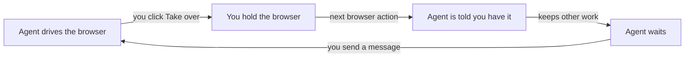

# Live browser

The live browser panel shows a real Chrome browser running on your Omnipus server, driven by an agent. You can watch the work as it happens, take the wheel yourself, and hand it back with your next message.

## What it is

Each [workspace](workspaces.md) has one browser. When an agent browses, it drives that browser with its tools: open a page, click, type, select, read text, take screenshots, manage tabs, and answer pop-up dialogs. If it reaches a sign-in it should not do for you, it can hand the browser over and wait.

The panel streams that browser to your screen as live video, with sound when the page has any. You can drive it too: your mouse, keyboard and scrolling reach the same pages the agent sees.

The browser belongs to the workspace whose chat you opened it from. Chats with that workspace's team share its tabs and its signed-in sessions, so a login you perform yourself stays available to the agent.

If the video cannot connect, you get an error with a reason and a Retry button — never a blank frame, never a quieter stand-in picture.

On a fresh install, Jim and Ray have browser tools; Mia and Ava do not. Operators can change this — see [agents](agents.md) and [tools](tools.md).

## When you would use it

- Watching work as it happens: see what a search returns before the agent finishes.
- Taking over mid-task: log in yourself, finish a payment, solve a check the agent cannot.
- Reviewing a site an agent built: previews it serves open in this panel — see [previews](previews.md).
- Pointing at a problem: draw a box and send a comment into the chat.

## How to open and watch

1. In a chat, click **Open browser** next to the message composer. A panel docks on the right side of the screen. If the agent has not browsed yet, you get a ready blank tab.
2. Click **Watch live** on any browser action in the thread instead, if you want the panel for that exact step.
3. Wait for the picture. A spinner shows until the first frame arrives.
4. Read the status chip in the toolbar: "<Agent> is browsing…" while the agent drives, "Click to drive" when idle, "Also viewing" when someone else has the panel open.
5. Click **Pop out** for a window of its own, or **Close** to dismiss it. Closing the panel does not stop the agent's run.

## How to take over from the agent

1. Click anywhere in the picture, or click the **Take over** button while the agent is working.
2. Drive as you would in any browser: click, type, scroll. Input works even while the agent works — the wheel decides who the agent yields to, not whether your clicks land.
3. Taking over does not stop the agent's run. On its next browser action it is told a person holds the browser, so it stops browsing and keeps doing other work. A line appears in the chat: "A person has taken control of the browser. The agent has stopped driving it — send a message to give it back."
4. Send a chat message to hand the browser back. Pressing **Esc** stops your driving but does not restart the agent; it still waits for your message.
5. If you walk away, your hold ends after 15 minutes of no activity — the default; an operator can change or disable the timer.

Taking over stops the agent's browsing, not its run; your next message hands the browser back.

An agent can also hand the browser to you, for example at a sign-in. The chat shows: "The agent handed the browser over to you. It has stopped driving — send a message when you are done and it will pick it back up."

## What the panel shows

The panel has two rows of controls above the live picture.

| Control | What it does |
|---|---|
| Tab strip | Switch, close or open the browser's tabs |
| Back, Refresh, Stop loading | Move around without touching the page |
| Address bar | Type an address or search words, press Enter |
| Agent chip | Which agent's browser you are watching |
| Status chip | Who is driving, or the connection state |
| Annotate | Draw a region and send a comment to the chat |
| Mute | Turn page sound on or off; shown when the page has sound |
| Pop out | Move the panel into its own window |
| Take over | Shown while the agent works; click to hold the browser |
| Retry | Shown with an error; starts a fresh video connection |

To annotate, click the annotate button, drag a box (or click a spot), write your comment, click **Send**. A cropped picture and your comment land in the chat as a normal message. Annotate works in the docked panel, not in the pop-out window.

## Limits and things to watch

Every failure is shown as an error with its reason and a Retry button.

| The panel says | What it means |
|---|---|
| Live video is turned off for this installation | An operator disabled it; they can enable it in Settings |
| Live video isn't supported on this server | The server platform or build cannot capture video; browsing still works |
| Live video isn't available in this lite build | This install was built without video |
| Live video is already in use by another agent | Close that other live view, then Retry |
| The browser's video capture didn't start in time | Retry; restart the live view if it repeats |
| Live video connection failed | Retry; reload the page if it repeats |

Other things to watch:

- Live video needs a server that supports it. Linux servers do; on other server platforms the agent can still browse, but the panel cannot show video.
- Locked-down networks can block the live media stream. You get the error above, not a lower-quality fallback.
- Sound starts muted. Click the mute button to hear the page.
- Your input pauses while the picture is not safe to click on — while the panel reconnects, resizes, or waits for the page to settle. A notice at the bottom says so, and input has its own Retry button when its connection drops.
- Watching or closing the panel never stops the agent's run. Only the chat Stop button cancels a turn.

## Related pages

- [previews](previews.md) — sites an agent serves for you open in this panel
- [workspaces](workspaces.md) — the browser belongs to a workspace and is shared by its team
- [agents](agents.md) — who Jim, Ray, Mia and Ava are, and what each one does
- [tools](tools.md) — how Allow, ask and deny govern the browser tools
