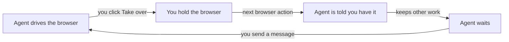

# Live browser

The live browser panel shows a real Chrome browser running on your Omnipus server, driven by an agent. You can watch the work as it happens, take the wheel yourself, and hand it back with your next message.

## What it is

Each [workspace](workspaces.md) has one browser. When an agent browses, it drives that browser with its tools: open a page, click, type, select, read text, take screenshots, manage tabs, and answer pop-up dialogs. If it reaches a sign-in it should not do for you, it can hand the browser over and wait.

The panel streams that browser to your screen as live video, with sound when the page has any. You can drive it too: your mouse, keyboard and scrolling reach the same pages the agent sees.

The browser belongs to the workspace whose chat opened it. That workspace's team shares its tabs and signed-in sessions.

If the video cannot connect, you get an error with a reason and a Retry button — never a blank frame, never a quieter stand-in picture.

On a fresh install, Mia, Jim and Ava have browser tools. Admin and the shipped workers do not. Operators can change supported capability settings — see [agents](agents.md) and [tools](tools.md).

## When you would use it

- Watching work as it happens: see what a search returns before the agent finishes.
- Taking over mid-task: log in yourself, finish a payment, solve a check the agent cannot.
- Reviewing a site an agent built: previews it serves open in this panel — see [previews](previews.md).
- Pointing at a problem: draw a box and send a comment into the chat.

## How to open and watch

1. In a workspace chat, click **Open browser** in the top bar. The panel docks on the right with a blank tab if browsing has not started.
2. Alternatively, click **Watch live** on a browser action in the thread.
3. Wait for the picture. A spinner shows until the first frame arrives.
4. Read the status chip in the toolbar: "<Agent> is browsing…" while the agent drives, "Click to drive" when idle, "Also viewing" when someone else has the panel open.
5. Select **Expand Browser panel** in the panel heading to open the full-screen Browser in a new browser tab, or to switch to a recognised existing tab for that Browser session and agent. Use the heading's **Close** control to dismiss the docked panel; closing it does not stop the agent's run. The full-screen view has **Back to chat**; [panels beside chat](using-omnipus-ui.md#panels-beside-chat) explains how it returns.

## How to take over from the agent

1. Click anywhere in the picture, or click the **Take over** button while the agent is working.
2. Click, type, and scroll as in any browser.
3. Taking over does not stop the run. At its next browser action, the agent stops browsing and continues other work. The chat tells you to send a message when you want to return control.
4. Send a chat message to hand the browser back. Pressing **Esc** stops your driving but does not restart the agent; it still waits for your message.
5. If you walk away, your hold ends after 15 minutes of no activity — the default; an operator can change or disable the timer.

```mermaid
flowchart LR
  Agent[Agent drives the browser] -->|you click Take over| Held[You hold the browser]
  Held -->|next browser action| Told[Agent is told you have it]
  Told -->|keeps other work| Wait[Agent waits]
  Wait -->|you send a message| Agent
```

Taking over stops the agent's browsing, not its run; your next message hands the browser back.

An agent can also hand you the browser, for example at a sign-in. Send a message when you are done to return control.

## What the panel shows

The panel has two rows of controls above the live picture.

| Control | What it does |
|---|---|
| Tab strip | Switch, close or open the browser's tabs |
| Back, Refresh, Stop loading | Move around without touching the page |
| Address bar | Type an address or search words, press Enter |
| Agent chip | Which agent's browser you are watching |
| Status chip | Who is driving, or the connection state |
| Annotate | Draw a region and send a comment to the chat |
| Mute | Turn page sound on or off; shown when the page has sound |
| Expand Browser panel | Open or switch to the full-screen Browser tab for the current session and agent |
| Take over | Shown while the agent works; click to hold the browser |
| Retry | Shown with an error; starts a fresh video connection |

To annotate, click the button, mark a region, write your comment, and click **Send**. The crop and comment enter the chat. Annotation works only in the docked panel.

## Limits and things to watch

Every failure is shown as an error with its reason and a Retry button.

| The panel says | What it means |
|---|---|
| Live video is turned off for this installation | An operator disabled it; they can enable it in Settings |
| Live video is not available because the managed Chrome build cannot capture the browser tab | Run the gateway installer to download a full Chrome build, or set `tools.browser.exec_path` to a local full Chrome binary. See gateway logs for the exact cause |
| Live video isn't available in this lite build | This install was built without video |
| Live video is already in use by another agent | Close that other live view, then Retry |
| The browser's video capture didn't start in time | Retry; restart the live view if it repeats |
| Live video connection failed | Retry; reload the page if it repeats |

Other things to watch:

- Live video can run on Linux and macOS when the installation has a usable full Chrome build and the required capture support. Windows does not pass the current live-video capability gate.
- On Windows, available memory cannot be measured, so Omnipus permits one browser for the whole host regardless of its physical RAM. Browser support on Windows is degraded and unsupported; there is no setting that raises this browser floor.
- The operator setting `tools.browser.cache_trim_interval` controls how often closed browser profiles are swept. It does not bound a profile's size. A workspace driven continuously, with no idle gap, keeps growing its cache because Omnipus never trims a live browser.
- Locked-down networks can block the live media stream. You get the error above, not a lower-quality fallback.
- Sound starts muted. Click the mute button to hear the page.
- Your input pauses while the picture is not safe to click on — while the panel reconnects, resizes, or waits for the page to settle. A notice at the bottom says so, and input has its own Retry button when its connection drops.
- Watching or closing the panel never stops the agent's run. Only the chat Stop button cancels a turn.

## Related pages

- [previews](previews.md) — sites an agent serves for you open in this panel
- [workspaces](workspaces.md) — the browser belongs to a workspace and is shared by its team
- [agents](agents.md) — the built-in chat colleagues and workers, and what each one does
- [tools](tools.md) — how Allow, ask and deny govern the browser tools
