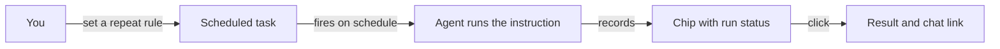

# Calendar and recurring work

The Calendar tab of a workspace is where everything that runs on a schedule lives: one-time runs, repeating series, and the outcome of each run. If work has to happen every Monday at 9:00, you set it up here.

## What it is

Every workspace has a Calendar tab, between Tasks and Library. It shows a Month, Week, Day, or Agenda grid. Each scheduled run appears as a chip at the moment it fires, the way a recurring meeting appears in a meeting calendar. A repeating task gets a chip on every occurrence in view, not only the next one.

All scheduled work lives here and nowhere else. The Tasks screen shows work with no schedule attached; a task with a schedule, one-time or repeating, appears only on the calendar. The split is deliberate: a card that comes back every week never reaches done, so it does not belong on a board. Old web addresses still resolve: `/tasks` redirects to the Tasks screen and `/automations` redirects to the Calendar.

The calendar also records outcomes. Each run chip carries a status icon, and clicking a chip opens the event panel with that run's status, its result, and a link to the chat it ran in.

A repeat rule keeps firing on its own; the calendar shows each run and how it went.

## When you would use it

- Standing work on a rhythm: a weekly report, a monthly invoice check, a daily scan.
- One run at a chosen future time, without putting a card on the board.
- Reviewing outcomes: did last night's run succeed, and what did it produce?
- Planning a week: filter the calendar to one agent and read only their commitments.

## How to schedule repeating work

1. Open the workspace and click the Calendar tab.
2. Click a day, or a time slot in Week or Day view. The New task button in the toolbar works too. A New event panel opens with the date filled in: a plain day click defaults to 9:00, a time slot takes that exact time.
3. Fill in the title and pick the agent who runs it. Write the instruction, which is what the agent does each time the task fires, and add at least one acceptance criterion and one Definition of Done item.
4. Open the Repeat dropdown. It offers presets computed from the date you picked: Does not repeat, Daily, Weekly on Monday, Monthly on the third Monday, Annually on July 20, Every weekday, and Custom.
5. Pick Custom for anything else. Choose the frequency, from minutes to years, and a multiplier from 1 to 99. Weekly rules take a weekday selection, monthly rules take a day of the month or an nth weekday. End the rule with Never, On date, or After N occurrences. A plain-English summary of the rule is shown at all times.
6. Save. The task appears as chips on every occurrence in the visible range.

Leaving Repeat on Does not repeat, with a time set, creates a one-time task that runs at that moment. It is scheduled work, so it lives on the calendar rather than the Tasks screen.

## How to edit or stop a series

1. Click any chip of the series. The panel opens in edit mode and lists the next runs under Upcoming.
2. Change the title or the agent and save. The schedule stays untouched.
3. Change the repeat rule or the time and save. The series restarts its count from now, and the panel says so before you save.
4. To end a series, edit it and set the end to On date or After N occurrences.

You edit a series as a whole: you cannot change one occurrence alone or drag its chip to another day.

## What you see on the calendar

Each kind of chip on the grid carries a specific meaning. The toolbar also has an agent filter, set to All agents by default, which narrows the grid to one agent or to unassigned work the moment you pick a name.

| Chip | What it means |
|---|---|
| Run chip | One run of a scheduled task, at its fire time; the icon shows that run's status |
| Aggregated chip | A task firing more than three times a day, collapsed to one chip per day in Month view, labeled with its rhythm |
| More not shown | The server capped how many runs it expanded for that task; the days beyond the marker are not empty |
| Due chip | The deadline of an unscheduled task, shown on its due date |

An agent heartbeat is separate from scheduled task work and does not appear on the calendar. See [agents](agents.md) to configure one.

## Limits and things to watch

- A missed run is skipped, never replayed. If the server was down at the fire time, that occurrence is gone, and After N occurrences counts planned runs, not completed ones.
- A failed run does not stop the series. The next occurrence fires anyway; the failure is recorded on its chip.
- The fastest repeat is once a minute.
- Monthly on day 29, 30, or 31 lands on the last day of shorter months, so nothing is skipped in February.
- Times hold their wall-clock position across daylight-saving changes. New rules use your browser's time zone.
- Tasks created before this editor existed, or through agent tools, can carry an old internal schedule format. They keep firing and appear on the calendar; opening one shows an old-schedule note with its next run and a fresh repeat picker. Saving a new rule replaces the old schedule, and the fire times may shift.
- No schedule syntax is ever shown or typed anywhere in the product. You always work with the repeat picker and its plain-English summary.

## Related pages

- [workspaces](workspaces.md) — what a workspace is; the Calendar is one of its tabs.
- [tasks](tasks.md) — unscheduled work on the board, and how it differs from scheduled work.
- [agents](agents.md) — the agents you can assign scheduled work and heartbeats to.
- [goals](goals.md) — ongoing outcomes that outlive any one recurring task.
