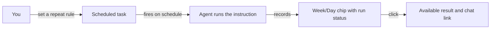

# Calendar and recurring work

The Calendar panel of a workspace is where everything that runs on a schedule lives: one-time runs, repeating series, and the outcome of each run. If work has to happen every Monday at 9:00, you set it up here.

## What it is

Every workspace has a Calendar panel, between Tasks and Library in the top bar. It opens beside Chat on **Week** by default. Choose **Day**, **Week**, or **Month** in its toolbar; Month stays inside the same panel, including the phone full-screen view. There is no Agenda view. Week and Day show scheduled runs as labelled chips at their fire times. Month is a compact day grid with up to three status-coloured dots per date. Dots do not open run details; switch to Week or Day to inspect a recorded run or edit its series. Clicking a Month date creates a new event.

In a narrow panel or on a phone, the toolbar controls wrap onto extra rows so the view choices, agent filter and **New task** button remain visible and easy to tap.

The Board and List hide scheduled tasks; use Calendar to manage scheduled and repeating work. The split is deliberate: a card that comes back every week never reaches done, so it does not belong on a board. Old web addresses still resolve: `/tasks` redirects to the Tasks panel and `/automations` redirects to the Calendar.

The calendar also records outcomes. In Week and Day, individual recurring-occurrence chips use the recorded run's status icon when a run exists, or the scheduled or no-record state when it does not. One-time scheduled-task chips use a clock icon, with colour taken from the task's status. Clicking a recorded occurrence lets you inspect its status and, when available, its result and a link to the chat it ran in.

```mermaid
flowchart LR
  You[You] -->|set a repeat rule| Task[Scheduled task]
  Task -->|fires on schedule| Run[Agent runs the instruction]
  Run -->|records| Chip[Week/Day chip with run status]
  Chip -->|click| Panel[Available result and chat link]
```

A repeat rule keeps firing on its own; use Week or Day to review recorded runs and how they went.

## When you would use it

- Standing work on a rhythm: a weekly report, a monthly invoice check, a daily scan.
- One run at a chosen future time, without putting a card on the board.
- Reviewing outcomes: did last night's run succeed, and what did it produce?
- Planning a week: filter the calendar to one agent and read only their commitments.

## How to schedule repeating work

1. Open the workspace and choose **Calendar** in the top bar or panels menu.
2. Click a day, or a time slot in Week or Day view. The New task button in the toolbar works too. A New event panel opens with the date filled in: a plain day click defaults to 9:00, a time slot takes that exact time.
3. Fill in the title and pick the agent who runs it. Write the instruction, which is what the agent does each time the task fires, and add at least one acceptance criterion and one Definition of Done item.
4. Open the Repeat dropdown. It offers presets computed from the date you picked: Does not repeat, Daily, Weekly on Monday, Monthly on the third Monday, Annually on July 20, Every weekday, and Custom.
5. Pick Custom for anything else. Choose the frequency, from minutes to years, and a multiplier from 1 to 99. Weekly rules take a weekday selection, monthly rules take a day of the month or an nth weekday. End the rule with Never, On date, or After N occurrences. A plain-English summary of the rule is shown at all times.
6. Save. Week and Day show individual scheduled occurrences as chips, subject to the server's expansion limits; **More not shown** warns when expansion was capped. Month represents the returned event data with status-coloured dots, including the server's per-day groupings of frequent repeats where they apply. The grid itself prints no rhythm or count labels; hovering a date lists its first three event titles and can show a "+N more" count.

Leaving Repeat on Does not repeat, with a time set, creates a one-time task that runs at that moment. The Board and List hide it; use Calendar to manage it.

## How to edit or stop a series

1. In Week or Day, click a chip of the series to open its editor. For a rule-based repeating series, **Upcoming** appears only when future occurrences have loaded. In Month, switch to Week or Day first; clicking a date creates a new event.
2. Change the title or the agent and save. The schedule stays untouched.
3. Change the repeat rule or the time and save. The series restarts its count from now, and the panel says so before you save.
4. To end a series, edit it and set the end to On date or After N occurrences.

You edit a series as a whole: you cannot change one occurrence alone or drag its chip to another day.

## What you see on the calendar

Week and Day use labelled chips with the meanings below. Month represents the event data with status dots rather than these chip labels; when a task repeats more than three times in a day, the server groups that day into a single entry for the broader Month range, and the grid shows only its dot. A date's hover text lists up to three event titles and may include that day's grouping label. The toolbar also has an agent filter, set to All agents by default, which narrows the grid to one agent or to unassigned work the moment you pick a name.

| Chip in Week or Day | What it means |
|---|---|
| Recurring occurrence chip | One scheduled occurrence of a repeating task, at its fire time; the icon reflects its recorded run or its scheduled or no-record state |
| One-time chip | A one-time task's scheduled fire, shown with a clock icon and the task's status colour |
| More not shown | The server capped how many runs it expanded for that task; the days beyond the marker are not empty. This marker does not open run details |
| Due chip | A workspace task's deadline, including a task that also has a schedule, shown on its due date |

An agent heartbeat is separate from scheduled task work and does not appear on the calendar. See [agents](agents.md) to configure one.

## Limits and things to watch

- A missed run is skipped, never replayed. If the server was down at the fire time, that occurrence is gone, and After N occurrences counts planned runs, not completed ones.
- A failed run does not stop the series. The next occurrence fires anyway; the failure is shown on its Week/Day chip.
- The fastest repeat is once a minute.
- Monthly on day 29, 30, or 31 lands on the last day of shorter months, so nothing is skipped in February.
- Times hold their wall-clock position across daylight-saving changes. New rules use your browser's time zone.
- Tasks created before this editor existed, or through agent tools, can carry an old internal schedule format. They keep firing and appear on the calendar; opening one shows an old-schedule note with its next run and a fresh repeat picker. Saving a new rule replaces the old schedule, and the fire times may shift.
- No schedule syntax is ever shown or typed anywhere in the product. You always work with the repeat picker and its plain-English summary.

## Related pages

- [workspaces](workspaces.md) — what a workspace is; the Calendar is one of its panels.
- [tasks](tasks.md) — unscheduled work on the board, and how it differs from scheduled work.
- [agents](agents.md) — the agents you can assign scheduled work and heartbeats to.
- [goals](goals.md) — ongoing outcomes that outlive any one recurring task.
