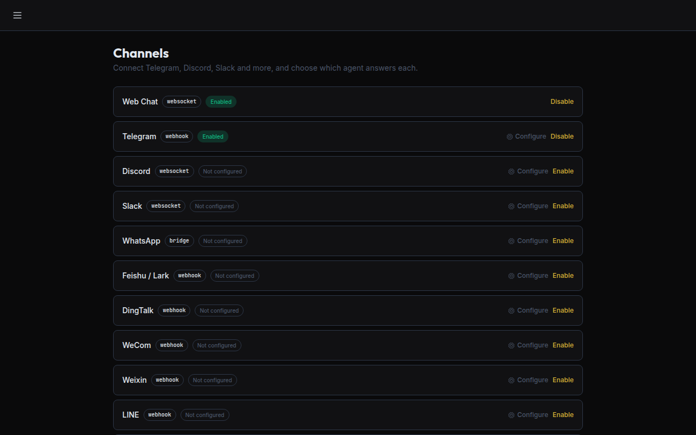
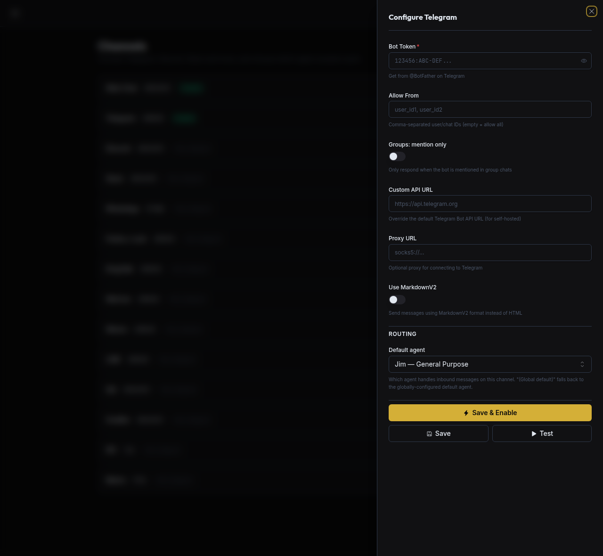

# Channels

> Back to [docs index](README.md)

Talk to your Omnipus through Telegram, Discord, WhatsApp, Matrix, QQ, DingTalk, LINE, WeCom, Weixin, Feishu, Slack, IRC, or Google Chat. **The web app is the primary way to set channels up.** Editing `config.json` by hand (shown in each [per-platform section](#per-platform-credentials)) is an optional alternative for headless or automated deployments.

## Configure a channel in the app

Open **Connectors** in the sidebar — the screen that lists every channel. (It used to be called **Channels**; the sidebar entry is now **Connectors**.) Every channel is a card showing its transport and status, with **Configure** and **Enable / Disable** actions.


*Screenshot predates the **Channels → Connectors** rename — the sidebar entry now reads **Connectors**.*

Click **Configure** on the channel you want. The panel has two parts:

1. **Connection** — paste the channel's credentials (e.g. a Telegram **Bot Token**) and any transport options (allow-list, proxy, custom API URL). The [per-platform sections below](#per-platform-credentials) tell you exactly where to get each value. Secrets are stored encrypted in `credentials.json`, never in plain config.
2. **Routing → Default agent** — choose which agent answers messages on this channel. Leave it on **"(Global default)"** to use your [global default agent](using-omnipus-ui.md#managing-agents) (the ★ on the Agents page), or pick a specific agent to dedicate the channel to it.



Click **Save & Enable** to connect the channel and start routing — no file editing required.

> Which agent answers is resolved most-specific-first: per-user → per-guild/team → this channel's default → the global default. For the full model see **[Routing](routing.md)**.

## Per-platform credentials

Each platform's section below tells you where to obtain the credentials you paste into **Configure** (bot tokens, app secrets, webhooks, etc.). Each section also shows the equivalent **`config.json`** snippet — the manual alternative for headless/automated setups.

> **Note**: Channels that rely on HTTP callbacks share a single Gateway HTTP server (`gateway.host`:`gateway.port`, default `127.0.0.1:5000`). Socket/stream-based channels such as Feishu, DingTalk, and WeCom do not rely on the shared webhook server for inbound delivery.

| Channel              | Difficulty         | Description                                           | Documentation                                                                                                    |
| -------------------- | ------------------ | ----------------------------------------------------- | ---------------------------------------------------------------------------------------------------------------- |
| **Telegram**         | ⭐ Easy            | Recommended, voice-to-text, long polling (no public IP needed) | [Docs](channels/telegram.md)                                                                  |
| **Discord**          | ⭐ Easy            | Socket Mode, group/DM support, rich bot ecosystem     | [Docs](channels/discord.md)                                                                           |
| **WhatsApp**         | ⭐ Easy            | Native QR scan (whatsmeow)                            | [Native](channels/whatsapp_native.md)                                                          |
| **Weixin**           | ⭐ Easy            | Native QR scan (Tencent iLink API)                    | [Docs](#weixin)                                                                            |
| **Slack**            | ⭐ Easy            | **Socket Mode** (no public IP needed), enterprise     | [Docs](channels/slack.md)                                                                             |
| **Matrix**           | ⭐⭐ Medium        | Federated protocol, self-hosting supported            | [Docs](channels/matrix.md)                                                                            |
| **QQ**               | ⭐⭐ Medium        | Official bot API, Chinese community                   | [Docs](channels/qq.md)                                                                                |
| **DingTalk**         | ⭐⭐ Medium        | Stream mode (no public IP needed), enterprise         | [Docs](channels/dingtalk.md)                                                                          |
| **LINE**             | ⭐⭐⭐ Advanced    | HTTPS Webhook required                                | [Docs](channels/line.md)                                                                              |
| **WeCom (企业微信)** | ⭐⭐⭐ Advanced    | Official AI Bot over WebSocket, streaming + media     | [Docs](channels/wecom.md) |
| **Feishu (飞书)**    | ⭐⭐⭐ Advanced    | Enterprise collaboration, feature-rich                | [Docs](channels/feishu.md)                                                                            |
| **Google Chat**      | ⭐⭐⭐ Advanced    | Bot mode (full interactive) or webhook (send only)    | [Docs](channels/google-chat.md)                                                                    |
| **IRC**              | ⭐⭐ Medium        | Server + TLS configuration                            | [Docs](channels/irc.md)                                                                                  |

<a id="telegram"></a>
<details>
<summary><b>Telegram</b> (Recommended)</summary>

**1. Create a bot**

Open Telegram, search for `@BotFather`, send `/newbot`, follow the prompts, and copy the token.

**2. Configure**

```json
{
  "channels": {
    "telegram": {
      "enabled": true,
      "token_ref": "telegram_bot_token",
      "allow_from": ["YOUR_USER_ID"],
      "use_markdown_v2": false
    }
  }
}
```

> Get your user ID from `@userinfobot` on Telegram.

**3. Run**

```bash
omnipus start
```

**4. Telegram command menu (auto-registered at startup)**

Omnipus keeps command definitions in one shared registry. On startup, Telegram automatically registers supported bot commands (for example `/start`, `/help`, `/show`, `/list`, `/use`) so command menu and runtime behavior stay in sync. Telegram command menu registration remains channel-local discovery UX; generic command execution is handled centrally in the agent loop via the commands executor.

If command registration fails (network/API transient errors), the channel still starts and Omnipus retries registration in the background.

You can also manage installed skills directly from Telegram using `/list skills`, `/use <skill> <message>`, `/use <skill>` and then send the actual request in the next message, or `/use clear`.

**5. Advanced Formatting**

You can set `use_markdown_v2: true` to enable enhanced formatting options. This allows the bot to utilize the full range of Telegram MarkdownV2 features, including nested styles, spoilers, and custom fixed-width blocks.

</details>

<a id="discord"></a>
<details>
<summary><b>Discord</b></summary>

**1. Create a bot**

Go to <https://discord.com/developers/applications>, create an application, navigate to Bot → Add Bot, and copy the bot token.

**2. Enable intents**

In the Bot settings, enable **MESSAGE CONTENT INTENT**. Optionally enable **SERVER MEMBERS INTENT** if you plan to use allow lists based on member data.

**3. Get your User ID**

Go to Discord Settings → Advanced, enable **Developer Mode**, then right-click your avatar and select **Copy User ID**.

**4. Configure**

```json
{
  "channels": {
    "discord": {
      "enabled": true,
      "token_ref": "discord_bot_token",
      "allow_from": ["YOUR_USER_ID"]
    }
  }
}
```

**5. Invite the bot**

Go to OAuth2 → URL Generator, set Scopes to `bot`, set Bot Permissions to `Send Messages` and `Read Message History`, open the generated invite URL, and add the bot to your server.

**Optional: Group trigger mode**

By default the bot responds to all messages in a server channel. To restrict responses to @-mentions only, add:

```json
{
  "channels": {
    "discord": {
      "group_trigger": { "mention_only": true }
    }
  }
}
```

You can also trigger by keyword prefixes (e.g. `!bot`):

```json
{
  "channels": {
    "discord": {
      "group_trigger": { "prefixes": ["!bot"] }
    }
  }
}
```

**6. Run**

```bash
omnipus start
```

</details>

<a id="whatsapp"></a>
<details>
<summary><b>WhatsApp</b> (native via whatsmeow)</summary>

Omnipus can connect to WhatsApp in two ways.

**Native (recommended):** In-process using [whatsmeow](https://github.com/tulir/whatsmeow). No separate bridge. Open **Connectors → Configure** on the WhatsApp card, turn on **Native Mode** and **Save & Enable** — the pairing QR renders live in the panel; scan it with WhatsApp → **Linked Devices** → **Link a Device** (see [Native docs](channels/whatsapp_native.md#pair-in-the-app-recommended)). Session is stored under your workspace (e.g. `workspace/whatsapp/`). Native WhatsApp is included in the **default build** (and every official release) — no build tag needed. (A smaller `lite` build that omits it is available via `make build-lite`; on a lite build the native channel fails to start.)

**Configure (native)**

```json
{
  "channels": {
    "whatsapp": {
      "enabled": true,
      "session_store_path": "",
      "allow_from": []
    }
  }
}
```

If `session_store_path` is empty, the session is stored in `<workspace>/whatsapp/`. After enabling the channel, scan the pairing QR — it renders live in the **Connectors → Configure** panel (recommended), and is also printed to the terminal on first run for headless setups. Scan with WhatsApp → **Linked Devices** → **Link a Device**.

</details>

<a id="weixin"></a>
<details>
<summary><b>Weixin</b> (WeChat Personal)</summary>

Omnipus supports connecting to your personal WeChat account using the official Tencent iLink API.

**1. Login**

Open **Connectors → Weixin → Configure** in the web UI (`omnipus start`, then visit
`http://localhost:5000`). A QR code appears in the panel — scan it with your WeChat
mobile app. On success, the token is saved automatically to the encrypted credential
store.

Alternatively, paste the `token_ref` value manually (see the config block below) if
you already have a token from another setup.

**2. Configure**

(Optional) Update `allow_from` with your WeChat User ID to restrict who can message the bot:
```json
{
  "channels": {
    "weixin": {
      "enabled": true,
      "token_ref": "weixin_token",
      "allow_from": ["YOUR_USER_ID"]
    }
  }
}
```

**3. Run**
```bash
omnipus start
```

</details>

<a id="qq"></a>
<details>
<summary><b>QQ</b></summary>

**Quick setup (recommended)**

QQ Open Platform provides a one-click setup page for OpenClaw-compatible bots:

1. Open [QQ Bot Quick Start](https://q.qq.com/qqbot/openclaw/index.html) and scan the QR code to log in
2. A bot is created automatically — copy the **App ID** and **App Secret**
3. Configure Omnipus:

```json
{
  "channels": {
    "qq": {
      "enabled": true,
      "app_id": "YOUR_APP_ID",
      "app_secret_ref": "qq_app_secret",
      "allow_from": []
    }
  }
}
```

4. Run `omnipus start` and open QQ to chat with your bot

> The App Secret is only shown once. Save it immediately — viewing it again will force a reset.
>
> Bots created via the quick setup page are initially for the creator only and do not support group chats. To enable group access, configure sandbox mode on the [QQ Open Platform](https://q.qq.com/).

**Manual setup**

Log in at [QQ Open Platform](https://q.qq.com/) to register as a developer, create a QQ bot and customize its avatar and name, copy the **App ID** and **App Secret** from the bot settings, then configure as shown above and run `omnipus start`.

</details>

<a id="dingtalk"></a>
<details>
<summary><b>DingTalk</b></summary>

**1. Create a bot**

Go to [Open Platform](https://open.dingtalk.com/), create an internal app, and copy the Client ID and Client Secret.

**2. Configure**

```json
{
  "channels": {
    "dingtalk": {
      "enabled": true,
      "client_id": "YOUR_CLIENT_ID",
      "client_secret_ref": "dingtalk_client_secret",
      "allow_from": []
    }
  }
}
```

> Set `allow_from` to empty to allow all users, or specify DingTalk user IDs to restrict access.

**3. Run**

```bash
omnipus start
```
</details>

<a id="matrix"></a>
<details>
<summary><b>Matrix</b></summary>

**1. Prepare bot account**

Use your preferred homeserver (e.g. `https://matrix.org` or self-hosted), create a bot user, and obtain its access token.

**2. Configure**

```json
{
  "channels": {
    "matrix": {
      "enabled": true,
      "homeserver": "https://matrix.org",
      "user_id": "@your-bot:matrix.org",
      "access_token": "YOUR_MATRIX_ACCESS_TOKEN",
      "allow_from": []
    }
  }
}
```

**3. Run**

```bash
omnipus start
```

For full options (`device_id`, `join_on_invite`, `group_trigger`, `placeholder`, `reasoning_channel_id`), see [Matrix Channel Configuration Guide](channels/matrix.md).

</details>

<a id="line"></a>
<details>
<summary><b>LINE</b></summary>

**1. Create a LINE Official Account**

Go to [LINE Developers Console](https://developers.line.biz/), create a provider and then a Messaging API channel, and copy the **Channel Secret** and **Channel Access Token**.

**2. Configure**

```json
{
  "channels": {
    "line": {
      "enabled": true,
      "channel_secret_ref": "line_channel_secret",
      "channel_access_token_ref": "line_channel_access_token",
      "webhook_path": "/webhook/line",
      "allow_from": []
    }
  }
}
```

> LINE webhook is served on the shared Gateway server (`gateway.host`:`gateway.port`, default `127.0.0.1:5000`).

**3. Set up Webhook URL**

LINE requires HTTPS for webhooks. Use a reverse proxy or tunnel:

```bash
# Example with ngrok (gateway default port is 5000)
ngrok http 5000
```

Then set the Webhook URL in LINE Developers Console to `https://your-domain/webhook/line` and enable **Use webhook**.

**4. Run**

```bash
omnipus start
```

> In group chats, the bot responds only when @mentioned. Replies quote the original message.

</details>

<a id="wecom"></a>
<details>
<summary><b>WeCom (企业微信)</b></summary>

Omnipus exposes WeCom as a single AI Bot channel over WebSocket. No public webhook callback URL is required.

See [WeCom Configuration Guide](channels/wecom.md) for the full configuration reference and migration notes.

**Quick Setup - Recommended**

**1. Authenticate**

Open **Connectors → WeCom → Configure** in the web UI (`omnipus start`, then visit
`http://localhost:5000`). A QR code appears in the panel — scan it in the WeCom
mobile app. On success, `bot_id` and `secret` are written automatically to the
encrypted credential store.

**2. Configure manually if needed**

```json
{
  "channels": {
    "wecom": {
      "enabled": true,
      "bot_id": "YOUR_BOT_ID",
      "secret_ref": "wecom_secret",
      "websocket_url": "wss://openws.work.weixin.qq.com",
      "send_thinking_message": true,
      "allow_from": [],
      "reasoning_channel_id": ""
    }
  }
}
```

**3. Run**

```bash
omnipus start
```

> Legacy `wecom_app` and `wecom_aibot` entries are replaced by the unified `channels.wecom` config in this branch.

</details>

<a id="feishu"></a>
<details>
<summary><b>Feishu (Lark)</b></summary>

Omnipus connects to Feishu via WebSocket/SDK mode — no public webhook URL or callback server needed.

**1. Create an app**

Go to [Feishu Open Platform](https://open.feishu.cn/) and create an application. In the app settings, enable the **Bot** capability. Create a version and publish the app (the app must be published to take effect). Copy the **App ID** (starts with `cli_`) and **App Secret**.

**2. Configure**

```json
{
  "channels": {
    "feishu": {
      "enabled": true,
      "app_id": "cli_xxx",
      "app_secret_ref": "feishu_app_secret",
      "allow_from": []
    }
  }
}
```

Optional fields: `encrypt_key` and `verification_token` for event encryption (recommended for production).

**3. Run and chat**

```bash
omnipus start
```

Open Feishu, search for your bot name, and start chatting. You can also add the bot to a group — use `group_trigger.mention_only: true` to only respond when @mentioned.

For full options, see [Feishu Channel Configuration Guide](channels/feishu.md).

</details>

<a id="slack"></a>
<details>
<summary><b>Slack</b></summary>

**1. Create a Slack app**

Go to [Slack API](https://api.slack.com/apps) and create a new app. Under **OAuth & Permissions**, add bot scopes: `chat:write`, `app_mentions:read`, `im:history`, `im:read`, `im:write`. Install the app to your workspace. Copy the **Bot Token** (`xoxb-...`) and **App-Level Token** (`xapp-...`, enable Socket Mode to get this).

**2. Configure**

```json
{
  "channels": {
    "slack": {
      "enabled": true,
      "bot_token_ref": "slack_bot_token",
      "app_token_ref": "slack_app_token",
      "allow_from": []
    }
  }
}
```

**3. Run**

```bash
omnipus start
```

</details>

<a id="irc"></a>
<details>
<summary><b>IRC</b></summary>

**1. Configure**

```json
{
  "channels": {
    "irc": {
      "enabled": true,
      "server": "irc.libera.chat:6697",
      "tls": true,
      "nick": "omnipus-bot",
      "channels": ["#your-channel"],
      "password": "",
      "allow_from": []
    }
  }
}
```

Optional: `nickserv_password` for NickServ authentication, `sasl_user`/`sasl_password` for SASL auth.

**2. Run**

```bash
omnipus start
```

The bot will connect to the IRC server and join the specified channels.

</details>

<a id="google-chat"></a>
<details>
<summary><b>Google Chat</b></summary>

Omnipus supports Google Chat via two modes: **webhook** (outbound only, simple setup) and **bot** (full interactive — receives and sends messages).

**1. Configure**

Webhook mode (outbound only):

```json
{
  "channels": {
    "google-chat": {
      "enabled": true,
      "mode": "webhook",
      "webhook_url": "https://chat.googleapis.com/v1/spaces/SPACE_ID/messages?key=...",
      "allow_from": []
    }
  }
}
```

Bot mode (full interactive):

```json
{
  "channels": {
    "google-chat": {
      "enabled": true,
      "mode": "bot",
      "service_account_json": "{...}",
      "space": "spaces/abc123",
      "bot_user": "bot@your-project.iam.gserviceaccount.com",
      "allow_from": [],
      "group_trigger": {
        "mention_only": false,
        "prefixes": ["/ask"]
      },
      "reasoning_channel_id": ""
    }
  }
}
```

**2. Run**

```bash
omnipus start
```

For full options, see [Google Chat Configuration Guide](channels/google-chat.md).

</details>
