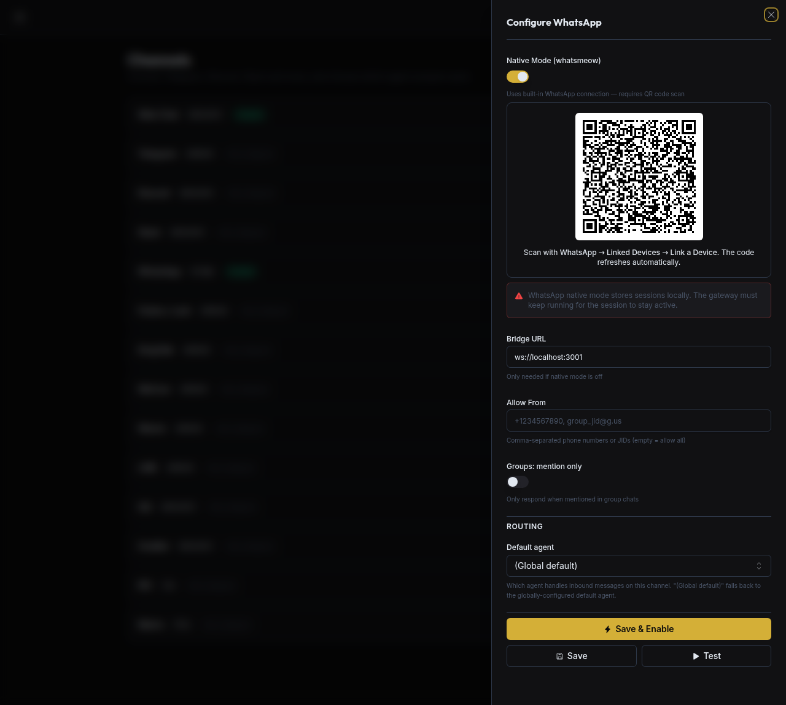

> Back to [Channels](../channels.md)

# WhatsApp Native (whatsmeow)

Omnipus connects to WhatsApp directly using the [whatsmeow](https://github.com/tulir/whatsmeow) library in-process. No external bridge process is required. Session state is stored in a local SQLite database via `modernc.org/sqlite` (pure Go, no CGo).

## Build requirement

**Native mode ships in the default build — no build tag needed.** A standard build (and every official release binary) includes the whatsmeow stack:

```bash
go build ./cmd/...        # native WhatsApp included
```

`modernc.org/sqlite` is pure Go and does not require CGo, so `CGO_ENABLED=0` builds are supported. The whatsmeow + SQLite stack adds roughly 58 MB to the binary.

> **Lite variant.** If you need the smaller binary and don't use native WhatsApp, build with `-tags lite` (`make build-lite`). The lite build omits whatsmeow; with it, `NewWhatsAppNativeChannel` returns an error and the channel will fail to start. The planned UI gating for the lite variant is tracked in [#299](https://github.com/elicify-ai/omnipus/issues/299).

## Configuration

```json
{
  "channels": {
    "whatsapp": {
      "enabled": true,
      "session_store_path": "",
      "allow_from": [],
      "reasoning_channel_id": "",
      "group_trigger": {
        "mention_only": false,
        "prefixes": []
      }
    }
  }
}
```

| Field | Type | Required | Description |
| --- | --- | --- | --- |
| `enabled` | bool | Yes | Activate the WhatsApp channel. |
| `session_store_path` | string | No | Directory for the SQLite session database (`store.db`). Defaults to `<workspace>/whatsapp` when empty (typically `~/.omnipus/workspace/whatsapp`). |
| `allow_from` | []string | No | Allowlist of WhatsApp JIDs (sender phone numbers or group IDs). Empty means all senders are accepted. |
| `reasoning_channel_id` | string | No | Chat ID where extended reasoning traces are sent separately. |
| `group_trigger` | object | No | Controls when the bot responds in group chats. `mention_only: true` restricts responses to @-mentions (reads `ContextInfo.MentionedJID`); `prefixes` lists additional trigger strings. |

## Setup

Native mode is included in the default build (see Build requirement above), so no special build step is needed — just run the gateway, then pair a device. There are two ways to scan the pairing QR — in the app (recommended) or from the gateway logs (headless).

### Pair in the app (recommended)

The pairing QR renders live inside the SPA — no log scraping required.

1. Open **Connectors** in the sidebar and click **Configure** on the WhatsApp card.
2. Turn on **Native Mode (whatsmeow)** and click **Save & Enable**. The QR appears in the panel and refreshes automatically as whatsmeow rotates it.
3. On your phone, open WhatsApp → **Linked Devices** → **Link a Device** and scan the QR.



The QR is pushed from the gateway over the `whatsapp_pairing` WebSocket frame (see [contracts/asyncapi.yaml](../../contracts/asyncapi.yaml) — `WhatsAppPairingFrame` / `WhatsAppPairingSubscribeFrame`, forwarded in `pkg/gateway/websocket.go`). The panel subscribes on open and renders the current code; you do not need to reload to get a fresh one.

### Pair from the gateway logs (headless)

When you run the gateway without the SPA in front of you, the same QR is also printed to stdout in half-block Unicode form on first run:

```
Starting WhatsApp native channel (whatsmeow)
Scan this QR code with WhatsApp (Linked Devices):
<QR code>
```

The QR code data is also emitted as a structured log entry with `"event": "whatsapp.qr_code"` for programmatic consumption. Scan it the same way (WhatsApp → **Linked Devices** → **Link a Device**).

### After pairing

- Once paired, the session is persisted in `store.db` under `session_store_path`. Subsequent gateway starts connect without re-pairing.
- If the session is logged out by the server (e.g. from the phone), the channel automatically clears the stored session, reconnects, and emits a fresh QR — both in the Configure panel and to the logs — for re-pairing.

## Notes

- **Capabilities.** The native channel implements `TypingCapable` using `whatsmeow`'s `SendChatPresence`. It sends `composing` immediately on `StartTyping`, refreshes the indicator every 10 seconds, and sends `paused` when the stop function is called. The maximum typing duration is 5 minutes.
- **Session storage.** The SQLite database is opened with `_foreign_keys=on` and `max_open_conns=1`. The store is created at `session_store_path/store.db`. Back this file up to preserve the paired session across reinstalls.
- **Reconnect behavior.** On a `Disconnected` event the channel enters an exponential-backoff reconnect loop (initial: 5 s, multiplier: 2×, ceiling: 5 min). On `LoggedOut` it clears the session and re-enters the QR pairing flow. Both reconnect paths are tracked by a `sync.WaitGroup` and respect the lifecycle context so `Stop()` exits cleanly without goroutine leaks.
- **Group message filtering.** In WhatsApp groups (JID server = `g.us`) the bot checks whether its own JID appears in `ContextInfo.MentionedJID` to detect @-mentions. The `group_trigger` config then decides whether to respond.
- **Chat ID format.** For outbound messages the `chat_id` field accepts either a bare phone number (e.g. `15551234567`) or a full JID (e.g. `15551234567@s.whatsapp.net`). For groups, use the group JID (e.g. `12345678-1234567890@g.us`).
- **No credential ref.** Session credentials are managed entirely by whatsmeow in `store.db`. The Omnipus credential store is not used for WhatsApp authentication.

For deeper details on how channels are orchestrated, see [pkg/channels/README.md](../../pkg/channels/README.md).
