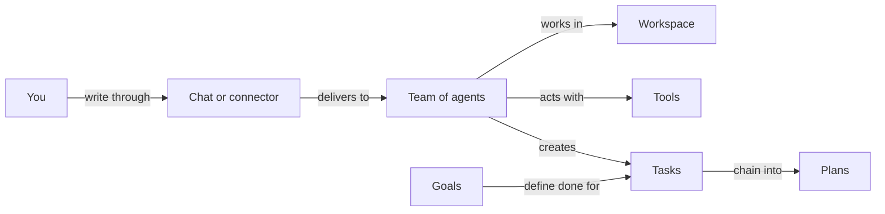

# Concepts

Omnipus is a team of AI agents that runs on your own machine. This page introduces the words the rest of the handbook uses. Each section gives the idea in a few sentences and links to the page that goes deeper.

## What it is

Everything in Omnipus hangs together in one shape:

- All your work lives in a **workspace**. Chats, tasks, the calendar, files, and the team of agents belong to it.
- **Agents** do the work. Four ship built in, and you can create your own.
- Agents act through **tools**: reading and writing files, searching the web, running commands.
- Work takes three shapes: **tasks**, **plans**, and **goals**.
- **Connectors** carry your messages in from chat platforms such as Telegram or Discord.

You reach a team of agents through a chat or a connector. The agents work with tools, and the work shows up as tasks, plans, and goals inside the workspace.

## When you would use it

Read this page once before [getting started](getting-started.md), so the words are in place. Return to it whenever another page uses a term you have not met. This page names ideas; it does not walk through screens.

## The workspace

A workspace is the container your work happens in. Every chat, task, plan, file, and calendar entry belongs to exactly one workspace, and each workspace keeps its own team of agents and its own memory. On a fresh install you start with one workspace, named My Workspace, with the four built-in agents already on the team. The same agent can sit on several workspaces, so you can split work by client or by topic without doubling up. See [workspaces](workspaces.md).

## The agents

Agents are who does the work. Four of them ship with Omnipus, and Mia is the default on a fresh install:

| Agent | Role | Reach for them when |
|---|---|---|
| Mia | Assistant | You want an everyday starting point. She answers and connects you with the right specialist. |
| Jim | Planner and Orchestrator | A job has many steps. He breaks it into tasks, hands them out, and tracks them to done. |
| Ava | Builder | You want a new agent. She interviews you, then creates it. |
| Ray | Scout | You need research. He digs into sources and presents findings with citations. |

You can also create your own agents, in three kinds. A **Main** agent is a chat colleague. A **Subagent** is a worker that other agents hand work to. An **external worker** runs on a command-line agent tool you already have. Workers never chat with you. See [agents](agents.md).

## Connectors

A connector links a chat platform you already use — Telegram, Discord, Slack, among others — to your agents. You write where you already write. The connector delivers the message into the workspace it is bound to, and the answer comes back in the same conversation. See [connectors](connectors.md).

## Tasks, plans, and goals

Work takes three shapes. The difference is how much work it holds, and how it runs to done:

| Shape | What it is | Where you follow it |
|---|---|---|
| Task | One piece of work with an owner agent, acceptance criteria, and a definition of done | A card on the workspace board |
| Plan | Several tasks with dependencies and one shared definition of done. The engine runs them in order, start to finish. | A tile above the board, and the graph of its tasks |
| Goal | An outcome you state in chat with `/goal`. Work starts in the same turn, and a separate Judge agent reads the work and decides when it counts as done. | The chat where you stated it |

Every task carries a goal of its own, and its completion is judged the same way. A plan is the one shape where the engine starts each task in turn, so you do not start them yourself. See [tasks](tasks.md), [plans](plans.md), and [goals](goals.md).

## Tools

A tool is one capability an agent can call while it works: reading a file, searching the web, running a command, sending email. A large set of tools ships built in, and you can connect external tool servers through MCP (Model Context Protocol, an open standard many services publish tools to). Every tool has a policy — **Allow**, **Ask**, or **Deny** — set once for the whole installation and tightened per agent. When a policy is Ask, the agent stops and waits for your approval. See [tools](tools.md).

## Limits and things to watch

- The four built-in agents are locked. They ship as they are; you add capacity by creating your own agents, not by editing the built-ins.
- Who may hand work to whom is set inside each workspace, not on an agent. The same agent can be trusted to receive work in one workspace and not in another.
- A task with no agent assigned cannot run. It stays on the board as a to-do for you.

## Related pages

- [Workspaces](workspaces.md) — the container all work happens in.
- [Agents](agents.md) — the built-in roster and the agents you create.
- [Tasks](tasks.md) — cards on the board, from creation to done.
- [Plans](plans.md) — chains of tasks the engine runs for you.
- [Goals](goals.md) — stated outcomes and how the Judge verifies them.
- [Tools](tools.md) — what agents can do, and the Allow / Ask / Deny control.
