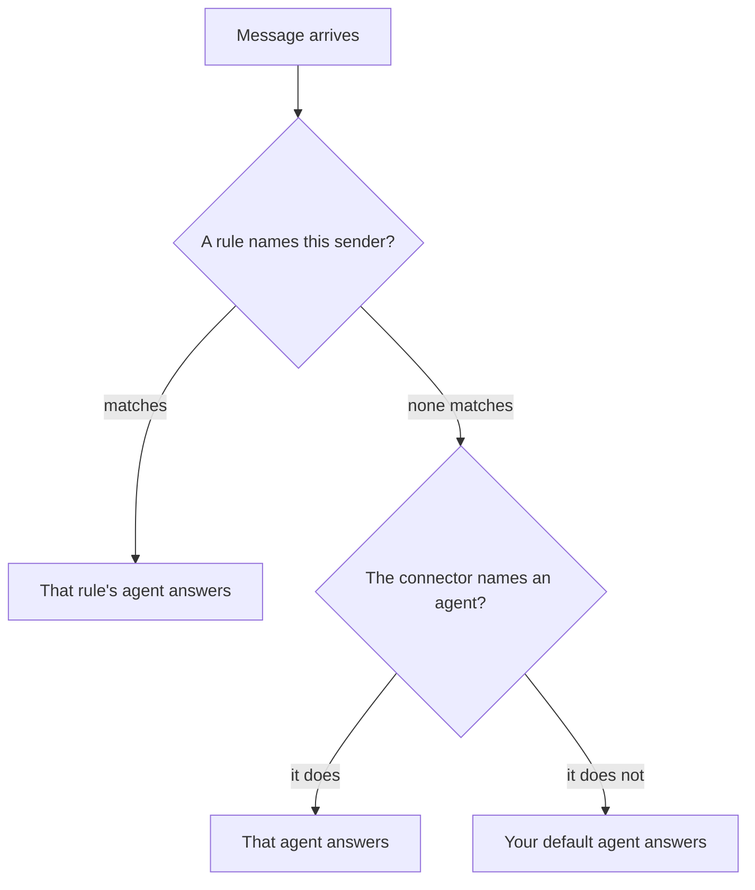

# Connectors

Connectors link your agents to the chat apps you already use: you message Omnipus on Telegram, Discord, or WhatsApp, and the reply arrives in the same conversation. Naming: the screen says connector; the programming interface underneath still uses the older name channel.

## What it is

A connector is a live bridge between one chat platform and your agents. You send a message on the platform; Omnipus decides which agent answers; the reply comes back in the same place.

- The web chat inside the app is built in and always on — no setup, no routing choices.
- Thirteen platforms can be connected; the table below lists them.
- Email is not chat. A mailbox gives one agent its own inbox to work through ([Email mailboxes](#email-mailboxes)).

Secrets you paste go into the encrypted credential store, never the plain config file. See [security](security.md).

## When you would use it

- You want to reach your agents from your phone, or from the app your team already lives in.
- You want one place served by one agent — a WhatsApp number that always answers as Ava.
- You want an agent to work an email inbox on its own, turning mail into tasks.

## How to connect a chat app

1. Open **Connectors** in the sidebar. Not-yet-connected platforms appear as cards with a **Configure** link; connected ones sit in groups, one row per account.
2. Click **Configure**. A side panel opens with the fields that platform needs — for Telegram a bot token, for Slack a bot token and an app token. The [connector's own page](#connectors-you-can-set-up) says where to get each value.
3. Fill in the fields. When you re-open a connected account, leave a secret field blank to keep the stored value.
4. Under **Routing**, pick a **Workspace** and then a **Default agent**, or leave the workspace unset.
5. Click **Save & Enable**. The row shows **Enabled** and messages start flowing. For WhatsApp, a QR appears in the panel — scan it on your phone under **Linked Devices** → **Link a Device**.
6. For a second account on the same platform, click **Add another…** on its group. You pick the workspace and agent; the app names the account, so a personal and a work WhatsApp can run side by side.

## Choosing who answers

The **Routing** part of the panel has two controls: **Workspace** and **Default agent**.

- **Bound to a workspace.** The agent list narrows to that workspace's team, and the agent you pick answers every message on that connector. This is the flow used when adding an account.
- **No workspace.** Messages go to your default agent — the one with the star on the [Agents](agents.md) screen — unless a finer rule matches first. Finer rules, aimed at a specific person or group, live in the config file and win over the connector's own choice.

An unbound connector falls through three checks: a rule for the sender, its own agent, then your global default. A bound connector skips them — its agent answers everything.

## Connectors you can set up

Each connector has a page with the exact fields, where to get each credential, and the config-file equivalent for automated setups.

| Connector | Effort | What to know | Guide |
|---|---|---|---|
| Telegram | Easy | Bot token from BotFather; voice notes become text when transcription is set up | [Telegram](connectors/telegram.md) |
| Discord | Easy | Bot over WebSocket; can be limited to @-mentions in groups | [Discord](connectors/discord.md) |
| WhatsApp | Easy | Scan a QR code in the panel after enabling; in every standard build | [WhatsApp](connectors/whatsapp_native.md) |
| Weixin | Easy | Scan a QR in the panel to link a personal WeChat account | [Weixin](connectors/weixin.md) |
| Slack | Easy | Socket mode: an outgoing connection, no public address needed | [Slack](connectors/slack.md) |
| Matrix | Medium | Works with any homeserver, including one you host | [Matrix](connectors/matrix.md) |
| QQ | Medium | Official bot API; a quick-setup page creates the bot | [QQ](connectors/qq.md) |
| DingTalk | Medium | Stream mode: an outgoing connection, no public address needed | [DingTalk](connectors/dingtalk.md) |
| IRC | Medium | Any IRC server, with TLS | [IRC](connectors/irc.md) |
| LINE | Advanced | Needs an HTTPS address reachable from the internet | [LINE](connectors/line.md) |
| WeCom | Advanced | AI bot over WebSocket; bind by scanning a QR in the panel | [WeCom](connectors/wecom.md) |
| Feishu | Advanced | Requires a published app with the bot capability | [Feishu](connectors/feishu.md) |
| Google Chat | Advanced | Interactive bot via a service account, or a send-only webhook | [Google Chat](connectors/google-chat.md) |

## Email mailboxes

A mailbox gives one agent, in one workspace, an inbox of its own: IMAP for reading, SMTP for sending. Every agent-and-workspace pair can hold one mailbox, so one agent can keep a different inbox in each workspace.

The agent checks its inbox on its heartbeat, the periodic wake-up an agent runs. Mail it cannot fully handle becomes a task on that workspace's [Board](tasks.md), assigned to that agent, capped at 25 per check. You watch the Board, not an inbox.

1. On the Connectors screen, find the **Email** section and click **Add mailbox**.
2. Pick the **Workspace** and the **Owning agent**; only that workspace's team members are offered.
3. Enter the email address and password (an app password where the provider uses them), the IMAP server (TLS, usually port 993), and the SMTP server (usually 587 or 465). Ports are optional.
4. Save. The mailbox appears in the list as **Active**.
5. Re-open it with **Configure**. **Remove Mailbox** deletes it, after asking you to confirm.

## Limits and things to watch

- Stored secrets are never shown again, in either panel. A blank password field means "keep what is stored", not "erase it".
- A connector row can show **Failed to start** with the reason underneath — for example a revoked token. Re-open Configure and paste a fresh value.
- Saving checks required fields before anything is written, so you cannot enable a half-filled connector.
- **Disable** pauses a row and keeps everything. The trash icon deletes that account for good: configuration, credentials, and stored state.
- On a lite build (a smaller binary some operators compile), WhatsApp is unavailable and its panel says so.
- LINE, and Google Chat in webhook mode, need the gateway reachable over HTTPS — a reverse proxy or tunnel.
- There is no inbox view for email. Board tasks are the only place unhandled mail surfaces.

## Related pages

- [Agents](agents.md) — the starred default agent, and agents that answer on connectors.
- [Workspaces](workspaces.md) — the teams a bound connector's agent must belong to.
- [Tasks](tasks.md) — the Board, where unhandled email lands.
- [Security](security.md) — the credential vault storing every connector secret.
- [Tools](tools.md) — the email tools an agent uses to read and send mail.
