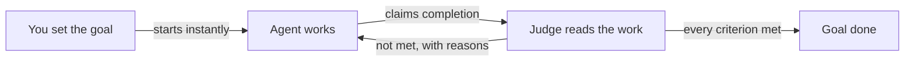

# Goals

A goal is a piece of work with its own definition of done. You state it, work starts in the same turn, and a separate Judge agent reads the work and decides when it is finished.

## What it is

A goal is its own thing, separate from a task and from the chat it arrived in. It owns a record: a restated statement of what you want, acceptance criteria ("Done when"), and a Definition of Done — standing quality checks for any piece of work. The Judge holds the work against that record.

Goals come from two places:

- **Chat.** Type `/goal` and what you want. The goal activates and work starts in the same turn. No form, nothing to confirm.
- **Tasks.** Every task on the Board carries a goal: the task form's required **Goal** field, criteria and Definition of Done become the record when the task runs. See [tasks](tasks.md).

From there the two are one machine: same loop, same claim, same Judge. Only visibility differs.

The working agent writes the goal record itself, as its opening move, and shows it in the chat as working assumptions. You do not approve them; if they are wrong you say so, and the agent updates the record and shows what changed. If the agent is unsure it understands you, it asks — one round of questions per goal. On the web app that is a question card; on a connector, a plain question in chat.

When the working agent believes it is done, it claims completion. Only then does the Judge run — after the answer reaches you, so you never wait on a verdict.

### The Judge, in plain language

The Judge is its own agent, under **System** on the Agents screen. You do not chat with it and cannot delegate to it. Its tools are read-only — open files, list folders, read session records — and it cannot write, run commands or go online. Only its model and its written instructions are yours to change.

It reads work like a human reviewer: opens the artifact a criterion names, looks at what the agent did, forms a view. A criterion is met when the Judge is persuaded — never because a machine check passed. Each criterion gets its own verdict, met or unmet, with a reason.

One consequence is deliberate: unproven is not done. A criterion the Judge could not verify counts as unmet, even if the work was finished. The reason names the missing evidence.

## When you would use it

- Work you want verified, not only attempted. The agent keeps working until the Judge is satisfied or the try budget runs out.
- Work you want to walk away from. A quiet agent is nudged back to work; a verdict that lands later waits for you.

For a quick answer, plain chat is the right tool. A goal adds verification, and it spends tries to get it.

## How to set and steer a goal

1. In a workspace chat, type `/goal` followed by what you want, for example `/goal build a game portal with tetris and snake`.
2. Press Enter. The goal activates and the reply starts streaming in the same turn; a pill labelled **active** appears bottom-right.
3. Watch for the goal card early in the run: the restated goal, with criteria and the Definition of Done behind collapsed headings such as "Done when · 3 criteria".
4. Answer the question card if one appears.
5. To change direction, send a normal message such as "make it dark-themed only". The agent updates the record and shows what changed. Nothing asks you to confirm.
6. To restate the goal outright, type `/goal` with the new wording; the new intent replaces the working prompt.
7. To check on progress, type `/goal` alone (or `/goal status`) for elapsed time, tries used, the latest Judge reason and the record.
8. To stop it, type `/goal clear`; the words `stop`, `off`, `reset`, `cancel` and `none` do the same.

A goal runs as a loop:

The agent works, claims completion, and the Judge either ends the goal or sends the agent back with the list of what is missing.

## What you see while a goal runs

Each goal shows as a labelled pill at the bottom-right of the chat:

| Pill | What it means | What you can do |
|---|---|---|
| active | Work is under way | Steer by chatting |
| waiting on you | Paused, waiting for you | Reply in chat |
| judge unavailable | Judging is paused because the Judge cannot run | Wait for the Judge to become available |
| re-planning | A plan needs your correction before work continues | Review the request and reply |
| judging | The Judge is reading the work | Wait |
| verifying elsewhere | Another judgment of the same work is already running | Wait for that verdict |
| blocked | Something stands in the way | Remove the obstacle |
| claim overturned | The agent said done; the Judge disagreed | Read the reasons |
| done | Every criterion was judged met | Read the verdict |
| failed | Tries ran out with work unmet | Restate or raise the budget |
| cleared | You stopped it | Restart if needed |
| expired | Quiet for seven days | Restart it |

## What controls a goal

These numbers shape a goal's life:

| Control | Value | Where it lives |
|---|---|---|
| Tries per goal | 20 by default | Settings, Performance, "Goal completion budget" |
| Task attempts | 3 by default | On the task |
| Question rounds | 1 per goal | Fixed |
| Idle expiry | 7 days | Server setting |
| Active chat goals | 16 at a time | Server setting; tasks count separately |

A goal ends one of four ways — met, tries exhausted, expired, cleared by you — and the record is kept in each: what was wanted, and how it was judged, stays readable.

## Limits and things to watch

- The try budget is global. One setting covers chat goals and task goals alike; there is no per-goal override. A running goal keeps the limit it started with.
- On a task, tries bound the work inside one run; attempts bound how many runs the task gets. The task card shows both, for example "attempt 1 of 3 · try 5 of 20".
- Unproven counts as unmet. Finished work can be sent back when the Judge could not verify it; the reason names the evidence that was missing.
- Verdict speed follows the Judge's model — a fast one keeps verdicts quick.
- Ending a goal never erases it, but goal records are swept by the same retention rule as sessions. Keep what you need somewhere durable.

## Related pages

- [tasks](tasks.md) — the visible Board card; its run is judged by this machinery.
- [plans](plans.md) — chains tasks together toward a larger outcome.
- [agents](agents.md) — the roster, plus the System section where the Judge lives.
- [workspaces](workspaces.md) — where chats, boards and goals are scoped.
- [tools](tools.md) — what agents can do while they work toward a goal.
