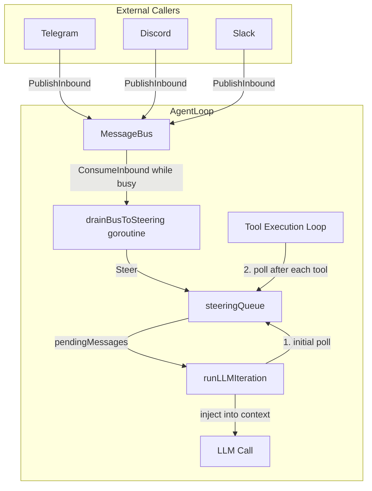
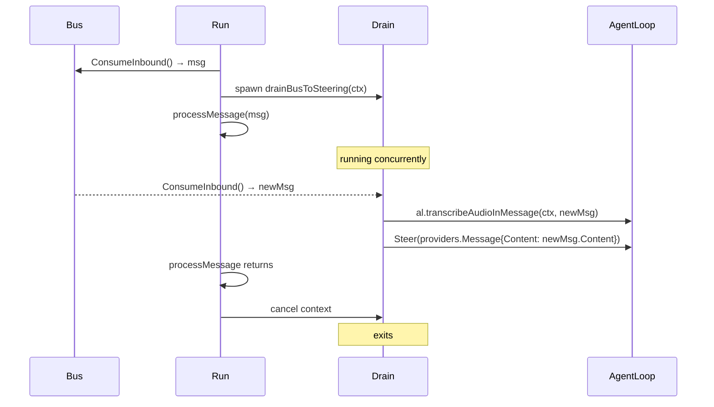
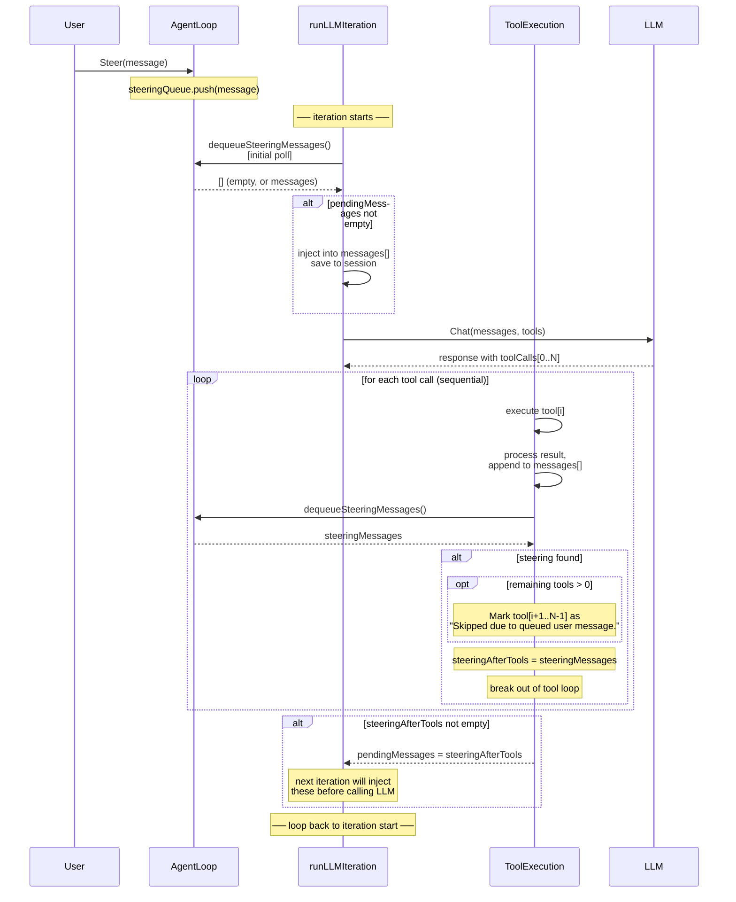
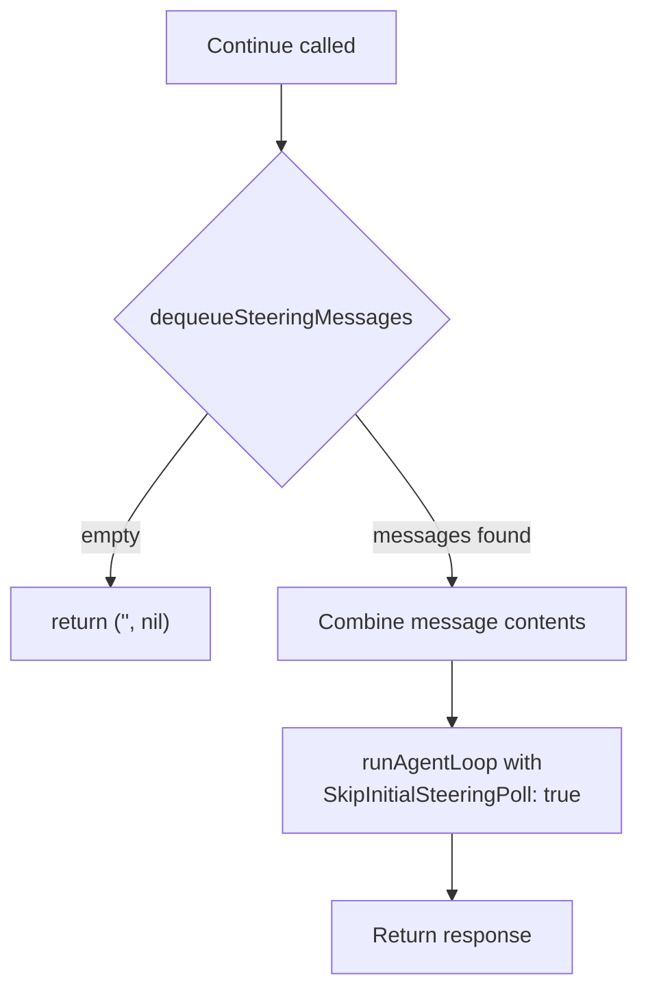

# Steering — Implementation Specification

**Amended 2026-10-06 (founder):** Stop click 1 / Esc 1 / `/stop` stops **this chat's current turn only** and opens a **3 s window**. A second Stop / Esc / `/stop` within that window stops **this chat and its whole helper tree**; `/cancel` does that immediately. **No separate button or offer.** `/stop-redirect <instruction>` stops this chat's turn and continues **this chat** with the instruction, in **any root or helper chat**. Same semantics on web, CLI and channels. Plain Stop leaves background shells running; a second Stop / Esc within 3 s, or `/cancel`, kills them. Agent delegate `stop` / `stop_all` is unchanged (one helper's turn / its tree). Authority: founder decision, 2026-10-06. **[External-worker qualification, U5b 2026-10-09]:** the "any root or helper chat" redirect scope is native-engine behaviour; an external-CLI (subagent_3p) helper chat refuses `/stop-redirect` (`not_steerable`) and steers by interrupt + native-conversation resume, not tool-boundary injection (FR-043).

## Amended 2026-10-06 — founder decision

Steering text is input, **not a Stop**: a mid-turn message continues the current turn. Both people and agents use `AgentLoop.StopSession`, polite now / force at 3 s / detach 3 s after force; no agent `cancel_grace` or public `hard` option.

Delegated input becomes delivered only after exact text/identity is durably in the transcript; a failed write stays queued with a visible error. At the finishing boundary, input before the actual terminal/outbox commit continues the same generation; input after it starts the next round, even if old-final publication failed. Provider text alone is not completion. A helper final reaches its parent once, poll OR wake; stopped parent holds it unconsumed, the tree-scope stop supersedes queued wakes.

One message route/record for every sender (planned transcript-as-record direction), waiting-message reboot reconstruction, aggregate 256 KiB cap, ledger compaction and live failed-descendant-stop retry are **deferred to #1198 (founder 2026-10-06)**. These guides' old queue/drop/API descriptions are historical source sketches, not a claim of current release conformance. Unrelated implementation disagreements are for team-lead. Authority: [The sub-agent control plane: stop, redirect, receipts, owner-question relay, restart resume](../architecture/ADR-20260928-sub-agent-control-plane.md)::D2/D4/D5 and [Steering commands: no person question](../architecture/ADR-20261004-steering-commands-no-person-question.md)::C1; R1 commit-boundary ruling.

## Problem

When the agent is running (executing a chain of tool calls), the user has no way to redirect it. They must wait for the full cycle to complete before sending a new message. This creates a poor experience when the agent takes a wrong direction — the user watches it waste time on tools that are no longer relevant.

## Solution

Steering introduces a **message queue** that external callers can push into at any time. The agent loop polls this queue at well-defined checkpoints. When a steering message is found, the agent:

1. Stops executing further tools in the current batch
2. Injects the user's message into the conversation context
3. Calls the LLM again with the updated context

The user's intent reaches the model **as soon as the current tool finishes**, not after the entire turn completes.

## Architecture Overview



### Bus drain mechanism

Channels (Telegram, Discord, etc.) publish messages to the `MessageBus` via `PublishInbound`. Without additional wiring, these messages would sit in the bus buffer until the current `processMessage` finishes — meaning steering would never work for real users.

The solution: when `Run()` starts processing a message, it spawns a **drain goroutine** (`drainBusToSteering`) that keeps consuming from the bus and calling `Steer()`. When `processMessage` returns, the drain is canceled and normal consumption resumes.



## Data Structures

### steeringQueue

A thread-safe FIFO queue, private to the `agent` package.

| Field | Type | Description |
|-------|------|-------------|
| `mu` | `sync.Mutex` | Protects all access to `queue` and `mode` |
| `queue` | `[]providers.Message` | Pending steering messages |
| `mode` | `SteeringMode` | Dequeue strategy |

**Methods:**

| Method | Description |
|--------|-------------|
| `push(msg) error` | Appends a message to the queue. Returns an error if the queue is full (`MaxQueueSize`) |
| `dequeue() []Message` | Removes and returns messages according to `mode`. Returns `nil` if empty |
| `len() int` | Returns the current queue length |
| `setMode(mode)` | Updates the dequeue strategy |
| `getMode() SteeringMode` | Returns the current mode |

### SteeringMode

| Value | Constant | Behavior |
|-------|----------|----------|
| `"one-at-a-time"` | `SteeringOneAtATime` | `dequeue()` returns only the **first** message. Remaining messages stay in the queue for subsequent polls. |
| `"all"` | `SteeringAll` | `dequeue()` drains the **entire** queue and returns all messages at once. |

Default: `"one-at-a-time"`.

### processOptions extension

A new field was added to `processOptions`:

| Field | Type | Description |
|-------|------|-------------|
| `SkipInitialSteeringPoll` | `bool` | When `true`, the initial steering poll at loop start is skipped. Used by `Continue()` to avoid double-dequeuing. |

## Public API on AgentLoop

| Method | Signature | Description |
|--------|-----------|-------------|
| `Steer` | `Steer(msg providers.Message) error` | Enqueues a steering message. Returns an error if the queue is full or not initialized. Thread-safe, can be called from any goroutine. |
| `SteeringMode` | `SteeringMode() SteeringMode` | Returns the current dequeue mode. |
| `SetSteeringMode` | `SetSteeringMode(mode SteeringMode)` | Changes the dequeue mode at runtime. |
| `Continue` | `Continue(ctx, sessionKey, channel, chatID) (string, error)` | Resumes an idle agent using pending steering messages. Returns `""` if queue is empty. |

## Integration into the Agent Loop

### Where steering is wired

The steering queue lives as a field on `AgentLoop`:

```
AgentLoop
  ├── bus
  ├── cfg
  ├── registry
  ├── steering  *steeringQueue   ← new
  ├── ...
```

It is initialized in `NewAgentLoop` from `cfg.Agents.Defaults.SteeringMode`.

### Detailed flow through runLLMIteration



### Polling checkpoints

| # | Location | When | Purpose |
|---|----------|------|---------|
| 1 | Top of `runLLMIteration`, before first LLM call | Once, at loop entry | Catch messages enqueued while the agent was still setting up context |
| 2 | After every tool completes (including the first and the last) | Immediately after each tool's result is processed | Interrupt the batch as early as possible — if steering is found and there are remaining tools, they are all skipped |

### What happens to skipped tools

When steering interrupts a tool batch after tool `[i]` completes, all tools from `[i+1]` to `[N-1]` are **not executed**. Instead, a tool result message is generated for each:

```json
{
  "role": "tool",
  "content": "Skipped due to queued user message.",
  "tool_call_id": "<original_call_id>"
}
```

These results are:
- Appended to the conversation `messages[]`
- Saved to the session via `AddFullMessage`

This ensures the LLM knows which of its requested actions were not performed.

### Loop condition change

The iteration loop condition was changed from:

```go
for iteration < agent.MaxIterations
```

to:

```go
for iteration < agent.MaxIterations || len(pendingMessages) > 0
```

This allows **one extra iteration** when steering arrives right at the max iteration boundary, ensuring the steering message is always processed.

### Tool execution: parallel → sequential

**Before steering:** all tool calls in a batch were executed in parallel using `sync.WaitGroup`.

**After steering:** tool calls execute **sequentially**. This is required because steering must be polled between individual tool completions. A parallel execution model would not allow interrupting mid-batch.

> **Trade-off:** This introduces latency when the LLM requests multiple independent tools in a single turn. In practice, most batches contain 1-2 tools, so the impact is minimal. The benefit of being able to interrupt outweighs the cost.

### Why skip remaining tools (instead of letting them finish)

Two strategies were considered when a steering message is detected mid-batch:

1. **Skip remaining tools** (chosen) — stop executing, mark the rest as skipped, inject steering
2. **Finish all tools, then inject** — let everything run, append steering afterwards

Strategy 2 was rejected for three reasons:

**Irreversible side effects.** Tools can send emails, write files, spawn subagents, or call external APIs. If the user says "stop" or "change direction", those actions have already happened and cannot be undone.

| Tool batch | Steering | Skip (1) | Finish (2) |
|---|---|---|---|
| `[search, send_email]` | "don't send it" | Email not sent | Email sent |
| `[query, write_file, spawn]` | "wrong database" | Only query runs | File + subagent wasted |
| `[fetch₁, fetch₂, fetch₃, write]` | topic change | 1 fetch | 3 fetches + write, all discarded |

**Wasted latency.** Tools like web fetches and API calls take seconds each. In a 3-tool batch averaging 3-4s per tool, the user would wait 10+ seconds for work that gets thrown away.

**The LLM retains full awareness.** Skipped tools receive an explicit `"Skipped due to queued user message."` result, so the model knows what was not done and can decide whether to re-execute with the new context or take a different path.

## The Continue() method

`Continue` handles the case where the agent is **idle** (its last message was from the assistant) and the user has enqueued steering messages in the meantime.



**Why `SkipInitialSteeringPoll: true`?** Because `Continue` already dequeued the messages itself. Without this flag, `runLLMIteration` would poll again at the start and find nothing (the queue is already empty), or worse, double-process if new messages arrived in the meantime.

## Configuration

```json
{
  "agents": {
    "defaults": {
      "steering_mode": "one-at-a-time"
    }
  }
}
```

| Field | Type | Default | Env var |
|-------|------|---------|---------|
| `steering_mode` | `string` | `"one-at-a-time"` | `OMNIPUS_AGENTS_DEFAULTS_STEERING_MODE` |


## Design decisions and trade-offs

| Decision | Rationale |
|----------|-----------|
| Sequential tool execution | Required for per-tool steering polls. Parallel execution cannot be interrupted mid-batch. |
| Polling-based (not channel/signal) | Keeps the implementation simple. No need for `select` or signal channels. The polling cost is negligible (mutex lock + slice length check). |
| `one-at-a-time` as default | Gives the model a chance to react to each steering message individually. More predictable behavior than dumping all messages at once. |
| Skipped tools get explicit error results | The LLM protocol requires a tool result for every tool call in the assistant message. Omitting them would cause API errors. The skip message also informs the model about what was not done. |
| `Continue()` uses `SkipInitialSteeringPoll` | Prevents race conditions and double-dequeuing when resuming an idle agent. |
| Queue stored on `AgentLoop`, not `AgentInstance` | Steering is a loop-level concern (it affects the iteration flow), not a per-agent concern. All agents share the same steering queue since `processMessage` is sequential. |
| Bus drain goroutine in `Run()` | Channels (Telegram, Discord, etc.) publish to the bus via `PublishInbound`. Without the drain, messages would queue in the bus channel buffer and only be consumed after `processMessage` returns — defeating the purpose of steering. The drain goroutine bridges the gap by consuming new bus messages and calling `Steer()` while the agent is busy. |
| Audio transcription before steering | The drain goroutine calls `al.transcribeAudioInMessage(ctx, msg)` before steering, so voice messages are converted to text before the agent sees them. If transcription fails, the error is silently discarded and the original message is steered as-is. |
| `MaxQueueSize = 10` | Prevents unbounded memory growth if a user sends many messages while the agent is busy. Excess messages are dropped with a warning. |
