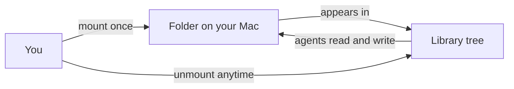

# Library and files

The Library is the file surface of every [workspace](workspaces.md): the images, videos, PDFs, audio, documents, and code that you and your agents put there. Use it to hand files to your team, to keep what your agents produce, and to share real folders from your Mac.

## What it is

A file explorer with a preview pane. The tree shows each workspace and everything inside it: folders, files you upload, files your agents create, and any folder you mounted from your Mac. Click a file and the pane renders it: pictures display, video and audio play, PDFs open for filling and signing, HTML pages run live.

Ordinary files belong to the workspace. Mounted folders are your real files, shown where they live on your Mac; every edit writes to the actual disk. The text side of the Library is the [knowledge base](knowledge.md); this page is about files.

Files arrive three ways:

- You upload them with the **Upload files** action.
- You attach them in chat: each attachment also becomes a real file, filed in a hidden `.library` folder and kept for reuse.
- Agents create them as they work; everything an agent writes shows up here.

## When you would use it

- Upload a document the team should work on, then mention it in chat.
- Preview or download what an agent produced: a chart, a report, a built page.
- Fill in a form or sign a PDF without leaving Omnipus.
- Mount a folder your project already lives in, instead of copying it in.
- Review which folders a workspace can write to, and revoke one.

## How to open the Library

1. Click **Library** in the sidebar. The panel opens with every workspace listed as a top-level folder.
2. From a workspace or one of its chats, click the workspace's **Library** tab or the library button in the chat header. The panel opens already inside that workspace's files.
3. Click **Open in new tab** at the top of the panel for a fullscreen Library. The side panel closes, the tab starts where you were, and its address names the selected file, so you can bookmark it. Closing the tab re-opens the panel.

## How to add files

1. Open the Library and navigate into the workspace and folder you want the files in.
2. Click the **+** create menu and choose **Upload files**.
3. Pick one or more files. They land in the folder you were viewing and keep their names. A name collision gets a numbered suffix: `report (2).pdf`.

The chat composer's **Attach from library** button lists what this workspace already holds, so a new conversation can reuse an earlier upload. Turn on **Show hidden** in the panel header to see the `.library` folder where chat attachments are filed.

## How to fill in and sign a PDF

1. Click a PDF in the tree. It renders page by page, with zoom controls.
2. Switch to **Edit** with the pencil toggle at the top of the pane. Fillable form fields become active: type into text fields, tick checkboxes, pick from dropdowns.
3. Click the signature button to draw one and place it on the page you are viewing; it shows a remove control until you save.
4. Click **Save**. Entries and signatures are written into the PDF itself, so it re-opens everywhere showing them.

A PDF with no fillable form fields says so, and drawing a signature is still offered.

## How to mount a folder from your Mac

1. Open the Library inside the workspace that should get the access; mounts belong to one workspace.
2. Click the **+** create menu and choose **Add a folder from your Mac**.
3. Browse the folders Omnipus lists, or type the path; a web page cannot open the Mac's own folder picker.
4. Read the verdict shown before you commit:
   - **Scoped**, the normal case: this folder and what is inside it.
   - **Broad**: your home folder, the disk root, or `/tmp`; adding one takes a second, explicit **Add anyway** click.
   - **Refused**: Omnipus's own data folder and system folders such as `/etc` and `/usr`.
5. Click **Add folder**. The folder appears in the tree with the mount icon and its real path. The workspace's agents can now read and write it; everything else on your disk stays read-only to them.

Mounting wires a real folder into the workspace; unmounting removes access without deleting anything.

To review grants, open the **+** menu and choose **Manage mounted folders**: each mount is listed with its real path and a **Broad grant** mark. **Unmount** removes access; your files stay exactly where they are.

## What the preview shows

The preview pane picks its surface by file type.

| File type | What you see | What you can do |
|---|---|---|
| Images (PNG, JPEG, GIF, WebP, SVG, and more) | The picture | Download |
| Video (MP4, WebM, MOV, and more) | Plays inline | Download |
| Audio (MP3, M4A, WAV, FLAC, and more) | Plays inline | Download |
| PDF | The rendered document | Fill fields, sign, save into the file |
| HTML page | The page running live, in a sandbox | Edit shows the markup source |
| Text and code | Highlighted text | Edit and save in place |
| Notes, records, views | The knowledge surface | See the knowledge base page |
| Everything else | A details card | Download |

## Limits and things to watch

- **No Office preview.** Word, Excel, and PowerPoint files, and other binaries such as ZIP archives, show the download card; they open in the applications you already use.
- **Chat attachments are capped** at 100 MB per file.
- **Mounts are real disk.** Edits inside a mounted folder change your actual files, the same ones your other apps open. Deleting one in the Library deletes the real file.
- **A mount's location is recorded once.** If you move or rename the folder on your Mac, its contents disappear from the workspace. Unmount and add the folder again at its new location.
- **Broad grants are wide.** Mounting your home folder gives every agent on the workspace write access to everything under it. The warning and the second click exist to catch exactly this mistake.
- **Ordinary deletes are permanent.** Removing a file from the workspace has no trash to recover from. A note inside a knowledge base moves to that knowledge base's trash instead.
- **HTML previews run scripts in a sandbox** that cannot read your Omnipus session or call the API as you.

## Related pages

- [knowledge base](knowledge.md) — notes, records, and views: the text side of the Library.
- [workspaces](workspaces.md) — what a workspace is, and the tabs around the Library tab.
- [previews](previews.md) — agent-built sites for review; unrelated to this preview pane.
- [agents](agents.md) — the agents who read and write these files.
