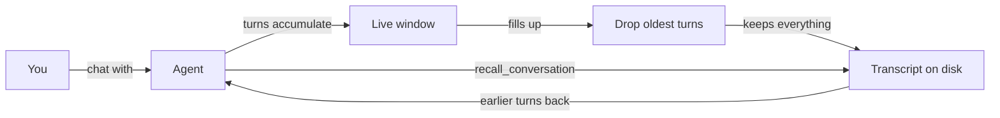

# Memory

Memory is what your agents keep between conversations. When a session ends, Omnipus writes a short recap of it, and anything an agent saved during it stays available to the team. This page explains what agents remember, where it lives, and which settings control it.

## What it is

Three kinds of memory, all stored as plain files on your machine:

- **Saved notes.** An agent saves a fact, decision, reference, or lesson with the `remember` tool. A note lives in one of two rooms: a shared room the whole workspace team reads, or a private room for one agent.
- **Recaps and retrospectives.** When a conversation has been idle for a while, a background call summarizes it — what it was about, what went well, what to improve. The recap is loaded back into the agent's context at the start of its next session, so it picks up where it left off.
- **The transcript.** The full conversation stays on disk. Only the recent part sits in the agent's live view; the rest can be read back on demand.

Every new session starts with the last recap and up to twenty recent saved notes already in the agent's context. The agent does not wait to be asked.

## When you would use it

- You tell an agent something worth keeping — "Remember that we invoice on the 15th" — and any teammate in the workspace can recall it in a later conversation.
- You return the next day and the agent already knows what happened yesterday, without you restating it.
- A conversation runs long, and the agent reads an earlier exchange back instead of guessing at it.
- You change how often recaps happen, or which model writes them, in Settings.

## How to save and recall a fact

1. In a chat, tell the agent what to keep: "Remember that the staging server is called elm." The agent calls `remember`, and the tool call appears in the thread.
2. The note lands in the shared room by default, where every agent in the workspace can recall it. Ask for a private note when only one agent should see it.
3. In any later conversation, ask about it. The agent searches with `recall_memory` and answers from saved notes and past retrospectives.
4. For something said earlier in the same conversation, the agent uses `recall_conversation` instead. That tool never crosses into other conversations.

The two rooms:

| Room | Who can read it | Good for |
|---|---|---|
| Shared (the default for saves) | Every agent in the workspace | Project decisions, conventions, references |
| Private | One agent only | Personal working notes, individual lessons |

## The four memory tools

Every agent has all four. The agent calls them on its own judgment; you trigger them by asking in chat.

| Tool | What it does | Bounds |
|---|---|---|
| `remember` | Saves a note as a decision, reference, or lesson | Up to 4,096 characters; shared room by default |
| `recall_memory` | Keyword search over saved notes and past retrospectives | Both rooms by default; 20 results, at most 50 |
| `recall_conversation` | Reads back earlier turns of the current conversation | By keyword, turn numbers, time window, or one tool result |
| `run_retrospective` | Records what went well and what to improve | Always the agent's private room |

## What happens when a session ends

With Auto recap on (Settings → Memory; it is on by default on a new install):

1. A session closes after it has been idle for the timeout you set — 30 minutes by default. After a gateway restart, any session that never got a recap gets one then, spread out a few per minute.
2. A background model call summarizes the conversation: a recap of at most 150 words, up to five wins, and up to five items to improve.
3. The recap is written to the agent's private room and injected into its next session. The retrospective is filed under its date and appears in `recall_memory` results.
4. If the summary call fails, the most recent user messages are carried forward word for word, and the file is marked as a fallback — the session is not silently forgotten.
5. The summary also proposes items worth remembering long-term. Nothing from that list is saved automatically; the agent still has to call `remember` for anything it wants to keep.

Delegated sub-task sessions never get a recap — only real conversations do.

## How long conversations stay in view

The live window holds the recent turns of a conversation. When it fills, the oldest whole turns drop out of view until the conversation fits again. Three things are worth knowing:

- Trimming makes no extra model call. It is arithmetic on message sizes, not a summary.
- Nothing is deleted from disk. The transcript file keeps everything; only the live view shrinks.
- The agent is told which turns scrolled away, and it can read them back with `recall_conversation`.

When the window fills, the oldest turns leave the live view but stay on disk, ready to be read back on demand.

## Limits and things to watch

| Limit | What it means for you |
|---|---|
| Search matches words, not meaning | A note saved as "invoice" will not surface for "billing" unless the words overlap. There is no meaning-based search. |
| No memory browser | No screen in the app lists saved notes, and no tool deletes one. To remove a note, delete its file under `~/.omnipus/`. |
| Retrospectives expire | A nightly sweep deletes retrospectives older than the retention setting — 180 days by default. |
| Transcripts expire | Session transcripts are kept 90 days by default (Settings → Data). `recall_conversation` cannot read past that. |
| Saved notes never expire | Nothing prunes them; a workspace in use for years keeps every note. |
| Writes are rate-limited | An agent can save at most 60 notes per minute, and one caller at most 600. Beyond that the save is rejected and the agent is told to wait. |
| Sharing needs a workspace | The shared room exists only for work in a workspace. Outside one, every note is saved privately and the agent is told so. |

Recap settings live in Settings → Memory: the Auto recap switch, the idle timeout in minutes, the restart catch-up pass and its per-minute cap, and the summarization model with its fallbacks.

## Related pages

- [workspaces](workspaces.md) — the team that shares the shared memory room
- [agents](agents.md) — who reads and writes memory
- [tools](tools.md) — the tool catalog the memory tools belong to
- [knowledge](knowledge.md) — notes and records you write yourself, separate from agent memory
- [settings](settings.md) — where recap and retention are configured
