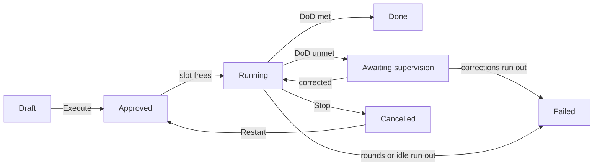

# Plans

A plan is a group of related tasks with dependencies and one shared Definition of Done (DoD), which Omnipus runs for you from start to finish.

## What it is

A plan lives in a [workspace](workspaces.md) and has three parts:

- **Member tasks** arranged as a dependency graph. A task waits until the tasks it depends on have finished, then runs. A task outside any plan is covered in [tasks](tasks.md).
- **A Definition of Done**: the conditions the finished work is checked against.
- **An owner agent**, accountable for the plan and woken at its decision points.

The engine runs plans on the server: it hands each unblocked task to its assignee, checks the result against that task's acceptance criteria, and judges the DoD once every member has finished.

You see plans in the **Tasks** tab of a workspace, as tiles above the board showing the state badge, a progress count such as "4 of 6 tasks done", the owner, and one action button. Selecting a tile filters the view to that plan's tasks and switches to the Graph view, where the dependency graph is drawn.

A plan moves through five states. This table shows what each one means and what you can do from the tile.

| State | Badge | What it means | Your action |
|---|---|---|---|
| Draft | Grey | Authored, not running | Execute |
| Approved | Blue | Accepted, waiting for a free run slot | Stop |
| Running | Gold | The engine is working | Stop |
| Done | Green | Finished; the Definition of Done was met | None |
| Failed | Red, or orange "Cancelled" | Ended. Orange means you stopped it | Restart, orange only |

A plan runs to Done, parks for supervision when its DoD is unmet, or fails; only a plan you stopped can be restarted.

## When you would use it

Use a plan when several tasks depend on each other and you can state a checkable finish line. For one job, create a task. Agents can also author and run plans from a conversation, as [agents](agents.md) describes.

## How to create and run a plan

1. Open your workspace's **Tasks** tab and press **New Plan**. A form opens beside the board.
2. Give the plan a title, an optional goal and description, and pick the owner agent from the team. Title and owner are required.
3. Add Definition of Done items and, if you want different limits, change the Bounds. Save the plan; it appears as a Draft tile.
4. Add member tasks with the **+ New Task** action: pick the plan, set what the task is blocked by, and give it at least one acceptance criterion. Two fields matter for parallel work — the paths a task creates or edits, and the merge-point marker for a task several parallel tasks feed into.
5. Press **Execute** on the plan tile and confirm. Before anything runs, the plan is checked: every member needs a criterion, parallel tasks may not write the same path, and parallel work may not converge on an unmarked merge point. A refusal names the offending tasks.
6. Watch the tile: the plan turns Approved, then Running once the engine admits it, with quiet phase chips (dispatching, judging, synthesizing) while it runs.

After Execute, nothing further needs your approval: tasks run, are checked, and are retried on their own.

## Definition of Done

The DoD uses the task criteria editor. Each item is a plain statement judged by reading the evidence, a technical check (a command and the exit code that counts as pass), or an action-count check (a tool that must be called a set number of times).

A plan created in the interface may leave the DoD empty — the work is then judged against the goal text. An agent-authored plan must carry one. Every member task also needs a criterion of its own, or the plan refuses to start.

## When a step fails: the Judge and the Plan Supervisor

Two built-in system agents — not chat colleagues — handle checking and rescue.

- **The Judge** rules each task's criteria met or unmet as the task finishes, and the plan's DoD when all members finish. It works read-only, in its own session.
- **The Plan Supervisor** is woken when a finished plan's DoD is unmet, or the graph stalls with nothing to dispatch. It applies one correction per wake.

The supervisor can apply four corrections.

| Correction | What it does |
|---|---|
| Append | Adds new tasks to the end of the graph |
| Supersede | Replaces a finished task with new work that inherits its criteria |
| Targeted retry | Re-runs one failed task |
| Abandon | Ends the plan, recording that the Definition of Done cannot be reached |

After a correction the plan returns to running; three wakes without a valid correction fail it. The tile shows a warning chip — "Re-planning — awaiting supervision" or "Stalled — needs a correction" — with an explanation underneath. There are no correction buttons for you: the supervisor is the only actor, and **Stop** halts the tasks, the checks, and the supervisor's review alike.

## Limits and things to watch

- **Restart exists only for plans you stopped.** A plan that failed on its own — rounds exhausted, idle too long, DoD unreachable, supervisor unavailable — is closed for good. Write a new plan.
- **Restart re-runs only unfinished tasks**, each from scratch. Finished tasks and their evidence are kept.
- **Stop is a hard cancel** — in-flight tasks, checks, and shell commands. A stopped plan never resumes on its own.
- **Run slots are capped at 16** active loops across the install — plans, conversation goals, and recurring loops together. A plan can wait at Approved and stays stoppable there.
- **Bounds are per plan** — the judge-round ceiling and idle-expiry days, defaulting to 20 rounds and 7 days. A plan idle that long ends failed.
- **A running plan can pause.** If its owner agent is disabled, the plan pauses and the tile shows the reason.
- **A running plan cannot be deleted.** The Clear action in a tile's menu works only on plans that are not running.
- **Agent-driven execution is permission-gated.** By default, Jim starts and stops plans without a prompt; Mia, Ava, and Ray ask first. [Tools](tools.md) explains the per-agent settings.

## Related pages

- [tasks](tasks.md) — single tasks, their acceptance criteria, and the board they share with plans.
- [workspaces](workspaces.md) — where the Tasks tab and its plan band live.
- [agents](agents.md) — the owner agent's role, and the Judge and Plan Supervisor as system agents.
- [goals](goals.md) — the same judging, applied to a goal set in a conversation.
- [tools](tools.md) — the permission settings that gate plan tools per agent.
