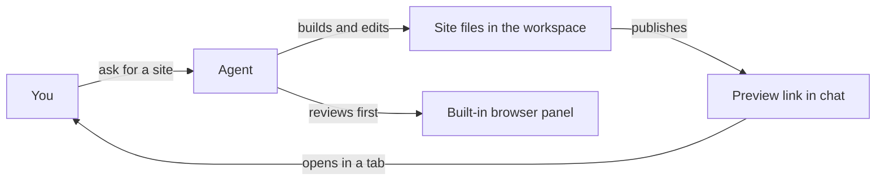

# Previews of agent-built sites

When an agent builds a website for you, Omnipus publishes it and hands you a link. This page covers opening the link, how the agent reviews its own work first, and the one setting an operator behind a reverse proxy must add.

## What it is

An agent can build a site inside its workspace — a landing page, a report, a small interactive app — and publish it with its serving tool, called `serve_web`. Omnipus serves the result on the same address as Omnipus itself. There is no second port to open in a firewall and no separate preview server to run.

The link looks like this:

```
https://your-omnipus-address/preview/<agent>/<token>/
```

The long random token in the path is the only credential. Anyone holding the complete link can view the preview until it expires. Anyone without it gets an error page. The preview never asks for an Omnipus sign-in.

## When you would use it

- You asked an agent to build a page or a small app, and you want to see the result yourself.
- The agent is iterating on a design and publishes each version as it goes.
- You want to check the agent's work in your own browser before accepting it.

## How to open a preview

1. Ask the agent in chat to build and serve the site.
2. When the tool finishes, chat shows a preview card with the link. For a live development server, the card says "Starting dev server" while it wakes up, then shows the link.
3. Click the link, or use the open-in-new-tab button on the card. The site opens in its own browser tab, where it runs as a full page and can hold its own login.
4. Use the copy button on the card if you need the link somewhere else. Remember that the link itself is the credential.

If a development server does not answer in time, the card says so and offers a Retry button. The agent can also open the preview in its built-in browser, check it, and walk you through it before you click anything. See [browser](browser.md) for that panel.

## The two serving modes

The serving tool has two modes. The agent picks one depending on whether the site is finished or still being built.

| Mode | What gets published | Where it works | How long the link lives |
|---|---|---|---|
| Finished files | A folder of built files from the workspace | Every platform | Up to 24 hours; the shortest window is 1 minute |
| Development server | A live development command the agent starts, such as `vite dev` | Linux only | 30 minutes without a visitor, or 4 hours in total |

A few details behind the table:

- The published folder must contain an `index.html` at its root. The link opens that file first.
- Publishing the same folder again renews the same link. Publishing a different folder replaces the registration, and the old link stops working. The agent is instructed to give you the new link when that happens.
- The development command must come from a fixed list: `next dev`, `vite dev`, `astro dev`, `sveltekit dev`, `npm run dev`, `pnpm dev`, or `yarn dev`. An operator can extend the list in the config file.
- At most two development servers run at once on a default install, and each agent can run only one at a time.



The preview flows from the agent's workspace to a link in your chat, and the agent can inspect the running site in its own browser before you open it.

## Limits and things to watch

- **The link is the credential.** Share it with the care you would give a password. Anyone who has it can view the preview until it expires.
- **Previews are temporary, not hosting.** An expired link returns "preview registration not found or expired". The files stay in the workspace; only the published link dies. Ask the agent to publish again for a fresh link.
- **Logins inside a development preview do not stick.** For development-server previews, the gateway removes cookies on every forwarded request, a deliberate safety choice. A login you make inside such a preview can be dropped on the next page load. Previews of finished files are unaffected.
- **An operator can switch previews off.** The switch lives in Settings, on the Gateway tab, labeled "Preview server". It takes effect at once, without a restart. While it is off, every preview link returns an error and the serving tool refuses to publish.

## Running Omnipus behind a reverse proxy

If Omnipus sits behind nginx, Caddy, or a similar proxy, previews arrive on the same single port as everything else (default 5000). One setting is needed:

1. Set `public_url` under `gateway` in Omnipus's config file to the full HTTPS address a browser uses to reach Omnipus, for example `https://omnipus.example.com`.
2. Restart the gateway. The setting is read at startup, so a change needs a restart to take effect.
3. Pass the `/preview/` path through untouched, like the rest of the app. The proxy must not block or rewrite that prefix.

Without `public_url`, a gateway listening on all network interfaces cannot build a correct link, and the serving tool refuses rather than hand you a broken URL. Full nginx and Caddy examples are in the [reverse proxy guide](operations/reverse-proxy.md).

## Related pages

- [browser](browser.md) — the built-in browser the agent uses to review a preview and present it to you.
- [workspaces](workspaces.md) — where the agent's files live before they are published.
- [tools](tools.md) — how allow, ask, and deny rules govern which tools an agent may use.
- [settings](settings.md) — the Gateway tab, where the preview switch lives.
- [Reverse proxy guide](operations/reverse-proxy.md) — worked nginx and Caddy examples for operators.
