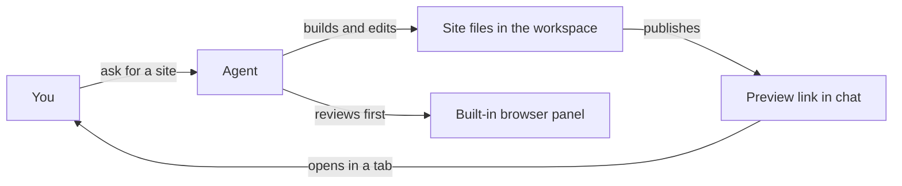

# Previews of agent-built sites

When an agent builds a website for you, Omnipus publishes it and hands you a link. This page covers opening the link, which address a preview gets, how logins and cookies behave inside it, the two risks worth knowing about, and the one setting an operator behind a reverse proxy must add.

## What it is

An agent can build a site inside its workspace — a landing page, a report, a small interactive app — and publish it with its serving tool, called `serve_web`. The result is served on the same single port as Omnipus itself: either on its own address (a random name ending in `.localhost`) or on Omnipus's address under a private path. There is no second port to open in a firewall, no DNS record to create, and no separate preview server to run.

The link looks like one of these:

```
http://k4qz…localhost:5000/                             (isolated address)
https://your-omnipus-address/preview/<agent>/<token>/   (shared address)
```

The full link — including its long random part — is the only credential. Anyone holding the complete link can view the preview until it expires. Anyone without it gets an error page. Omnipus never asks you to sign in to open a preview.

## Which address a preview gets

Omnipus picks the preview's address automatically when the agent publishes, based on how Omnipus itself is reached:

| How Omnipus is reached | Address the preview gets |
|---|---|
| `http://localhost` (the default desktop install) | Its own isolated address: `http://<random-name>.localhost:5000/` — a fresh, random name that exists only for this one preview. Chrome, Edge and Firefox open such names directly, with no setup. Safari does not, so in Safari the card shows the shared address instead. |
| Any other way — HTTPS, an IP address, a real domain, Tailscale | The shared address: Omnipus's own address under a private path, `/preview/<agent>/<token>/`. |

Both addresses serve the same preview. The chat card always shows the one that works in your browser.

The two addresses differ in separation, not in features: the site runs as a full web app either way — storage, cookies, login, forms, popups and downloads all work on both (see [Logins and cookies](#logins-and-cookies-inside-a-preview)).

- **Isolated address.** The preview has its own separate name, so it is a separate place from Omnipus: your Omnipus sign-in does not apply there, and none of Omnipus's cookies or API keys travel to it.
- **Shared address.** The preview lives on Omnipus's own address. Omnipus fences it in: the page may make its network calls only within its own private path, and Omnipus removes its own sign-in and security cookies from everything the page sends through the gateway (see [Logins and cookies](#logins-and-cookies-inside-a-preview)).

## When you would use it

- You asked an agent to build a page or a small app, and you want to see the result yourself.
- The agent is iterating on a design and publishes each version as it goes.
- You want to check the agent's work in your own browser before accepting it.

## How to open a preview

1. Ask the agent in chat to build and serve the site.
2. When the tool finishes, chat shows a preview card with the link — the one that works in your browser (see [Which address a preview gets](#which-address-a-preview-gets)). For a live development server, the card says "Starting dev server" while it wakes up, then shows the link.
3. Click the link, or use the open-in-new-tab button on the card. The site opens in its own browser tab, where it runs as a full page and can hold its own login.
4. Use the copy button on the card if you need the link somewhere else. Remember that the link itself is the credential.

If a development server does not answer in time, the card says so and offers a Retry button. The agent can also open the preview in its built-in browser, check it, and walk you through it before you click anything. See [browser](browser.md) for that panel.

## Finished files or a live dev server

The serving tool has two ways to publish. The agent picks one depending on whether the site is finished or still being built.

| Way of publishing | What gets published | Where it works | How long the link lives |
|---|---|---|---|
| Finished files | A folder of built files from the workspace | Every platform | Up to 24 hours; the shortest window is 1 minute |
| Development server | A live development command the agent starts, such as `vite dev` | Linux only | 30 minutes without a visitor, or 4 hours in total |

A few details behind the table:

- The published folder must contain an `index.html` at its root. The link opens that file first.
- Publishing the same folder again renews the same link. Publishing a **different** folder replaces the registration: the old link stops working, and the new link is a new address — so the site starts from scratch there (its saved data and any login are empty on the new address). That is expected, not a bug.
- The development command must come from a fixed list: `next dev`, `vite dev`, `astro dev`, `sveltekit dev`, `npm run dev`, `pnpm dev`, or `yarn dev`. An operator can extend the list in the config file.
- At most two development servers run at once on a default install, and each agent can run only one at a time.


```mermaid
flowchart LR
  You[You] -->|ask for a site| Agent[Agent]
  Agent -->|builds and edits| Files[Site files in the workspace]
  Files -->|publishes| Link[Preview link in chat]
  Link -->|opens in a tab| You
  Agent -->|reviews first| Panel[Built-in browser panel]
```

The preview flows from the agent's workspace to a link in your chat, and the agent can inspect the running site in its own browser before you open it.

## Logins and cookies inside a preview

A site inside a preview is a real web app, and its logins hold.

- **The site's own login sticks.** The site keeps its own cookies and saved data between page loads and between visits, on both addresses. A login you make inside a preview stays working.
- **What Omnipus removes, and only that.** Where a preview's requests pass through Omnipus's gateway, Omnipus removes from them only its own sign-in and security cookies (named `omnipus-session`, `csrf` and `__Host-csrf`) and its own API keys. Everything else — the site's own cookies above all — passes through untouched, which is exactly why the site's login holds.
- **The reverse direction too.** A previewed site cannot hand your browser a cookie named like one of Omnipus's own: Omnipus drops any such attempt before it reaches you, so a preview can never overwrite your Omnipus session.

### If Omnipus clears cookies (a one-click recovery)

If something inside a preview plants an extra copy of an Omnipus cookie, Omnipus refuses the affected request, clears the planted copies, and shows a message: "Omnipus cleared cookies set by a preview — please retry", with a **Retry** button that repeats the failed action once.

- If the message keeps coming back, the preview that plants them is still open: it re-plants them as fast as Omnipus clears them. **Close that preview tab first, then click Retry once** — recovery is one click once the planting tab is closed.
- This is never a permanent login lockout.

## What previews cannot protect against

Two risks are accepted and documented rather than engineered away. Both stem from the same place: you opened a page your own agent built.

- **A fake Omnipus login screen.** An agent-built page can display a fake Omnipus sign-in form. Omnipus itself never asks you to sign in inside a preview — so never enter your Omnipus password inside a preview.
- **Driving Omnipus through a popup — shared address only.** On the shared address the preview runs on the same address as Omnipus, so a page there could in principle open Omnipus itself in a second window and click through the real interface as you. Omnipus narrows this window as much as headers allow, but cannot close it on this address. The isolated address does not have this problem. The hosted version of Omnipus will not rely on the shared address for previews.

## Limits and things to watch

- **The link is the credential.** Share it with the care you would give a password. Anyone who has it can view the preview until it expires.
- **Previews are temporary, not hosting.** An expired link returns "preview registration not found or expired". The files stay in the workspace; only the published link dies. Ask the agent to publish again for a fresh link.
- **A blank preview means a blocked part of the page.** If a preview on the shared address opens blank, some part of the page tried to reach outside its private path and Omnipus blocked it. Browsers report that only in the console — the page itself shows no error. Open the browser console (F12) and tell the agent what it says; the agent can also check its own built-in browser first.
- **An operator can switch previews off.** The switch lives in Settings, on the Gateway tab, labeled "Preview server". It takes effect at once, without a restart. While it is off, every preview link returns an error and the serving tool refuses to publish.

## Running Omnipus behind a reverse proxy

If Omnipus sits behind nginx, Caddy, or a similar proxy, previews share Omnipus's own address (there is no isolated address in this setup), and everything still arrives on the single port (default 5000). One setting is needed:

1. Set `public_url` under `gateway` in Omnipus's config file to the full HTTPS address a browser uses to reach Omnipus, for example `https://omnipus.example.com`.
2. Restart the gateway. The setting is read at startup, so a change needs a restart to take effect.
3. Pass the `/preview/` path through untouched, like the rest of the app. The proxy must not block or rewrite that prefix.

Without `public_url`, a gateway listening on all network interfaces cannot build a correct link, and the serving tool refuses rather than hand you a broken URL. Full nginx and Caddy examples are in the [reverse proxy guide](operations/reverse-proxy.md).

## Related pages

- [browser](browser.md) — the built-in browser the agent uses to review a preview and present it to you.
- [workspaces](workspaces.md) — where the agent's files live before they are published.
- [tools](tools.md) — how allow, ask, and deny rules govern which tools an agent may use.
- [settings](settings.md) — the Gateway tab, where the preview switch lives.
- [Reverse proxy guide](operations/reverse-proxy.md) — worked nginx and Caddy examples for operators.
