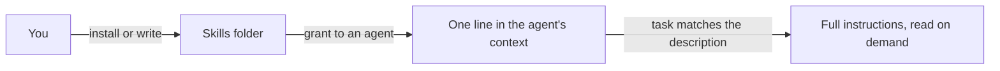

# Skills

A skill is a written playbook an agent picks up when a task calls for it. This page explains what a skill is, how to add one, and how to decide which agents may use it.

## What it is

A skill is a folder that holds a single file, `SKILL.md`: a short description, and instructions written in Markdown. Installing a skill changes nothing on its own. Granting it to an agent adds one line to that agent's context — the skill's name and description. The full instructions are read only when the agent decides the task matches, and they apply to that task only.

This is what separates a skill from its neighbors. [Tools](tools.md) are the actions an agent can take. [Memory](memory.md) is what an agent remembers between conversations. A skill is how you teach a repeatable procedure once, so any agent can follow it the same way every time.

The format is the common `SKILL.md` convention other agent tools use, so a repository that already carries skills works as-is.

A skill sits in the folder until you grant it; a granted skill stays a one-line entry until a task needs the whole thing.

Skills reach your agents from four places.

| Source | What it is | How it gets there |
|---|---|---|
| Your skills folder | Skills you install or write, grantable to any agent | Lives at `~/.omnipus/skills` in your data folder |
| Shipped skills | Five examples that come with Omnipus | Seeded automatically on first boot |
| A mounted folder | Skills that belong to a repository and travel with it | Put them in `.omnipus/skills` or `.claude/skills` at the root, then [mount the folder](library.md) |
| The ClawHub registry | Community-published skills | Search and install from the Skills & Tools screen |

The five shipped skills are Daily Briefing, Define Goal, Plan, Skill Authoring, and Summarize.

## When you would use it

- A procedure repeats. Your release checklist, your invoice handling, your house style for customer replies. Write it once, grant it to the agents that need it.
- Someone already wrote it. The ClawHub registry carries community skills; search before you write.
- Your repository carries its own skills. Mounting the folder is enough for its skills to become available to agents in that workspace.
- An agent offers to capture a procedure it just performed. Say yes, and it writes the skill for you.

## How to add a skill and grant it

1. Open **Skills & Tools** in the sidebar. You see three tabs: Installed Skills, MCP Servers, Built-in Tools.
2. Click **Browse Skills**. A search window opens over the screen.
3. Type what you are looking for. Results come from the ClawHub registry, each with its name, version, and summary.
4. Click **Install** on the one you want. The skill appears under Installed Skills, marked Community.
5. To use a file you already have, choose **Install from file** in the same window. A file install cannot be verified against a published checksum, so Omnipus shows what the skill claims to do and asks you to confirm.
6. Grant the skill. Open the agent, new or existing, and tick the skill in its skills list. An agent with nothing ticked has no skills.
7. Send the agent a task that matches the skill's description. You can also type `/` in chat and pick the skill to activate it for that one message.

You can also skip the screen: ask an agent in chat to find and install a skill, or to write one for you. Agents ask for your approval before they write or change skill files.

Each card under Installed Skills shows when the skill was last used. "Never used" on a skill you granted is the sign its description is not doing its job.

## What a skill file contains

A skill is one folder, one file. These are the parts the app reads.

| Part | Required | What it is for |
|---|---|---|
| Folder name | Yes | The skill's identifier — what you grant and what follows `/` in chat. Letters, digits, and single hyphens, up to 64 characters. |
| `description` | Yes | One line saying when to use the skill. At most 1024 characters. Falls back to the first paragraph of the body. |
| Body | Yes | The instructions, in Markdown. Read only when the agent loads the skill. |
| `name` | No | Display name shown in the app, such as "Daily Briefing". Falls back to the folder name. |
| `author`, `version` | No | Shown on the skill's card in Installed Skills. |
| `argument-hint` | No | A hint shown next to the skill in the chat `/` menu, such as `<query>`. |

The description is the part that decides whether the skill is ever used. The agent picks a skill by matching the description against the task, so write it as a trigger: "Use when the user asks to cut a release or publish release notes" fires; "Release process documentation" does not. Name the phrases a task would actually contain.

## Limits and things to watch

- Installing is not granting. A new skill sits unused until you grant it to an agent, and a new agent starts with no skills at all.
- A skill that never fires looks identical to a skill nobody needed. The "Last used" row on each card is the only signal — check it before assuming a grant worked.
- Registry installs are checked against a published checksum; file installs cannot be. The setting lives in Settings, under Security: **Block unverified** refuses installs with no checksum to check, **Warn unverified** allows them with a warning (the default), and **Allow all** turns checking off.
- Editing a shipped skill never changes the original. Your edit becomes a copy in your skills folder that overrides it, and every save keeps a snapshot of the prior version under `.versions` inside the skill's folder, so a bad edit is recoverable.
- A mounted folder's skills come with the mount, available to every agent in that workspace. They cannot replace a skill you granted under the same name — your grant wins.
- Every skill available to an agent adds one line to its context on every message. A mounted repository carrying a large skill collection adds all of them, with no limit. If the per-message menu grows, trim the repository's skills folder or unmount it.

## Related pages

- [tools](tools.md) — what tools are, and how allow, ask, and deny permissions govern them.
- [agents](agents.md) — creating agents and choosing each one's skills.
- [library](library.md) — mounting a folder into a workspace, which is how a repository's own skills arrive.
- [memory](memory.md) — what your agents remember across conversations — different from a procedure you teach once.
- [settings](settings.md) — the skill trust setting and the rest of the app's configuration.
