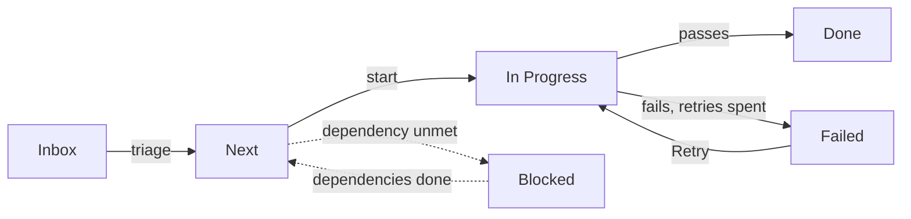

# Tasks

The Tasks tab inside a workspace is where you turn work into cards you can assign, start, and follow to completion. This page covers the Board and List views and the task detail panel.

## What it is

Every workspace has a Tasks tab, next to Chat, Calendar, Library, and Team. It holds the workspace's one shared task list — yours and your agents' together — behind three views:

- **Board** — a kanban: one card per task, in one of six status columns.
- **List** — the same tasks as a table. Each header dropdown sorts or filters by value.
- **Graph** — the tasks drawn as a dependency map. That view belongs to planning; see [plans](plans.md).

Above the views, the Plans band scopes the screen: click a plan tile to see that plan's tasks (the view also jumps to its graph), or **All tasks** to clear the filter.

On the Board, the **Agent** and **Tags** filters narrow further. The List filters per column instead, like a spreadsheet: each header offers sorting and value checkboxes. The list refreshes itself about every 15 seconds, so an agent's changes appear without a reload.

## When you would use it

- You want to hand a piece of work to an agent and follow it without watching the chat.
- You want a shared backlog the whole team can see and prioritize.
- An agent created tasks during a goal or plan, and you want to review them.

## How to create and start a task

1. Open the workspace, then its **Tasks** tab.
2. Click **New Task** at the top right. A form slides in from the right.
3. Fill in the required fields: **Title**, **Goal**, at least one **Acceptance criterion**, and at least one **Definition of Done** item.
4. Pick an **Agent** to own the work, or leave it **Unassigned**. A task with no agent cannot run — it stays on the board as a human to-do.
5. Click **Create** to save the task in the Inbox column, or **Create & Run** to save it and start it right away.

To start a saved task later, press **Run** on its card (a play symbol), drag it into **In Progress**, or press **Start Task** in the panel. The engine then drives it: the agent works toward the goal, each run is judged against your criteria, and the card's status follows.

## The task form

The fields on the New Task form, in order.

| Field | What it does | Required |
|---|---|---|
| Title | The card's name, up to 200 characters | Yes |
| Goal | What the task should achieve; the agent works from this | Yes |
| Priority | P1 Critical through P5 Minimal. P3 Medium is the default | No |
| Plan | The plan this task belongs to, if any | No |
| Tags | Free-form labels, used by the board filters | No |
| Acceptance criteria | Checks a finished task must pass | Yes |
| Definition of Done | Standing quality gates, judged every attempt | Yes |
| Agent | Who does the work. Must be on the workspace team | No |
| Depends on | Tasks that must finish before this one starts | No |
| Due date | A deadline, separate from any schedule | No |
| Todos | A checklist that shows its progress on the card | No |

Picking a plan reveals two more fields — the files the task may touch, and whether it assembles parallel work. Those belong to [plans](plans.md).

## Task statuses

The Board has one column per status; the List has a Status column.

| Status | What it means | How it changes |
|---|---|---|
| Inbox | Captured, not triaged | Every new task lands here |
| Next | Triaged and ready | You move it, or an agent does |
| In Progress | A run is working on it | You start it, or a plan reaches it |
| Blocked | A dependency is unmet | Set and cleared automatically |
| Done | The last run passed | Final — a passing run or you set it |
| Failed | The last run failed, or was stopped | Retry opens a fresh run |

A task you stop shows as orange **Cancelled** rather than red **Failed**, inside the same Failed column.

A task flows from Inbox toward Done; Blocked hangs off to the side until its dependencies finish.

## The task detail panel

Click any card or List row and the detail panel slides in. Every field saves as you edit; there is no Save button. From here you can:

- Change the status, assign a different agent, or move the task to another plan.
- Edit the goal, priority, tags, dependencies, due date, and checklist.
- Press **Start Task** while it is idle, **Retry** after a failure, or **Stop/Clear goal loop** while it runs. Stop and Delete both ask for confirmation.
- Press **Open in Chat** to read the run's conversation, once it has run.
- Read the **Run history**: one row per attempt, its outcome, and a link into that run's chat. Above it sit the latest verdicts on each acceptance criterion, with the evidence behind them — the judge is explained in [goals](goals.md).

## Limits and things to watch

- **A task with no agent cannot run.** The engine skips unassigned tasks; assign one before starting.
- **The assigned agent must be on the workspace team** — its core members plus anyone reachable through delegation. See [workspaces](workspaces.md).
- **You cannot drag into Blocked or out of Done.** Blocked belongs to the dependency engine; Done is final.
- **A task in a plan is driven by its plan.** It has no Run or Stop control of its own; start, stop, and restart happen at the plan level. See [plans](plans.md).
- **Dependency circles are rejected.** A chain may not loop back on itself, and dependencies stay inside one plan.
- **Runs stop after the attempt limit** — three by default. When attempts are spent, the task lands in Failed.
- **Scheduled and repeating tasks never appear here.** They live in the workspace [calendar](calendar.md).
- **An assignee warning means the agent cannot finish this task as configured.** The warning names the fix, usually a tool permission; starting anyway fails at once.
- **Deleting a task cannot be undone.** The confirmation is your last chance.

## Related pages

- [workspaces](workspaces.md) — what a workspace is, and how its team decides who can be assigned.
- [plans](plans.md) — the Graph view, plan membership, and how a plan starts its tasks.
- [calendar](calendar.md) — scheduled and repeating tasks, which the Board and List hide.
- [goals](goals.md) — the goal loop behind every run, and the judge that scores it.
- [agents](agents.md) — the agents you can assign to a task, and what each is for.
