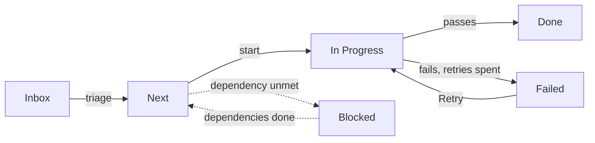

# Tasks

The Tasks panel inside a workspace is where you turn work into cards you can assign, start, and follow to completion. This page covers the Board and List views and the task detail panel.

## What it is

Every workspace has a **Tasks** control in its top bar, alongside Calendar, Library, Mail, and Team. Click it to open the Tasks panel beside Chat; click it again to close it. Chat is the page underneath, not a separate top-bar entry. The panel holds the workspace's one shared task list — yours and your agents' together — behind three views:

- **Board** — a kanban of eligible top-level workspace tasks, grouped by status in six columns. Scheduled tasks are hidden, and subtasks are not separate Board cards.
- **List** — the same tasks as a table, with per-column sorting and filtering.
- **Graph** — top-level plan members and tasks with dependency relationships, drawn as a dependency map. That view belongs to planning; see [plans](plans.md).

Above the views, the Plans band scopes the screen: click a plan tile to see that plan's tasks (the view also jumps to its graph), or **All tasks** to clear the filter.

On the Board, the **Agent** and **Tags** filters narrow further. The List filters per column instead, like a spreadsheet: Priority, Status and Agent sort and filter; Tags filters only; Title and Updated sort only. The list refreshes itself about every 15 seconds, so an agent's changes appear without a reload.

The toolbar follows the panel's own width, not the browser window. At narrow widths its groups stack, and the heading/view group and filters can wrap. The selector continues to offer Board, List and Graph.

The Board stacks its status groups vertically in a narrow panel. In List, Tags and Updated are hidden by default in a narrow panel; use the three-dot control in the Actions header to show or hide Tags and Updated.

## When you would use it

- You want to hand a piece of work to an agent and follow it without watching the chat.
- You want a shared backlog the whole team can see and prioritize.
- An agent created tasks during a goal or plan, and you want to review them.

## How to create and start a task

1. Open the workspace, then its **Tasks** panel.
2. Click **New Task** at the top right. A form slides in from the right.
3. Fill in the required fields: **Title**, **Goal**, at least one **Acceptance criterion**, and at least one **Definition of Done** item.
4. Pick an **Agent** to own the work, or leave it **Unassigned**. A task with no agent cannot run — it stays on the board as a human to-do.
5. Click **Create** to save the task in the Inbox column, or **Create & Run** to save it and start it right away.

To start a saved task later, press **Run** on its card (a play symbol), drag it into **In Progress**, or press **Start Task** in the panel. The engine then drives it: the agent works toward the goal, each run is judged against your criteria, and the card's status follows.

### If the task conversation cannot be created

A queued dispatch, or a new manual start that uses the assigned agent's conversation store, must create its task conversation before handing work to the agent. If that store is unavailable, or creating the conversation returns an error, the start is refused instead of running without a conversation. This applies to both native agents and external command-line agents on those start paths. The refused start consumes no execution attempt, creates no run-history entry, and starts no model request, tool call, or external command.

| Start path | What happens after conversation creation is refused |
|---|---|
| Queued dispatch | Omnipus tries to save **Failed** with the creation error, then reads the saved task to verify that status. If it cannot confirm **Failed**, the returned error also says so. |
| New manual start through the web app or `run_task`, using the assigned agent's conversation store | The start returns an error; its caller tries to restore the task's previous status. It does not return a new conversation ID. |

If the task store also cannot save the failure or restore the previous status, the card may still say **In Progress** even though no work began. Fix the reported storage or agent-store problem before retrying; see [troubleshooting](troubleshooting.md#a-task-is-refused-before-work-starts).

## The task form

The fields on the New Task form, in order.

| Field | What it does | Required |
|---|---|---|
| Title | The card's name, up to 200 characters | Yes |
| Goal | What the task should achieve; the agent works from this | Yes |
| Priority | P1 Critical through P5 Minimal. P3 Medium is the default | No |
| Plan | The plan this task belongs to, if any | No |
| Tags | Free-form labels, used by the board filters | No |
| Acceptance criteria | Checks a finished task must pass | Yes |
| Definition of Done | Standing quality gates, judged every attempt | Yes |
| Agent | Who does the work. Must be on the workspace team | No |
| Depends on | Tasks that must finish before this one starts | No |
| Due date | A deadline, separate from any schedule | No |
| Todos | A checklist that shows its progress on the card | No |

Picking a plan reveals two more fields — the files the task may touch, and whether it assembles parallel work. Those belong to [plans](plans.md).

## Task statuses

The Board has one column per status; the List has a Status column.

| Status | What it means | How it changes |
|---|---|---|
| Inbox | Captured, not triaged | Every new task lands here |
| Next | Triaged and ready | You move it, or an agent does |
| In Progress | A run is working on it | You start it, or a plan reaches it |
| Blocked | A dependency is unmet | Set and cleared automatically |
| Done | The last run passed | Final — a passing run or you set it |
| Failed | The last run failed, was stopped, or a queued start was refused | Retry opens a fresh run |

A task you stop shows as orange **Cancelled** rather than red **Failed**, inside the same Failed column.

An **In Progress** task shows a spinning-arrow indicator on its Board card, List row, and Graph node, including task nodes in a plan's graph. A running plan's tile in the Plans band uses the same indicator. These task and plan indicators show no token counts; Chat keeps its existing token counter. The arrow follows the item's reported status, not a separate measure of model activity. With reduced motion enabled, it stays visible but does not spin.

```mermaid
flowchart LR
  Inbox -->|triage| Next
  Next -->|start| Run[In Progress]
  Run -->|passes| Done
  Run -->|fails, retries spent| Failed
  Next -.->|dependency unmet| Blocked
  Blocked -.->|dependencies done| Next
  Failed -->|Retry| Run
```

A task flows from Inbox toward Done; Blocked hangs off to the side until its dependencies finish.

**Agents cannot certify their own task runs with `update_task`.** While working on that task, an agent cannot set its status to Done or Failed; it uses `goal_claim` with `met` and evidence when finished, or `blocked` if it cannot proceed. The judge decides the outcome of the run. Outside a run, `update_task` also refuses Done for a regular task with acceptance criteria: start the task so its work can be judged rather than skipping those checks.

## The task detail panel

Click any card or List row and the detail panel slides in. Every field saves as you edit; there is no Save button. From here you can:

- Change the status, assign a different agent, or move the task to another plan.
- Edit the goal, priority, tags, dependencies, due date, and checklist.
- Press **Start Task** while it is idle, **Retry** after a failure, or **Stop/Clear goal loop** while it runs. Stop and Delete both ask for confirmation.
- Press **Open in Chat** to read the run's conversation, once it has run.
- Read the **Run history**: one row per attempt, its outcome, and a link into that run's chat. Above it sit the latest verdicts on each acceptance criterion, with the evidence behind them — the judge is explained in [goals](goals.md).

## Limits and things to watch

- **A task with no agent cannot run.** The engine skips unassigned tasks; assign one before starting.
- **The assigned agent must be on the workspace team** — its core members plus anyone reachable through delegation. See [workspaces](workspaces.md).
- **You cannot drag into Blocked or out of Done.** Blocked belongs to the dependency engine; Done is final.
- **A task in a plan is driven by its plan.** It has no Run or Stop control of its own; start, stop, and restart happen at the plan level. See [plans](plans.md).
- **Dependency circles are rejected.** A chain may not loop back on itself, and dependencies stay inside one plan.
- **Runs stop after the attempt limit** — three by default. When attempts are spent, the task lands in Failed.
- **Board and List hide scheduled tasks.** Use the workspace [Calendar](calendar.md) to manage scheduled and repeating work.
- **An assignee warning means the agent cannot finish this task as configured.** The warning names the fix, usually a tool permission; starting anyway fails at once.
- **Deleting a task cannot be undone.** The confirmation is your last chance.

## Related pages

- [workspaces](workspaces.md) — what a workspace is, and how its team decides who can be assigned.
- [plans](plans.md) — the Graph view, plan membership, and how a plan starts its tasks.
- [calendar](calendar.md) — scheduled and repeating tasks, which the Board and List hide.
- [goals](goals.md) — the goal loop behind every run, and the judge that scores it.
- [agents](agents.md) — the agents you can assign to a task, and what each is for.
