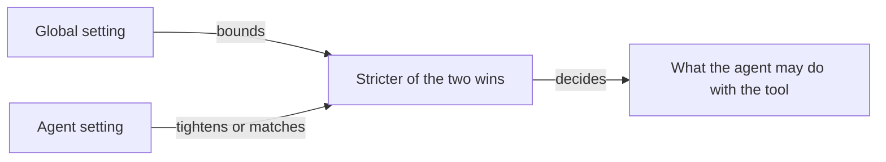

# Tools

Tools let an agent read and write files, search the web, run commands, and send email. This page covers where tools come from and how you control access.

## What it is

A tool is one capability an agent can call while it works. When an agent uses a tool, the call appears in the chat as a collapsible entry, so you can see what it did.

Tools come from two places:

- **Built-in tools** ship with Omnipus — a large catalog; the **Built-in Tools** tab under Skills & Tools lists the current set.
- **Tools from connected servers.** Omnipus speaks MCP (Model Context Protocol), an open standard many services publish tools to. Connect a server and its tools appear next to the built-in ones.

Every tool, built-in or from a server, has a policy with three values: **Allow**, **Ask** or **Deny**. You set it in two places — once for the whole installation, once per agent.

The built-in groups you will meet in practice are below. For every current name and description, use the generated [built-in tool catalog](reference/built-in-tools.md). The **Built-in Tools** tab is the live list for your installation.

| Group | Tools you will notice | What they do |
|---|---|---|
| Files | `read_file`, `write_file`, `edit_file` | Read and change workspace files |
| Shell | `bash` | Run shell commands |
| Web & Search | `search_web`, `fetch_url` | Search the web and open a page |
| Browser | `browser_navigate`, `browser_screenshot` | Drive a live browser, capture what it shows |
| Communication | `send_email`, `read_inbox`, `send_message` | Send email and chat messages |
| Delegation | `delegate` | Hand work to another agent |

An agent sees common tools directly and searches the rest when a task calls for one. If it does not reach for a tool, name it in your request.

## When you would use it

- An agent is using a tool you do not want it to use — deny the tool.
- A tool is risky enough that you want to confirm each use — set it to Ask.
- You connected a new server and need to decide who may use its tools.
- You scheduled recurring work and nobody will be present to answer approval prompts.

## How to change an agent's tool access

1. Open **Agents** in the sidebar and click the agent. The profile opens.
2. Scroll to the **Tools & Permissions** panel.
3. Optional: start from a preset — **Cautious** (every tool asks first), **Balanced** (safe tools run; file writes, commands and browser control ask first) or **Full access** (nothing asks).
4. Expand a group and click **Allow**, **Ask** or **Deny** on the tool you care about. Changes save on their own.

The installation-wide setting lives in **Settings → Security**, under **Advanced / technical details**, in **Tool Access — Global Policies**. What you set there applies to every agent at once. Saving a change there asks you to re-type your password.

## Allow, ask and deny

What each setting does, and what you see when it fires:

| Setting | What the agent can do | What you see |
|---|---|---|
| Allow | Runs the tool without checking | The call runs and shows in the chat |
| Ask | Stops and waits for your approval, unless Auto-approve lets the call through | An approval card with Approve Once, Deny and Always Allow |
| Deny | Cannot run the tool | The tool disappears from the agent's view |

On the approval card, **Approve Once** runs the call and remembers nothing. **Always Allow** remembers that exact call for the rest of the chat, so an identical one does not ask again. For a shell command, Always Allow can instead remember a whole family of similar commands. See [security](security.md) for the exact wording and when that choice is offered.

**Auto-approve** sits on top of Ask. It never changes a tool set to Allow or Deny. When it is on, a tool set to Ask skips the card for calls Omnipus can judge safe and still shows it for the rest — this now works with or without a kernel sandbox (changed 2026-09-24). Without a kernel sandbox, the shell's own checks are text-only; see [security](security.md#auto-approve-and-the-kernel-sandbox-changed-2026-09-24) for what that means in practice. It is on by default, and you can turn it off globally, for one agent, or for one chat.

Under Auto-approve, most tools run without a card. File tools run only when every path is inside the workspace or a mounted folder, so `write_file` to `notes/plan.md` runs while `read_file` of `/etc/hosts` asks. A fixed list of 28 tools always asks, such as `delete_task`, `send_email`, `set_config`, `browser_evaluate` and `install_skill`. `send_message` and `send_file` are **not** on that list: messages, and files from inside the workspace, go out to chat channels with no card. The shell has its own checks: it asks for writes outside the workspace and for network access. See [security](security.md) for the full list and the shell details.

The **Under Auto** column in the [built-in tool catalog](reference/built-in-tools.md) shows, for every built-in tool, **Runs**, **Runs if inside workspace** or **Asks**. The same answer appears as a small marker — **Auto: runs**, **Auto: runs inside workspace** or **Auto: asks** — next to each tool set to Ask in the **Tools & Permissions** panel and in **Tool Access — Global Policies**. `bash` has no marker, because it has its own checks.

The two layers — global and per agent — combine by one rule: **the stricter of the two wins** (Deny beats Ask, Ask beats Allow). A setting on one agent can only tighten the global setting, never loosen it.

An agent's setting can make a tool stricter than the global one, never looser.

Concrete combinations:

| Global setting | Agent setting | What happens |
|---|---|---|
| Allow | Ask | The agent asks first |
| Allow | Deny | The tool is blocked for that agent |
| Ask | Allow | Still asks — an agent setting cannot loosen this |
| Deny | Allow | Blocked — a global Deny cannot be overridden |

A tool blocked globally is greyed out in each agent's tool list, so you can see where the ceiling sits while you work.

## Tools from connected servers

A connected server adds tools Omnipus was not born with — a company wiki, a design app, a database. One server can add several tools.

To connect one:

1. Open **Skills & Tools** in the sidebar.
2. Go to the **MCP Servers** tab and click **Add Server**.
3. Choose **Local program** (a command that runs on your machine) or **Network address** (an https address, for hosted services). A local program asks you to confirm you trust it.
4. Save. The server appears with its connection status, and its tools join the catalog.

Server tools carry the server's name, so you can tell where a tool came from. In both policy editors they sit in their own group under the server's name. One Allow, Ask or Deny control covers every tool from that server. The stricter-wins rule applies to them like any other tool.

Under Auto-approve, a server tool set to Ask runs without a card only when its server labels it read-only or explicitly not destructive. A tool with no label asks. Most servers send no labels today, so most server tools still ask. Each server tool set to Ask shows its own **Auto: runs** or **Auto: asks** marker.

## Limits and things to watch

- **The four base agents are locked.** Their tool settings are read-only. To change tool access, create a custom agent — see [agents](agents.md).
- **Policies do not reach external runners.** An agent on an external command-line tool manages its own tool access; Omnipus settings have no effect.
- **Unattended runs cannot answer questions.** This covers every run nobody is sending live: a Calendar-triggered task on a workspace's Board, a Schedules-feature fire, a queued task the task drain picks up, a plan's own member-task dispatch, a task's auto-advance once its dependency finishes, and a parent task's automatic follow-up once its children finish. Auto-approve works the same there as in a chat: a call it would run in a chat also runs there. A call that would need a person, such as `delete_task` or a file write outside the workspace, is refused straight away with an error saying no operator is available — never a live approval card, even if someone happens to have that agent's chat open (founder decision, 2026-09-24). Give an unattended agent Allow on any tool it needs that would otherwise ask. Clicking **Run now** on a task, or starting one from the Board, is different — you are watching it, so it still asks normally.
- **The shell can touch files directly.** Denying `write_file` does not stop an agent with `bash` from changing files with a command. To block file access, deny `bash`.
- **Auto-approve no longer needs a kernel sandbox (changed 2026-09-24).** On Windows, or with the process sandbox not set to Enforce, Auto-approve still runs — the chat header shows **Auto — shell asks (no sandbox)** instead of plain **Auto**. Every tool except the shell behaves exactly the same either way. For the shell, without a kernel sandbox Omnipus can only check a command's text before running it, with no operating-system check behind that, so *(changed again 2026-09-24)* it only auto-runs a read-only command (listing files, printing a file's contents, `git status`/`log`/`diff`/`show`, and similar) or one an operator's `command_rules` allow rule explicitly covers — every other shell command asks first, even one that only touches files inside the workspace. A deliberately disguised command can still slip past this text-only check either way. See [security](security.md#auto-approve-and-the-kernel-sandbox-changed-2026-09-24) for the concrete risk and how to avoid it.
- **Email tools need a mailbox.** They exist only for an agent that owns an enabled mailbox, configured on the [Connectors](connectors.md) screen — one mailbox per agent and workspace.
- **Web search works without setup**, on a default provider that needs no key. To use another provider, add its key under **Settings → Integrations**.

## Related pages

- [agents](agents.md) — what agents are, the four base agents, and how to create a custom one.
- [skills](skills.md) — the other half of the Skills & Tools screen: reusable playbooks agents pick up.
- [connectors](connectors.md) — where email mailboxes and chat connectors are configured.
- [settings](settings.md) — the Settings screen, including the global tool policies under Security.
- [security](security.md) — the sandbox that contains what tools are allowed to do.
- [browser](browser.md) — the browser tools and the live browser panel.
- [built-in tool catalog](reference/built-in-tools.md) — the generated list of every built-in tool in this release.
