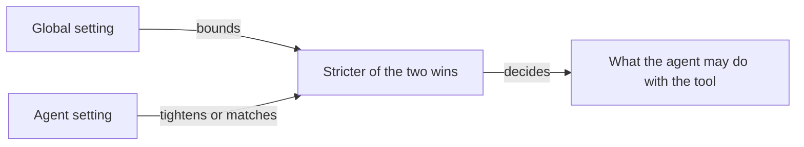

# Tools

Tools are the hands an agent works with: reading and writing files, searching the web, running commands, sending email. This page covers where tools come from and how you control which ones an agent may use.

## What it is

A tool is one capability an agent can call while it works. When an agent uses a tool, the call appears in the chat as a collapsible entry, so you can see what it did.

Tools come from two places:

- **Built-in tools** ship with Omnipus — about ninety of them, grouped by capability area.
- **Tools from connected servers.** Omnipus speaks MCP (Model Context Protocol), an open standard many services publish tools to. Connect a server and its tools appear next to the built-in ones.

Every tool, built-in or from a server, has a policy with three values: **Allow**, **Ask** or **Deny**. You set it in two places — once for the whole installation, once per agent.

The built-in groups you will meet in practice:

| Group | Tools you will notice | What they do |
|---|---|---|
| Files | `read_file`, `write_file`, `edit_file` | Read and change workspace files |
| Shell | `bash` | Run shell commands |
| Web & Search | `search_web`, `fetch_url` | Search the web and open a page |
| Browser | `browser_navigate`, `browser_screenshot` | Drive a live browser, capture what it shows |
| Communication | `send_email`, `read_inbox`, `send_message` | Send email and chat messages |
| Delegation | `delegate` | Hand work to another agent |

The catalog is deep, but an agent sees only its common tools directly; the rest are available and the agent searches the catalog when a task calls for one. If an agent owns a tool and does not reach for it, name the tool in your request.

## When you would use it

- An agent is using a tool you do not want it to use — deny the tool.
- A tool is risky enough that you want to confirm each use — set it to Ask.
- You connected a new server and need to decide who may use its tools.
- You scheduled recurring work and nobody will be present to answer approval prompts.

## How to change an agent's tool access

1. Open **Agents** in the sidebar and click the agent. The profile opens.
2. Scroll to the **Tools & Permissions** panel.
3. Optional: start from a preset — **Cautious** (every tool asks first), **Balanced** (safe tools run; file writes, commands and browser control ask first) or **Full access** (nothing asks).
4. Expand a group and click **Allow**, **Ask** or **Deny** on the tool you care about. Changes save on their own.

The installation-wide setting lives in **Settings → Security**, under **Advanced / technical details**, in **Tool Access — Global Policies**. What you set there applies to every agent at once. Saving a change there asks you to re-type your password.

## Allow, ask and deny

What each setting does, and what you see when it fires:

| Setting | What the agent can do | What you see |
|---|---|---|
| Allow | Runs the tool without checking | The call runs and shows in the chat |
| Ask | Stops and waits for your approval | An approval card with Approve, Deny and Always Allow |
| Deny | Cannot run the tool | The tool disappears from the agent's view |

On the approval card, **Always Allow** remembers that exact call, so an identical one does not ask again.

The two layers — global and per agent — combine by one rule: **the stricter of the two wins** (Deny beats Ask, Ask beats Allow). A setting on one agent can only tighten the global setting, never loosen it.

An agent's setting can make a tool stricter than the global one, never looser.

Concrete combinations:

| Global setting | Agent setting | What happens |
|---|---|---|
| Allow | Ask | The agent asks first |
| Allow | Deny | The tool is blocked for that agent |
| Ask | Allow | Still asks — an agent setting cannot loosen this |
| Deny | Allow | Blocked — a global Deny cannot be overridden |

A tool blocked globally is greyed out in each agent's tool list, so you can see where the ceiling sits while you work.

## Tools from connected servers

A connected server adds tools Omnipus was not born with — a company wiki, a design app, a database. One server can add several tools.

To connect one:

1. Open **Skills & Tools** in the sidebar.
2. Go to the **MCP Servers** tab and click **Add Server**.
3. Choose **Local program** (a command that runs on your machine) or **Network address** (an https address, for hosted services). A local program asks you to confirm you trust it.
4. Save. The server appears with its connection status, and its tools join the catalog.

Server tools carry the server's name, so you can tell where a tool came from. In both policy editors they sit in their own group under the server's name, and one Allow/Ask/Deny control covers every tool from that server in one click. The stricter-wins rule above applies to them like any other tool. The **Built-in Tools** tab of the same screen lists the whole catalog by capability area — a good place to browse.

## Limits and things to watch

- **The four base agents are locked.** Their tool settings are read-only. To change tool access, create a custom agent — see [agents](agents.md).
- **Policies do not reach external runners.** An agent on an external command-line tool manages its own tool access; Omnipus settings have no effect.
- **Scheduled runs cannot answer questions.** When scheduled work hits a tool set to Ask, the call is denied automatically — nobody is there to approve. Give a scheduled agent Allow on the tools it needs.
- **The shell can touch files directly.** Denying `write_file` does not stop an agent with `bash` from changing files with a command. To block file access, deny `bash`.
- **Email tools need a mailbox.** They exist only for an agent that owns an enabled mailbox, configured on the [Connectors](connectors.md) screen — one mailbox per agent and workspace.
- **Web search works without setup**, on a default provider that needs no key. To use another provider, add its key under **Settings → Integrations**.

## Related pages

- [agents](agents.md) — what agents are, the four base agents, and how to create a custom one.
- [skills](skills.md) — the other half of the Skills & Tools screen: reusable playbooks agents pick up.
- [connectors](connectors.md) — where email mailboxes and chat connectors are configured.
- [settings](settings.md) — the Settings screen, including the global tool policies under Security.
- [security](security.md) — the sandbox that contains what tools are allowed to do.
- [browser](browser.md) — the browser tools and the live browser panel.
