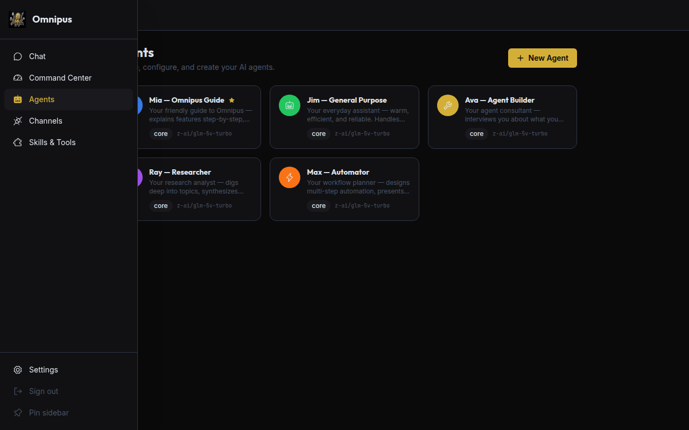
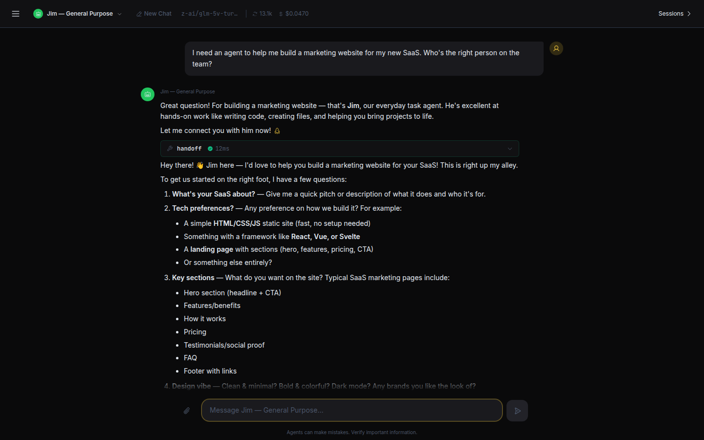
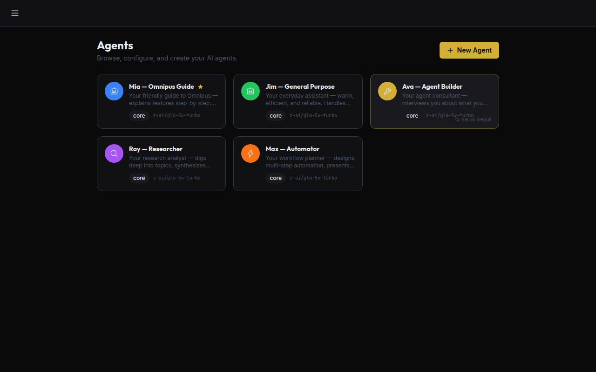
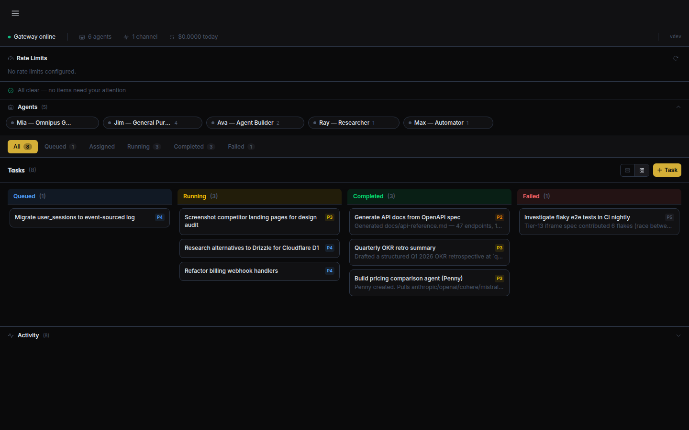

# Using Omnipus in the web app

This is a practical, task-based tour of the Omnipus web app. You've finished onboarding, the app is running (by default at `http://localhost:5000`), and you're looking at your first chat. Let's walk through how to actually get things done.

**Prefer the terminal?** See [Using Omnipus from the command line](using-omnipus-cli.md).

Everything here is "how do I _do X_" — find the section you need and skim. Each agent you talk to is one of your five teammates (Mia, Jim, Ava, Ray, Max). If that's new to you, the [Concepts guide](concepts.md) explains who's who in two minutes.

---

## A tour of the screen

The left sidebar is how you move around the app. **Chat** is where you talk to your agents — it's the home screen. **Command Center** is a dashboard of tasks, activity, and daily cost. **Agents** shows the roster of your five teammates (and any custom ones you build). **Connectors** is where you connect chat apps (Telegram, Discord, Slack, and more) and choose which agent answers each. **Skills & Tools** is where you install new skills, connect MCP servers, and see what your agents can do. **Settings** (near the bottom) covers providers, security, your profile, and more. **Sign out** sits at the very bottom.

On a wide screen, you can pin the sidebar open so it stays put: press **Cmd+B** (Mac) or **Ctrl+B** (Windows/Linux). Press it again to collapse it back to icons and reclaim space.

*The sidebar is your map. Pin it open with Cmd/Ctrl+B. (Screenshot predates the **Channels → Connectors** rename — that entry now reads **Connectors**.)*

---

## Chatting

Talking to an agent works exactly like any chat app. Type a message in the box at the bottom and press **Enter** to send. Need a new line without sending? Press **Shift+Enter**.

The reply streams in word by word, so you can start reading before the agent has finished thinking. Try something simple to start:

> "Hi Mia — what can you and the team help me with?"

**Copy a reply** by hovering over any agent message and clicking the copy button to grab the text.

**Something went wrong?** If a reply fails (for example, a network hiccup), you'll see an error and a **Retry** button. Click it to send the same message again — you don't have to retype it.

*Mia greets you on first open. Just start typing.*

---

## Switching agents

Each of your five teammates is good at different things. Mia coaches and routes; Jim handles day-to-day code and files; Ray researches; Max automates and schedules; Ava builds new agents. You don't have to pick perfectly — Mia will often hand your request to the right teammate on her own.

But you can also switch on purpose. In the session bar above the chat there's an **agent picker** showing who you're talking to. Click it and choose someone else — even in the middle of a conversation.

When you switch, the conversation and its history stays — the new agent can see what you've been discussing. What changes is who answers next, and which skills and tools they bring.

For example, ask Mia a research question and she may hand off to Ray; or switch to Ray yourself and say:

> "Ray, find me three recent sources on this and cite them."

*Pick a teammate from the session bar. Your conversation comes with you.*

---

## Sessions & history

Every conversation is a **session**, and the app remembers what you discussed so you can pick up later.

**Start fresh** by clicking **New chat** to begin a clean conversation.

**Find an old one** by opening the **Sessions panel** to see your past sessions. You can **search** them by what they were about, **resume** one by clicking it, or **delete** ones you don't need.

**Keep an eye on usage:** the session bar shows the **tokens** used and the running **cost** for the current conversation, so there are no surprises.

> 📸 **Screenshot needed:** the Sessions panel open with a couple of past sessions listed, plus the search box.

---

## Sending images & files

You can share things with your agents, not just type at them.

**Attach a file** by clicking the **+ (Add files or context)** button in the message box and picking a file.

**Paste an image** by copying an image (a screenshot, a photo, a diagram) and pasting it straight into the chat with Cmd/Ctrl+V.

If your chosen model supports vision, the agent can actually **see** the image — so you can paste a screenshot and ask:

> "What's the error in this screenshot, and how do I fix it?"

Agents can also send files **back** to you. Ask Jim to write something to a file and he can hand you the result to download.

> 📸 **Screenshot needed:** the chat composer with an attached image thumbnail showing above the text box.

---

## Voice notes

The web app is **text-first** — you type, the agent replies in text.

If you'd rather talk, connect a chat channel that supports voice. On channels like **Telegram**, you can send a voice message and Omnipus will transcribe it to text for the agent automatically. That's a great option from your phone when typing is awkward. See [Connecting chat apps](channels.md) to set one up.

---

## When an agent asks permission

Your agents can do real work — run commands, touch files, automate a browser. For anything sensitive, Omnipus stops and asks **you** first. An approval card appears right in the chat showing exactly what the agent wants to do, with three buttons and a countdown of about **5 minutes** (300 seconds):

| Button | What it does |
|--------|-------------|
| **Allow** | Let it run this one time. |
| **Deny** | Block it this once. The agent gets told no and carries on. |
| **Always** | Allow this kind of action from now on, so you're not asked again for it. |

If the countdown runs out before you choose, the action is treated as denied — nothing happens without your say-so. When in doubt, read the command, and **Deny** if it's not what you expected.

> 📸 **Screenshot needed:** an exec-approval card in chat showing the command with Allow / Deny / Always buttons and the countdown timer.

---

## Watching work happen

When an agent does more than just talk, you'll see its work appear as cards in the chat — no guessing what it's up to.

**Tool-call cards** appear each time an agent uses a tool (reads a file, searches the web, runs a command). Click to **expand** a card and see the inputs, the result, whether it succeeded, and how long it took.

**Subagent & handoff cards** mark the moment one teammate hands the job to another (say Mia to Jim), or spins up a helper to work in parallel, so you can follow the chain.

**Inline previews** let you see a web page or HTML that an agent builds right inside the chat, without leaving the app.

*Handoffs and tool calls show up as cards so you can see the work, not just the answer.*

---

## Slash commands in chat

Type a **slash command** in the message box for quick actions. These work in the web app and in connected chat channels.

| Command | What it does |
|---|---|
| `/help` | Show the available commands and quick help. |
| `/list` | List things you have — try `/list models`, `/list channels`, `/list agents`, or `/list skills`. |
| `/show` | Show details about your current setup. |
| `/switch` | Change the model the agent is using. |
| `/use <skill>` | Force a specific skill for one turn — e.g. `/use research find recent news on X`. |
| `/clear` | Wipe the current chat's history and start clean. |
| `/cancel` | Stop the turn that's currently running. |
| `/subagents` | Show the tree of any subagents running right now. |

To stop a reply mid-stream without typing anything, just click the **Stop** button (it walks through *Stopping… → Force-stopping… → Cancelled*), or press **Escape**.

---

## Managing agents

The **Agents** page shows your roster as a grid of cards. Click any agent to open its profile.

*Your team at a glance. Click a card to open a profile.*

**The default agent.** One agent carries a gold star ★ — it's the **default**: the agent that answers incoming messages that don't have a more specific rule (for example, a Telegram DM when you haven't pinned that channel to a particular agent). On a fresh install, **Mia** is the default. To change it, hover any other agent's card and click **Set as default** — the star moves, and only one agent is ever the default.

*Mia is the default agent (★). Hover another card and click "Set as default" to change it.*

On a profile you can always change the **Model** (which LLM powers that agent) and **Model settings** — things like temperature, max length, and top-p, plus rate limits. **Switching the model mid-conversation keeps your context** — the running session carries over to the new model, so you can move a chat to a stronger (or cheaper) model without starting over.

For the **five core agents** (Mia, Jim, Ava, Ray, Max), their identity is **locked** — you can't change who they are or rename them — but you *can* swap their model and tune those settings to taste. Custom agents you create are fully yours to edit.

**Want a brand-new agent?** Two ways:

1. Click **New Agent** on the roster and fill in the details yourself.
2. Or just ask **Ava** in chat — she interviews you about what you need and builds the agent for you. Try:
   > "Ava, I want an agent that drafts polite reply emails in my voice."

*Ava builds custom agents by interviewing you — no forms required.*

---

## Connectors

The **Connectors** page connects Omnipus to chat apps — Telegram, Discord, Slack, WhatsApp, Matrix, and more — as a single scrolling list, one card per channel. **Configure** opens a panel to enter the channel's credentials and pick its **Default agent** (which agent answers messages there); **Enable / Disable** turns it on or off. (Web Chat is always on.)

*One card per channel — Configure to connect it and choose which agent answers. (Screenshot predates the **Channels → Connectors** rename.)*

→ Full step-by-step, with per-platform credentials, routing, and screenshots: **[Channels](channels.md)**.

---

## Skills & Tools page

The **Skills & Tools** page is where you expand what your agents can do. It has three tabs:

| Tab | What it's for |
|-----|--------------|
| **Installed Skills** | The skills currently available to your agents. **Install a skill** here by searching for one and adding it; from then on agents can use it. |
| **MCP Servers** | Connect external tool servers that add capabilities. |
| **Built-in Tools** | The tools that ship with Omnipus (files, web search, messaging, and so on), so you can see what's available out of the box. |

> Connecting chat apps moved to its own **[Connectors](#connectors)** page (see below) — it's no longer a tab here.

*Three tabs: Installed Skills, MCP Servers, and Built-in Tools.*

For more on what skills are and how to pick good ones, see the [Skills guide](skills.md).

---

## Command Center

The **Command Center** is your dashboard for everything happening across your agents.

**Task board** — see work as a **list** or a **kanban** board, filter by status (queued, running, completed, failed), drag a card between columns, and click any task for its details. You can create a task by giving it a title, a description, a priority, and assigning it to an agent.

**Delegation between agents** — agents can create and assign tasks to *each other*, not just to you. An agent might plan a job and hand a piece of it to a teammate. An assigned task waits in **queued** until it's started — either you start it from the board, or it's picked up automatically on the next scheduled sweep. (It doesn't run the instant it's assigned.)

**Activity feed** — a live stream of what your agents have been doing.

**Pending-approval badge** — a heads-up when something is waiting on your **Allow / Deny** decision.

**Daily cost** — what you've spent today at a glance, alongside how many agents and channels are active.

*Tasks, activity, approvals, and daily cost — all in one place.*

**Parallel work with subagents.** For a big job, a capable agent can **spawn subagents** that work on different parts at the same time and report back — so a large task finishes faster. Jim can do this out of the box; other agents can be given the ability in their **Tools & permissions**. The subagents' work appears as nested cards in the chat (see [Watching work happen](#watching-work-happen)).

---

## Settings quick map

The **Settings** page is organized into tabs.

| Tab | What it's for |
|-----|--------------|
| **Providers** | The LLM services behind your agents (and where their API keys live, encrypted on disk). |
| **Security** | Protections and safety controls for the app. |
| **Gateway** | Settings for the server that runs the web app and API. |
| **Data** | Your data, storage, and exports. |
| **Devices** | Paired devices that can connect to your gateway. |
| **Performance** | Resource and concurrency tuning. |
| **Profile** | Your own account details, plus **"What should the agents know about you?"** (see below). |
| **About** | Version and app info. |

*Settings, grouped by what you're trying to change.*

### Tell your agents your preferences

In **Settings → Profile** there's a box labelled **"What should the agents know about you?"**. Whatever you write here is shared with **every** agent, on every conversation — so you only have to say it once. Good things to put here: your name and timezone, how you like answers ("be concise", "always show your reasoning"), tools or languages you prefer ("I use Python", "default to metric units"), and anything an agent should always keep in mind.

> 📸 **Screenshot needed:** Settings → Profile showing the "What should the agents know about you?" text box.

---

## Where to go next

**[Concepts](concepts.md)** — the big picture: the five agents, handoffs, and memory.

**[Getting started](getting-started.md)** — installation and first-run setup.

**[Using Omnipus from the command line](using-omnipus-cli.md)** — the terminal half of this guide.

**[Connecting chat apps](channels.md)** — use your agents from Telegram, Discord, Slack, and more.

**[Skills](skills.md)** — find, install, and get the most out of skills.
