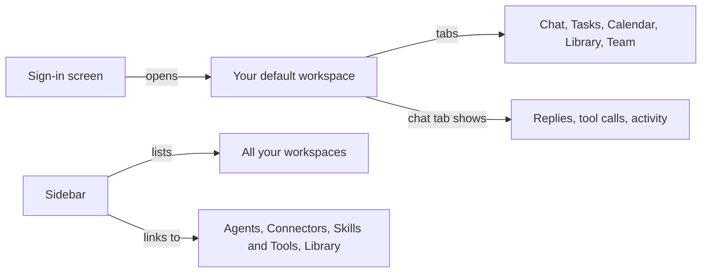

# Using the Omnipus interface

A tour of the Omnipus web app: what you see from the sign-in screen onward, and where everything lives. Each stop that has its own page gets one sentence and a link — this page is the map, not the manual.

## What it is

The web interface is every screen of Omnipus in your browser: sign-in, sidebar, workspaces, chat, and settings. Installing the server is covered by [getting started](getting-started.md); the big picture belongs to [concepts](concepts.md).

The layout has two fixed points, and everything hangs off one of them:

The diagram shows the whole shape: signing in drops you into a workspace, the sidebar reaches every workspace and every app-wide screen, and a workspace's tabs hold its work.

## When you would use it

Open this page in your first week, or later when you are hunting a control you have seen once and cannot find again. To learn what a screen *does* rather than where it is, follow its link.

## How to get from sign-in to a running agent

1. Open the app's address in your browser. On the sign-in screen, enter your username and password, then select **Sign in**. A wrong combination is refused; too many attempts in a row asks you to wait. (A fresh install has no account yet — [getting started](getting-started.md) covers creating one.)
2. You land in your default [workspace](workspaces.md), on its **Chat** tab. If setup is not finished, onboarding runs first.
3. Type in the message box at the bottom of the chat and press **Enter** to send; **Shift+Enter** adds a new line instead. The reply streams in as the agent writes it. Three controls sit above the box: which [agent](agents.md) answers, which model it uses, and the session's token count.
4. While the agent works, you can steer or stop it (see the table below).
5. To hand the agent a file, use the **+** button next to the message box, drag a file onto the chat, or paste an image in.

## The sidebar

The sidebar is a drawer that slides over the screen. Press **Cmd+B** (Mac) or **Ctrl+B** (Windows and Linux), or select the list icon at the top left, to open and close it. On a screen at least 1024 pixels wide, the pin icon at the top of the sidebar keeps it open permanently.

What the sidebar holds:

| Section | What you find there |
|---|---|
| Workspaces | Every active workspace. Selecting a name opens its chat; the chevron beside it expands its conversations, with **New chat** at the top and **More** opening search. The **+** creates a workspace once you type a name. **Archive** reaches the retired ones. |
| Assets | App-wide screens: [agents](agents.md), [tools](tools.md) (the Skills & Tools screen), [connectors](connectors.md), and the [library](library.md) panel for files and [knowledge base](knowledge.md) notes. |
| Account menu | Your username at the very bottom opens notifications, [usage](#where-settings-and-account-live), [profile](#where-settings-and-account-live), [settings](settings.md), and sign out. |

The magnifier at the top of the sidebar searches all your conversations.

## A workspace and its tabs

A [workspace](workspaces.md) is where one effort lives: conversations, task board, files, team. Switch workspaces from the sidebar; each opens on the same five tabs.

| Tab | What it is for |
|---|---|
| Chat | Talking to the workspace's agents; their work and replies appear here. |
| Tasks | The workspace's work as a [board, list, or graph](tasks.md), including its [plans](plans.md). |
| Calendar | [Scheduled and recurring work](calendar.md), shown by when it fires. |
| Library | The workspace's files and notes; the tab opens the docked [Library](library.md) panel. |
| Team | Who is on this workspace's team and which [agent](agents.md) may delegate to which. |

Workspace settings are not a tab: select the workspace's name at the left of the tab bar. On a narrow screen the tabs collapse into one switcher menu that carries the same entries.

## The chat area

The chat is a conversation with the workspace's agents. Replies stream in; each tool an agent uses appears as a card you can expand or collapse ([tools](tools.md) explains what agents can do). When an agent wants to do something sensitive, an approval dialog asks you to approve it once, deny it, or always allow it — [security](security.md) covers the rules behind it. Each active [goal](goals.md) shows as its own small pill under the message box.

Two buttons at the top of the chat open side panels: **Open browser** shows the agent's [live browser](browser.md), and **Open library** opens this workspace's files. When an agent builds something reviewable, like a small site, the chat links to it ([previews](previews.md)).

While a turn is running, the message box stays yours:

| Control | What it does |
|---|---|
| **Enter** (with text typed) | Sends your message into the running turn — the agent takes it into account without stopping. A send button with the same effect appears next to Stop. |
| **Stop** or **Escape** | Asks the agent to halt. The button shows a stopping state, then the turn ends as cancelled. |
| Activity pill | Below the message box: shows running background work. Select it to open the Activity panel with running and finished items, including any that failed. |

## Where settings and account live

App-wide settings live behind **Settings** in the account menu, on tabs from providers and models to security, data, and chat behavior; [settings](settings.md) walks each one. Your **Profile** (preferences, password, and what agents should know about you) and **Usage** (token history) are separate entries in the same menu. Settings for one workspace live in that workspace, under its name.

## Limits and things to watch

- The sidebar overlays the screen by default. Pinning needs a window at least 1024 pixels wide; below that, the pin icon does not appear.
- Sending mid-turn steers the running turn; it does not queue a message for afterwards. To let the agent finish first, wait for the reply before sending.
- Stop is a request, not a switch: the agent halts where it is, and work already finished stays finished.
- The activity pill disappears when everything has ended successfully. A failed background item keeps it visible, so failures do not vanish silently.
- The **Library** tab does not open a page; it opens the Library panel over your chat and returns you to the Chat tab.
- For readability, some routine tool activity is hidden from the conversation by default. **Settings**, then **Chat**, then **Verbose chat** reveals every call.

## Related pages

- [getting-started](getting-started.md) — install, create the account, finish onboarding.
- [workspaces](workspaces.md) — what a workspace is and what lives inside one.
- [agents](agents.md) — the roster, the default agent, building your own.
- [tasks](tasks.md) — the board, list, and graph views, and plans.
- [tools](tools.md) — what agents can do, and the permissions that gate them.
- [settings](settings.md) — every settings tab in detail.
