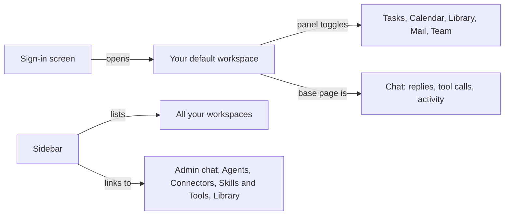

# Using the Omnipus interface

A tour of the Omnipus web app: what you see from the sign-in screen onward, and where everything lives. Each stop that has its own page gets one sentence and a link — this page is the map, not the manual.

## What it is

The web interface is every screen of Omnipus in your browser: sign-in, sidebar, workspaces, chat, and settings. Installing the server is covered by [getting started](getting-started.md); the big picture belongs to [concepts](concepts.md).

The layout has two fixed points, and everything hangs off one of them:

```mermaid
flowchart LR
  SignIn[Sign-in screen] -->|opens| Workspace[Your default workspace]
  Bar[Sidebar] -->|lists| Workspaces[All your workspaces]
  Bar -->|links to| Screens[Admin chat, Agents, Connectors, Skills and Tools, Library]
  Workspace -->|panel toggles| Panels[Tasks, Calendar, Library, Mail, Team]
  Workspace -->|base page is| Chat[Chat: replies, tool calls, activity]
```

The diagram shows the whole shape: signing in drops you into a workspace, the sidebar reaches every workspace and every app-wide screen, and workspace panels open beside Chat, the base page.

## When you would use it

Open this page in your first week, or later when you are hunting a control you have seen once and cannot find again. To learn what a screen *does* rather than where it is, follow its link.

## How to get from sign-in to a running agent

1. Open the app's address in your browser. On the sign-in screen, enter your username and password, then select **Sign in**. A wrong combination is refused; too many attempts in a row asks you to wait. (A fresh install has no account yet — [getting started](getting-started.md) covers creating one.)
2. You land in your default [workspace](workspaces.md), on **Chat**, its base page. If setup is not finished, onboarding runs first.
3. Type in the message box at the bottom of the chat and press **Enter** to send; **Shift+Enter** adds a new line instead. The reply streams in as the agent writes it. The [agent](agents.md) is chosen in the sidebar, not beside the box. Above the box are the model and **Auto**, this chat's Auto-approve switch. When the message box has enough width, the session's token count sits on that same row.
4. While the agent works, you can steer or stop it (see the table below).
5. To hand the agent a file, use the **+** button next to the message box, drag a file onto the chat, or paste an image in.

## The sidebar

Main-chat navigation and its attention cues require the matching server update. Until that update is available, Omnipus shows an unavailable notice rather than guessing a main chat or treating an unknown attention count as zero. **Retry** refreshes the data; it cannot supply a missing server feature.

Unless you pinned it, the sidebar starts closed and the header shows **Show sidebar** (the hamburger). Show is visible only while the sidebar is off screen, and opening it never pins it: a click shows the sidebar over the page. To keep it there, **Pin sidebar** — inside the sidebar, shown on a window at least 1024 pixels wide — docks it beside the page and remembers that for your next visits; while pinned, a click outside no longer closes it. The same control then reads **Unpin sidebar**: unpinning removes the dock — a sidebar you opened during this visit remains open as an overlay, so a click outside closes it, and a sidebar that was visible only because of a saved pin closes when you unpin. While the sidebar is open but not pinned, **Escape**, a click outside it, or choosing a destination closes it (a pin you saved on a wider window stays saved). When focus is outside a field or text editor, **Cmd+B** (Mac) or **Ctrl+B** (Windows and Linux) hides a visible sidebar and shows a hidden one. Inside a field or editor, the shortcut stays with that control.

What the sidebar holds:

| Section | What you find there |
|---|---|
| Workspaces | Your active workspaces: the default workspace first, then pinned workspaces, then up to five unpinned ones. If there are more, select **more…** to reveal them; **Show fewer** collapses that workspace list again. These controls reveal workspaces, not a list of sessions. Selecting a name opens its chat. Under the name is one row for each eligible agent's main chat in that workspace — not a list of recent conversations. Workers are not listed. Admin is listed only on the default workspace, even when Admin is not on the team. Select an agent's name to open that agent's main chat. **Past sessions** opens earlier chats for that workspace and that agent. **New chat** starts an extra chat with that agent and leaves the main chat in place. The control beside the name is **Show <workspace> agents** or **Hide <workspace> agents**. A collapsed workspace shows only the attention dot and the count, not the agent rows. An expanded workspace shows the rows, and a main chat that needs you shows a halo on its icon. The workspace you are in starts expanded. Showing the agents or opening the workspace refreshes the team list. The **+** creates a workspace once you type a name. **Archive** reaches the retired ones. |
| Assets | **Admin chat** for the standalone operator; app-wide screens: [agents](agents.md), [tools](tools.md) (the Skills & Tools screen), [connectors](connectors.md), and the [library](library.md) panel for files and [knowledge base](knowledge.md) notes. |
| Account menu | Your username at the very bottom opens notifications, [usage](#where-settings-and-account-live), [profile](#where-settings-and-account-live), [settings](settings.md), and sign out. |

The agents form an indented group beside a vertical guide under their workspace name. The magnifier at the top of the sidebar searches conversations across workspaces, with no workspace or agent filter. The right side of an agent row has two quiet icon buttons: **Clock** for past sessions, then **Plus** for a new chat. On Mia's row their labels are **Past sessions with Mia** and **New chat with Mia**. They stay visible on the selected agent's tinted row. On other rows they appear when you hover or move keyboard focus into the row; on touch screens they stay visible. The agent stays selected while you use an extra chat with that agent in the same workspace. **Past sessions** opens that same search already limited to one workspace and one agent. The agent filter and groups use the chat's owner, not whichever agent answered most recently. Each limit shows as a filter you can remove on its own.

Agent rows are visible only while the workspace is expanded. Collapsed, a workspace shows an amber dot and the words **1 main chat needs your attention**, or the number of main chats, when that count is known and at least one needs you. The dot pulses unless reduced motion is on; the cue stays, the pulse does not. Expanded, that count is replaced by an amber halo on the agent's icon, and the halo follows the same reduced-motion rule. The cue is only for a main chat. The cue appears only when the server reports that the chat needs you; Omnipus never guesses it, so a chat the server has not said anything about shows no halo at all. With a supporting server, opening that main chat can request that the results shown to you be marked as seen. Omnipus keeps one pending request for this shown opening. When its history finishes loading, while the chat is in front on a visible tab, Omnipus captures the saved-position number from the server's attach response — the first number captured for this opening stays fixed: later frames, reconnect completions and retries never replace it. Every send attempt checks everything again: that this opening is still the current one, the tab is visible, the chat is still in front, loaded metadata identifies a main chat, attention is known, and a number was captured. Unknown attention means no request yet: if a later refresh makes attention known while everything else still holds, the request is sent then, with the same number. If this opening finished without a number, it never acknowledges — reopening the chat starts a new opening that can acknowledge its own number. A failed send keeps the request pending for retry. Sending the request is not confirmation that the server saved a seen mark; marking results seen for everyone is the server's job. The request does not answer a pending question or approve an action; while a request is pending or being retried, the browser keeps its captured saved-position number instead of substituting a newer one. If the supporting attention information becomes unavailable, the halo can disappear or the workspace count can be withheld, and the relevant unavailable notice appears instead — a missing cue is therefore not, by itself, confirmation that nothing needs your attention. An extra chat, a helper, or a tab in the background does not ask, and opening the chat does not clear the cue by itself.

If the main chats are identified but their attention count cannot be known, the sidebar says **Attention unavailable** and offers **Retry**, and it does not show zero. **Attention unavailable** means the server has not said which chats need you: the value is unknown, not zero, and it does not mean Omnipus missed an update. If a main chat cannot be identified, it says **Main chat unavailable** and offers **Retry**. Selecting an agent whose main chat is not in the list says the same under that row. If the team list fails before any agents have loaded, an expanded workspace says **Could not load team** and offers **Retry**. If a refresh fails after the list has loaded, the sidebar keeps the earlier agent rows and says **Could not refresh team — showing cached, out-of-date agents** with **Retry**. **Retry** on the cached-list warning refreshes the agents and workspace membership. The warning stays while the agent refresh is pending or fails again; it clears only after a successful agent refresh replaces the cached rows.

Opening a workspace shows **Restoring your conversation…** while Omnipus chooses the chat. It opens the conversation this browser last opened in that workspace, when that conversation still belongs there. If there is none, or it was deleted, or it belongs to another workspace, Omnipus opens Ava's main chat. A remembered conversation that is visible in the loaded list still opens if loading the workspace details fails. If the conversation list fails to load, or workspace details fail when needed to find Ava's main chat, a warning says **Could not restore your last conversation. Retry to try again.** and offers **Retry**, which tries that choice again. The chat already on screen stays open, and Omnipus does not switch to Ava. Sending and message retries stay blocked while the destination is loading or the restore has failed; a retry attempt shows the same warning rather than sending into the old chat. Repeated blocked attempts do not stack copies of a warning already on screen. **Retry** on that reused warning checks the workspace you are now trying to enter. Messages already queued in the open tab are kept and resume in order once the destination is available. When there is no remembered conversation and Ava's main chat cannot be identified, the message box says **This chat is unavailable right now**, **Retry** tries again, and sending is turned off.

A workspace opened in a background browser tab waits until that tab is visible before attaching its chat; being in the background alone is not a restore failure. Choosing an agent's **New chat** starts a fresh extra and clears an earlier restore failure or pending restore, so that old attempt cannot later replace the new chat. The existing first-message confirmation still applies when delivery is unconfirmed.

If the sidebar shows **Could not load workspaces**, select **Retry** to reload the workspace list and **Archive** when it is expanded. If loading fails again, the message stays so you can retry again. If loading the list pauses because you are offline, the sidebar says **Offline — workspaces will load when you reconnect.** and loads the list once you are back online.

## A workspace and its panels

A [workspace](workspaces.md) is where one effort lives: conversations, task board, files, team. Switch workspaces from the sidebar. Chat is the base page, not a workspace-bar entry. The bar offers five panel toggles, in this order:

| Panel | What it is for |
|---|---|
| Tasks | The workspace's work as a [board, list, or graph](tasks.md), including its [plans](plans.md). |
| Calendar | [Scheduled and recurring work](calendar.md), shown by when it fires. |
| Library | The workspace's files and notes; opens the [Library](library.md) panel. |
| Mail | The workspace agents' configured mailboxes; opens the [Mail](mail.md) panel. |
| Team | Who is on this workspace's team and which [agent](agents.md) may delegate to which. |

Select a toggle to open its panel beside Chat, select it again to close it, or choose another to replace the open panel. The header uses the widest layout that fits the space actually available, leaving room for **Open browser**. Opening a panel, pinning or hiding the sidebar, resizing the window, or changing the font size can change that space.

| Available space | Workspace header |
|---|---|
| Enough for the full row | The workspace name, then **Tasks**, **Calendar**, **Library**, **Mail**, and **Team**, each with an icon and label. Select the workspace name to open its settings. |
| Enough for icons, but not all labels | The workspace name stays; the five panel toggles show icons only. Hover an icon or focus it with the keyboard to see its label. The open panel's icon stays gold. Select the workspace name to open settings. |
| Too narrow for the icon row | The workspace name and a downward caret open a menu with **Settings** and the same five panel toggles. Select the name, then the item you want. |

The hamburger means **Show sidebar** only; there is no second hamburger for panels. Panel names and keyboard access stay the same in all three layouts. Workspace settings remain a page, not a panel.

## The chat area

The chat is a conversation with the workspace's agents. When the open conversation is the one this workspace remembers, a status line above the messages names its kind: **Main chat** for a main chat identified by the matching server update (nothing after it), **Extra chat**, or **Extra chat —** plus the title when that chat has one, **Task run**, or **Helper**. That line stays while older messages are loading. A task transcript that is not the conversation this workspace remembers still shows **Task:** and the task title. Replies stream in; each tool an agent uses appears as a card you can expand or collapse ([tools](tools.md) explains what agents can do). When an agent wants to do something sensitive, an approval dialog asks you to approve it once, deny it, or always allow it — [security](security.md) covers the rules behind it. Each active [goal](goals.md) shows as its own small pill under the message box.

### Who is replying

Replies in the web app's chat show the agent's name above the text without a portrait, including streaming replies, saved history, and another agent's replies in the same chat. When the reply records its author, the name follows that author rather than the current agent selection. Older replies without a recorded author fall back to the chat's current agent. If an agent's details cannot be found, its stored ID can appear instead of a name.

During a live reply, an inline mark replaces the old bouncing-dot indicator. It combines the agent's figure and role badge with a short status phrase, inside the conversation, not on the message box. The name remains above the reply. While agent details are loading or unavailable, the phrase can appear without the figure. The same running-tool rule applies when the chat uses its simpler message-list fallback: a tool belonging to this reply selects Working until its call finishes; a tool in another reply does not.

| What is happening | What you see |
|---|---|
| A reply is awaiting or generating a response, with no running tool or pending decision | The mark breathes and rotates through thinking phrases, starting with **Thinking…**. |
| A tool call belonging to this reply is running, whether its card is visible or hidden | The mark uses its Working motion, with a stable **Working on it…** phrase unless more specific copy applies. Showing tool cards with **Verbose chat** does not change the phase. |
| The agent is setting up a goal whose record is still empty | **Framing your goal**, or **Setting acceptance criteria** while that step runs. This phrase takes priority over a background-command label; the motion still follows whether a tool is actually running. |
| A background-command tool call is running and its card is hidden in the chat | The Working mark shows the call's short description or a label such as **Running git…**, rather than its command line. It follows that tool call, not the whole lifetime of a background process. |
| A tool needs your approval | **Waiting for your approval**, with the tool's name. The mark uses its waiting motion. |
| The agent asked you a question | **Waiting for your input**. If a question and an approval are both pending, this phrase wins. |
| The connection dropped or is reconnecting | **Unavailable/reconnecting** where the reply's status is shown. The mark stays still. |
| The latest reply has settled, you are connected, and no approval or question is pending | **Idle** can appear next to that reply's name once history has finished loading. This describes the reply, not whether helpers or background commands have finished. |

**Limits of the inline mark:** it needs an assistant reply to display against. A question or approval can still need attention when no inline mark is visible. In loaded history, a running reply that already has visible content does not show the Thinking or Working mark. Queued work has no inline **Queued** mark; check **Sessions** or Activity instead. For background processes that outlast their tool call, use the Sessions command count and the Activity panel.

In the simpler message-list fallback, live tool activity appears against the reply that owns it, before the answer finishes. If a hidden tool finishes successfully and the reply still has nothing visible, the mark returns to Thinking while the agent continues. If a tool failure makes its **Failed** card visible, that otherwise-empty reply shows the card without an extra Thinking mark, even when the failure has no separate error text.

The mark's figure and badge stay fully opaque. With normal motion they gently change size, and a separate glow animates behind them; Working also has a moving highlight. If your system requests reduced motion, these loops stop and the thinking phrase stops rotating. The name and current phrase remain visible.

A failure or refusal routed to an existing chat appears in that conversation, including when no reply has started. It does not turn into an app-wide connection banner when you open another conversation or start a new chat. Connection and routing-protocol failures remain separate app-wide problems.

Chat follows the current gateway connection. Once a replacement connection opens, an older connection closing does not disable the message box or interrupt the current reply. A genuine connection loss still triggers reconnect and reloads the chat's missing history.

**Open browser** at the top of the chat shows the agent's [live browser](browser.md). Library is in the sidebar, and opens every workspace's files. When an agent builds something reviewable, like a small site, the chat links to it ([previews](previews.md)).

While a turn is running, the message box stays yours:

| Control | What it does |
|---|---|
| **Enter** (with text typed) | Sends your message into the running turn — the agent takes it into account without stopping. A send button with the same effect appears next to Stop. |
| **Stop** or **Escape** | The first activation asks only this chat's current turn to stop and shows **Stopping...**. A second activation in the same chat within three seconds confirms Stop all, including its helpers. |
| Activity pill | Below the message box: the Agents number counts helpers whose current state is running. Select it to open the Activity panel. **Running now** excludes stopped and finished helpers; queued helpers and helpers waiting for an answer have their own sections. Stopped helpers remain inspectable with **Open**, without a growing elapsed timer or a failed-work label. A resumed helper returns to Running now when its state is running again. |

### If the gateway restarts during a reply

A gateway restart ends an in-flight answer; losing only your browser connection does not. The main conversation shows **Interrupted**, rather than staying **Working** forever—even if boot recovery could not save its update, as long as the saved execution is readable. A recovery storage error is reported to the operator; the label alone is not proof that the stop was saved. Its saved messages stay in the same chat, and its goal is not cleared. Work cut off in a helper session stays resumably **Stopped**. An open Interrupted chat also shows a notice above the message box: **Interrupted · The restart cut this answer off. Send a message to continue.** A tab that watched the reply get cut off uses this one notice as soon as it finishes reconnecting, even if the conversation list is delayed or unavailable; it does not briefly switch to a separate “couldn't be finished” line. The notice goes away as soon as you send a message or request a new answer. If the conversation continues from another tab or device while this tab is disconnected, the notice clears when its refreshed conversation state confirms that later work. If your last question never got an answer, **Generate again** stays available beside the notice, but only in a tab that was already open when the gateway restarted; a tab opened or reloaded afterwards shows the notice alone. **Generate again** resends only when you click it. If a main conversation was waiting for an approval or an answer when the gateway restarted, that old prompt is gone: the conversation shows **Interrupted**, not **Waiting for answer**, and does not re-ask the lost prompt. Your next message continues it normally. A prompt from the current gateway process still waits for its answer.

Omnipus does not automatically rerun the interrupted instruction. Send a new chat or channel message to continue the same conversation and round of work with a fresh execution; the agent can delegate again. A standing heartbeat or scheduled conversation can continue on its next normal tick or trigger after a restart stop; this is the schedule continuing, not boot replay. After a physical gateway restart, the next heartbeat interval starts from gateway startup, rather than immediately catching up on the cut turn. An automatic trigger does not override a human Stop of live work. Pressing Stop on a conversation already marked Interrupted leaves its restart reason unchanged, so a later message or normal trigger can still continue it. If the chat offers **Generate again** for an unanswered message, that is also an explicit new answer request, not an automatic replay, and it may repeat earlier work or tool actions. Another restart does not add another interruption to an already-stopped execution. Idle conversations and completed answers keep their previous state.

### Stop and redirect commands

Three slash commands in the message box control the current chat directly:

| Command | Where it works | What it does |
|---|---|---|
| `/stop` | Any chat | Exactly one **Stop** activation: first asks only this conversation's current turn to stop and opens the same three-second confirmation window. |
| `/cancel` | Any chat | Immediately requests Stop all for this chat and every helper below it. It never stops a parent or sibling chat. |
| `/stop-redirect <instruction>` | Any root or native helper chat | Stops this chat's current turn, then continues this same chat with your instruction — for example `/stop-redirect focus on the failing tests`. Its helpers keep working; the command does not target one of them. Refused in an **external-CLI helper chat** (a helper running on Claude Code, Codex or OpenCode): use Stop, or the parent's delegate actions. |

After a first **Stop**, **Escape**, or `/stop`, the same Stop button stays available for three seconds. Press Stop or Escape again in that window to confirm Stop all; `/stop` follows the same activation rule. There is no separate **Stop all** button. The window closes after three seconds, when the window loses focus, or when you switch chats; the next activation is a first, current-chat-only Stop again. `/cancel` needs no second activation.

`/stop-redirect` without an instruction (or with only spaces) replies with usage and changes nothing. The instruction is required and sent as typed after the command, with surrounding spaces removed. If no active session is attached to the current chat, a visible message asks you to reopen it; no redirect is sent. If the connection is down, the redirect cannot be sent: a visible error says so, this chat's turn keeps running, and you can run the command again once you are reconnected.

A turn stopped by `/stop-redirect` keeps its partial reply but is not labelled (interrupted), because it was redirected, not abandoned; a turn stopped with Stop, Escape, `/stop` or `/cancel` still shows (interrupted). After you reload the page this holds for a redirected main chat and a redirected helper chat. A tab that did not send the redirect may show (interrupted) until it is reloaded. One case cannot be told apart from the saved history, so after a reload it can differ from what you saw live: a turn you stopped with Stop and then redirected later, with no message of yours in between, loses its (interrupted) label.

### Clear a chat's context

`/clear` clears this chat's model context without deleting the saved conversation or starting another chat. You stay in the same chat. The context change happens on the server; it does not wait for the chat view to update.

After the command's reply, the chat re-reads its saved messages from the server. When that read succeeds, the view is replaced with the server's current view and the marker appears as a quiet **Conversation context cleared** divider. A failed or delayed refresh can leave the divider absent even though the server has already cleared the context; the chat tries the read again after a later reply ends, and if the history list shows **Could not load messages.**, that screen's **Retry** also completes the refresh — you do not need to repeat `/clear`. Anything you typed or sent after the command — including while the refresh was still on its way — stays in the view, and the earlier messages remain in the saved history.

The server runs the command at the start of the chat's next turn, so a `/clear` sent while a reply is being written takes effect when that turn ends.

`/clear` works in a main or extra chat only. In a helper, worker, delegate or task-child session it refuses with an explanation and changes nothing — no view move, no history change, no new chat. The refusal appears as the command's reply.

`/new` no longer exists. To start an extra conversation, use **New chat** on the agent's sidebar row. Typing `/new` shows a message saying so, and nothing is sent to the server.

### If the first message loses its connection

Your first message is kept in the open tab while Omnipus checks delivery. If loading a saved chat's history fails, the message list may temporarily show **Could not load messages.** instead; select that screen's **Retry** to reload the history. Reconnecting does not resend the message automatically. **Retry** is available only while connected; delivery Retry uses the original message and delivery ID, not the current agent, model, attachment or Auto-approve choices.

| Message status | What it means and what you can do |
|---|---|
| **Sending…** | Waiting for confirmation that the first message was saved. |
| **Delivery not confirmed · Retry** | Omnipus cannot confirm whether the message was saved. This can follow a connection failure or a server-reported uncertain save. An older gateway's chat-start acknowledgement without the original delivery ID does not confirm delivery and, by itself, does not change **Sending…** to this status. Select **Retry** while connected; reconnect first if needed. |
| **Checking delivery…** | Your explicit Retry is in progress. Another Retry is not available at the same time. |
| **Saved** | The server confirmed that this message was saved using its delivery ID, directly or through the saved chat's history. A chat-created acknowledgement alone does not confirm a save. The answer may still be starting or running. |
| **Checking chat…** | Omnipus knows the chat ID and is loading its history to check whether the first message was saved and whether an answer exists or is still running. |
| **Could not check this chat · Retry** | Checking delivery or loading the saved chat failed. This does not establish whether an unconfirmed message was saved. Your message is kept in the open tab; **Retry** uses the original delivery request until a save is confirmed, even if a chat ID is known. After a confirmed save, it checks the saved chat again. |
| **Could not save message · Retry** | Omnipus reported that it could not save the message. You can retry delivery. |
| **Message saved, but no answer started · Generate again** | The message was saved, but no answer began. **Generate again** deliberately starts a new answer in the saved chat. |
| **Couldn't finish · Generate again** | Checking the recovered chat finished with your message still unanswered and no answer running. You can deliberately generate a new answer. |
| **Not delivered** | You stopped the agent before it read this message, so it was discarded — the text stays in the chat, nothing is sent later, and the same status is shown again after you reload the page. |

For an ordinary first message, an acknowledgement without the original delivery ID does not open or confirm the pending chat, or apply its agent and Auto-approve settings. Buffered messages remain queued until a matching save receipt or checked history confirms delivery; they also wait while a reply is running. An older acknowledgement alone does not release them.

An unconfirmed message does not offer **Generate again**. That action is separate from delivery Retry: it sends a new request and may repeat work or tool actions. The saved chat's current Auto-approve setting applies, not a restored setting from the original send.

The slash menu uses the command list returned by the server, alongside available skills and web-only session-search and workspace-switch entries. `/help` lists the server commands and those web-only entries. `/clear` appears in the menu only when the server's command list includes it; choosing it sends it to the server, which performs the clear (see Clear a chat's context). `/new` has been removed: the menu never offers it and typing it refuses visibly without sending anything. An alias alone is not a separate menu entry. Typing `@` does not switch the agent; `@` is ordinary text. Another conversation is **New chat** on that agent's sidebar row. When the current first message has no known chat ID, **New chat** asks **Start a new chat?** and shows **Delivery not confirmed. Copy your message before starting a new chat.** Choose **Keep this chat** to stay, or **Start a new chat** to leave it. Copy the message first: that bubble will not be in the new chat. The new chat is an extra chat, so the agent's main chat stays in place. If a chat ID is already known, **New chat** starts the extra chat without this question.

**Limits:** recovery before a chat ID is known lives only in the open tab; a full browser reload can lose it. The gateway remembers delivery IDs only for its current process, and only for a limited number of recent first messages: up to 256 per account and 10,000 in total. When those limits are reached, the oldest are forgotten first, so a Retry of a very old unconfirmed first message can create a second chat and answer twice, exactly as after a restart. If it crashes after saving the message but before acknowledging it, Retry after that restart can likewise create a second chat and answer twice. Reusing a delivery ID for a different message is refused with a conflict error instead of being treated as the same message. Delivery Retry is not a guarantee of exactly-once answers or tool actions. After a gateway upgrade, reload any browser tab that was already open: an older tab does not understand the new delivery messages, so starting a new chat there can appear to hang until the page is reloaded.

## Sessions

Type `/sessions` in the web chat's message box and press Enter to open **Sessions**, or select it from the slash-command menu. It opens the same view as the sidebar's magnifier. `/resume` has been removed and is not an alias for `/sessions`.

The view is titled **Sessions** and offers two status filters:

| Filter | What it includes |
|---|---|
| **All** | The available sessions across workspaces, including queued and ended work. Search, date, and workspace filters can narrow the list. Internal verifier sessions are not included. |
| **Running** | Sessions whose current lifecycle display is **Working** and whose server execution classification is running, plus their parent rows so helpers stay in context. Queued and restart-interrupted sessions do not match Running themselves, though a non-running parent can remain above a genuinely running helper. |

Search matches a session's title, workspace, or agent name. The date-range control filters by when the session was last active, not when it started.

If agent details cannot be loaded and no saved agent list is available in the open app, Sessions warns that **agent-name search is unavailable**. Title and workspace search still work, but a search by agent name alone can show no matches. Select the notice's **Retry** to load agent details again; your search stays in place, and agent-name matches return when that request succeeds.

If the required session or workspace list cannot be loaded, the error names what failed: **Could not load sessions**, **Could not load workspaces**, or **Could not load sessions and workspaces**. Select **Retry** in that view to retry the failed requests. The list returns when they succeed; another failure keeps a visible error and Retry available.

Each real session row shows its title above its status, kind, when it started, and when it was last active. On a phone, the title wraps rather than being squeezed beside the metadata, so chats with the same opening words remain distinguishable. Its token count appears when known and the screen is wide enough. A stored zero is shown as 0; a missing count is not invented.

| Status | When you see it |
|---|---|
| **Working** | The server's lifecycle record says it is working, and it is not queued. |
| **Waiting** | It is waiting for an answer. |
| **Queued** | It is queued, not executing. |
| **Done** | Its lifecycle record says it finished. If no lifecycle status is available, an archived chat also shows Done. |
| **Failed** | It failed. |
| **Stopped** | It was stopped. The cause is included when known, for example **Stopped · timeout**. |
| **Interrupted** | A server restart cut the turn off. This takes priority over an old queued or running record. |
| **Unavailable** | No usable lifecycle or queued status is available, and the chat is not archived. An active chat without that information is not labelled Working. |

The server classifies queued or running work only while that same session's current lifecycle display is **Working**. After a restart, an interrupted main conversation is not itself running or queued, even if its old record still says so. It may remain in **Running** as parent context for a genuinely running helper. **Interrupted** is not a permanent label: once that conversation is actually resumed or re-adopted with a fresh execution in the current gateway process, running work shows **Working** and matches **Running** again. The gateway being back online alone does not restart the old execution. As explained [above](#if-the-gateway-restarts-during-a-reply), the Interrupted label alone does not prove that recovery saved a stop.

Kind is the session's real type: **Chat**, **Task**, **Helper**, **Scheduled**, **Channel**, or **Main chat**. A Helper is a delegated session with its own parent chat.

Helpers stay under their real parent in **All**, **Running**, and search, even when the parent itself does not match. If a complete list has no record of the parent, the helpers appear under **parent chat unavailable**. This is an expandable heading, not a chat you can open; the helpers beneath it can still be opened. Omnipus does not invent a title for the missing parent. If the list is incomplete, the heading instead says **Parent not in this partial list**: a missing page is not proof that a parent is unavailable. An incomplete-list notice offers **Retry** to load the list again.

The list is also incomplete when the server cannot read a session's saved lifecycle record, even if it can load the session itself. That row stays in **All**, but the server does not guess its lifecycle status or whether it is running. Such a row does not qualify for **Running** on its own; an empty Running result with an incomplete-list notice is not proof that no work is running. Use **Retry** after the storage problem is resolved. A session with no lifecycle record is a normal case and does not, by itself, trigger this warning.

API callers receive these warnings in the existing `partial_errors` array: `agent=<id>: session_list_failed` means session enumeration failed, while `session=<id>: lifecycle_read_unavailable` means one row's saved lifecycle could not be read. The tokens do not include local file paths or the underlying storage error. Healthy rows and pagination remain usable; the unreadable row's `lifecycle_state`, `stop_note`, and `execution` keys are omitted, not sent as `null`. Session detail, agent-specific session lists, and session create or rename responses have no page-level warning field: an unexpected lifecycle-read failure returns HTTP 500 with `session lifecycle unavailable` instead of pretending to have loaded the runtime state. A create or rename may already have saved its session or title before this response read fails; inspect the existing session before repeating a write.

Consecutive helpers with the same title under the same parent fold into **N similar helper runs**. This means similar labels, not a guarantee that their instructions or results are identical. Expand the heading to see each original session, with its own status and selectable title. Runs under different parents never fold together.

When a session itself owns running background commands, its row says **N background commands running** (or **1 background command running**). Zero or an unknown count shows no sentence. The count belongs to that session only, not its helpers. Background commands do not get synthetic session rows: open the owning chat and inspect its Activity panel.

With focus in the search field, **Up** and **Down** move the highlight, and **Enter** opens the highlighted session. You can also select a real row's title — its Open action. Once that chat is attached, its Activity panel opens. Folded and missing-parent headings expand or collapse instead of attaching a chat. If an update removes the highlighted target, the highlight clears and focus returns to the search field; Enter does not silently open another session in its place. A connection failure while opening a workspace chat shows an error instead of pretending the switch succeeded.

## Panels beside chat

[Tasks](tasks.md), [Calendar](calendar.md), [Library](library.md), [Mail](mail.md), and Team open from the workspace bar or its compact panels menu and use the shared panel controls, as does [Browser](browser.md). **Library** is also in the sidebar. **Open browser** at the top of the chat opens the agent's live Browser panel when a browser session is available. Only one panel sits beside Chat at a time. Choosing another replaces it; if the outgoing editor reports protected unsaved changes, you are asked before it leaves.

| Control | What it does |
|---|---|
| Panel heading and **Close** (X) | Shows which panel is open; X closes it and returns focus to Chat. Pressing **Escape** also closes a panel (not Browser), except while you are typing in a field or a dialog is open; in a full-screen panel it behaves like **Back to chat**. On a narrow screen, the panel replaces the chat area and also has **Back** at the top to return to Chat. |
| Divider between Chat and the panel | Drag it to change the panel's width. You can focus the divider and press the left or right arrow key; **Home** and **End** jump to its narrowest and widest sizes. Double-click it to reset the width. |
| **Expand** icon (named **Expand** followed by the panel's name, for example **Expand Library panel**) | In a normal browser tab, Library, Browser, Mail, Tasks, Team and Calendar open their full-screen view in a new browser tab, without the app sidebar or workspace bar. When Omnipus recognises an existing tab for the same panel and workspace (or the same Browser session and agent), it focuses that tab or offers **Switch** (or asks you to switch manually) instead of opening another. Reuse depends on Omnipus still recognising that tab; it is not guaranteed if cross-tab communication is unavailable. Reloading or closing the original Chat tab does not close an expanded panel tab. After a reload, Omnipus can offer Switch when cross-tab communication still recognises that panel; the browser may require you to switch tabs manually. After opening or reusing a tab, the docked panel closes in the source tab. If pop-ups are blocked, the docked panel stays open and Omnipus shows a short notice, for example **Library was blocked. Allow pop-ups and try again.** If opening the tab fails with an error instead, the panel stays open and a short notice says, for example **Library could not open full screen. The panel remains here.** |
| **Back to chat** in any full-screen panel | In a normal browser tab, **Back to chat** tries to close the full-screen tab. A tab that Omnipus opened can restore the panel beside Chat only in its original tab while that tab still owns the expanded panel, when that tab is still available and no different panel is open there. Reloading the original Chat tab releases that ownership, so **Back to chat** no longer restores the panel there automatically after the reload; you may need to reopen the panel. Restoration uses the last context received by the original tab. If cross-tab context updates are unavailable, it can restore an older selection. A tab that only switched to or reused an existing full-screen tab does not get that restoration. If the full-screen tab cannot close itself, the button opens workspace Chat with the panel open in that same tab. If Chat cannot be opened, an error stays visible so you can try again. |

**Installed app windows:** when Omnipus runs as an installed app or standalone Chrome window, **Expand** opens the full-screen panel in that same window, not another window. **Back to chat** returns to the workspace view in the same window with the panel reopened. Mail keeps its current mailbox, folder and selected message; Browser keeps its session and agent; Tasks, Team and Calendar keep their workspace. Library returns without reopening the selected file; select it again. If a workspace is selected in Library, it reopens that workspace. If Library is showing the all-workspaces root, returning instead opens Library in the Chat workspace; select the **Library** breadcrumb to show all workspaces again. On wider layouts the reopened panel sits beside Chat. On narrow layouts it takes Chat's place; use the panel heading's **Back** or **Close** control to reveal Chat. Library and Mail still ask before expansion or return when their editors have protected unsaved changes; cancelling keeps you where you are. This also applies to minimal-UI, window-controls-overlay and full-screen display modes. Normal browser-tab expansion is unchanged.

Tasks and Calendar follow the workspace in their full-screen tab's address, including browser Back and Forward. When child-context updates reach the original tab, its recognised workspace mapping follows too: after a child moves from workspace A to B, choosing the panel for B tries to switch to it and choosing it for A can open a docked panel at A. If cross-tab updates are unavailable, the original tab may retain an older mapping. Automatic restoration to the original Chat tab requires that tab to still own the expanded panel and have no different panel open; it uses the last workspace context that the original tab received. Installed-app returns and the same-tab fallback described above do not require an original-tab owner.

Library and Mail ask before an app-initiated close, panel switch, expansion, or full-screen return when their editors report protected unsaved changes; cancel the prompt to stay. If the unsaved-change check fails during expansion, the panel stays open and an error notice asks you to try again—for example **Library could not expand because its unsaved-change check failed. Try again.** In Mail, that covers changed drafts and Compose messages with a nonempty body, **not** a new Compose message with only recipients or subject filled in. The Browser panel has no equivalent text-edit warning. See the [Mail guide](mail.md#work-with-drafts) for Save and draft-sending steps.

## Where settings and account live

App-wide settings live behind **Settings** in the account menu, on tabs from providers and models to security, data, and chat behavior; [settings](settings.md) walks each one. Opening Settings stays on Settings, including while the app is still opening your workspace after sign-in. Your **Profile** (preferences, password, and what agents should know about you) and **Usage** (token history) are separate entries in the same menu. Settings for one workspace live in that workspace, under its name.

## Limits and things to watch

- The sidebar starts closed unless you pinned it. **Show sidebar** (the hamburger in the header) appears only while the sidebar is off screen and shows it without pinning. **Pin sidebar**, inside the sidebar, appears at 1024 pixels and wider and docks it for this and future visits; **Unpin sidebar** removes the dock — a sidebar opened during this visit stays open as an overlay until a click outside closes it, and one that was visible only because of the saved pin closes when you unpin. While it is open but not pinned, Escape, a click outside, or choosing a destination closes it, and a pin saved on a wider window stays saved. When focus is outside a field or text editor, **Cmd+B** (Mac) or **Ctrl+B** (Windows and Linux) hides a visible sidebar and shows a hidden one. Inside a field or editor, the shortcut stays with that control.
- Sending mid-turn steers the running turn; it does not queue a message for afterwards. To let the agent finish first, wait for the reply before sending.
- Stop is a request, not a switch: the agent halts where it is, and work already finished stays finished.
- The activity pill disappears when everything has ended successfully. A failed background item keeps it visible, so failures do not vanish silently.
- The **Library** and **Mail** entries open panels beside Chat on wider screens, rather than separate workspace pages; on narrower screens a panel takes over the chat area.
- For readability, some routine tool activity is hidden from the conversation by default. **Settings**, then **Chat**, then **Verbose chat** reveals every call.
- If a turn ends in an error after text has started streaming, the failure message replaces that text in the same reply. The message is visible even with **Verbose chat** off; **Verbose chat** shows technical details when available. A turn you stop still keeps its partial reply. **(interrupted)** belongs to that reply's message, not to the whole conversation; a later successful answer does not inherit it. Likewise, **(cut off at the output limit)** appears only on the affected reply.
- An agent saying what it plans to do is not a finished answer. If it reaches its tool-call limit before a final answer, chat keeps the narration and adds a separate limit notice. The notice remains in the saved conversation when you reopen it. An admin can raise **Max tool calls per turn** under **Settings → Performance**; an agent's own lower limit is on its profile's **Advanced** tab.
- If conflicting tool names stop a turn, chat shows the standard failure notice instead of ending without an explanation: “This turn didn’t finish, and we can’t tell why. Retry — if it keeps happening, open Verbose chat for details, or try a different model.” Any earlier narration and tool activity remain in the saved conversation, followed by the failure notice.

## Related pages

- [getting-started](getting-started.md) — install, create the account, finish onboarding.
- [workspaces](workspaces.md) — what a workspace is and what lives inside one.
- [agents](agents.md) — the roster, the default agent, building your own.
- [tasks](tasks.md) — the board, list, and graph views, and plans.
- [tools](tools.md) — what agents can do, and the permissions that gate them.
- [mail](mail.md) — read, compose, and manage drafts in the Mail panel.
- [browser](browser.md) — watch or drive an agent's live browser in its panel.
- [settings](settings.md) — every settings tab in detail.
