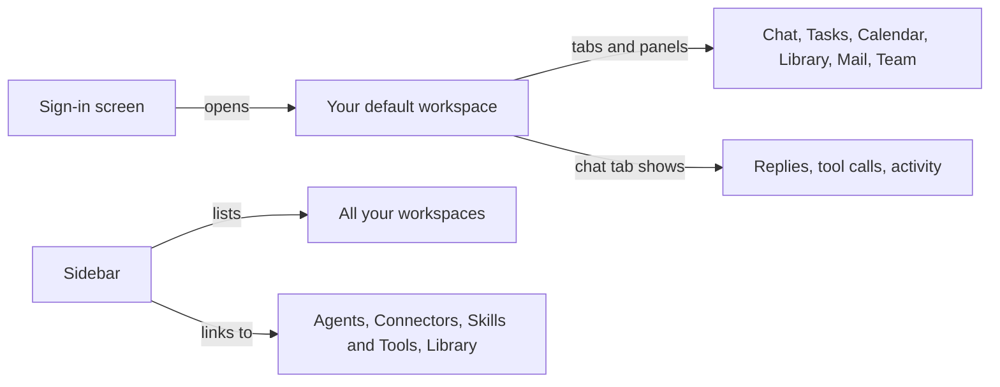

# Using the Omnipus interface

A tour of the Omnipus web app: what you see from the sign-in screen onward, and where everything lives. Each stop that has its own page gets one sentence and a link — this page is the map, not the manual.

## What it is

The web interface is every screen of Omnipus in your browser: sign-in, sidebar, workspaces, chat, and settings. Installing the server is covered by [getting started](getting-started.md); the big picture belongs to [concepts](concepts.md).

The layout has two fixed points, and everything hangs off one of them:

```mermaid
flowchart LR
  SignIn[Sign-in screen] -->|opens| Workspace[Your default workspace]
  Bar[Sidebar] -->|lists| Workspaces[All your workspaces]
  Bar -->|links to| Screens[Agents, Connectors, Skills and Tools, Library]
  Workspace -->|tabs and panels| Tabs[Chat, Tasks, Calendar, Library, Mail, Team]
  Workspace -->|chat tab shows| Chat[Replies, tool calls, activity]
```

The diagram shows the whole shape: signing in drops you into a workspace, the sidebar reaches every workspace and every app-wide screen, and a workspace's tabs hold its work.

## When you would use it

Open this page in your first week, or later when you are hunting a control you have seen once and cannot find again. To learn what a screen *does* rather than where it is, follow its link.

## How to get from sign-in to a running agent

1. Open the app's address in your browser. On the sign-in screen, enter your username and password, then select **Sign in**. A wrong combination is refused; too many attempts in a row asks you to wait. (A fresh install has no account yet — [getting started](getting-started.md) covers creating one.)
2. You land in your default [workspace](workspaces.md), on its **Chat** tab. If setup is not finished, onboarding runs first.
3. Type in the message box at the bottom of the chat and press **Enter** to send; **Shift+Enter** adds a new line instead. The reply streams in as the agent writes it. Three controls sit above the box: which [agent](agents.md) answers, which model it uses, and the session's token count.
4. While the agent works, you can steer or stop it (see the table below).
5. To hand the agent a file, use the **+** button next to the message box, drag a file onto the chat, or paste an image in.

## The sidebar

On a window at least 1024 pixels wide, the sidebar starts docked beside the page, unless you previously hid it. **Hide sidebar**, inside the sidebar, hides it and forgets that dock. **Show sidebar** appears in the header only while the sidebar is hidden. On a wide window, Show docks the sidebar again. On a narrower window, Show opens it as a drawer over the page. On that narrower window, **Escape**, a click outside the drawer, or choosing a destination closes the drawer and does not forget a dock you saved on a wider window. When focus is outside a field or text editor, **Cmd+B** (Mac) or **Ctrl+B** (Windows and Linux) hides a visible sidebar and shows a hidden one. Inside a field or editor, the shortcut stays with that control.

What the sidebar holds:

| Section | What you find there |
|---|---|
| Workspaces | Every active workspace. Selecting a name opens its chat; the chevron beside it expands its conversations, with **New chat** at the top and **More** opening search. The **+** creates a workspace once you type a name. **Archive** reaches the retired ones. |
| Assets | App-wide screens: [agents](agents.md), [tools](tools.md) (the Skills & Tools screen), [connectors](connectors.md), and the [library](library.md) panel for files and [knowledge base](knowledge.md) notes. |
| Account menu | Your username at the very bottom opens notifications, [usage](#where-settings-and-account-live), [profile](#where-settings-and-account-live), [settings](settings.md), and sign out. |

The magnifier at the top of the sidebar searches all your conversations.

## A workspace and its tabs

A [workspace](workspaces.md) is where one effort lives: conversations, task board, files, team. Switch workspaces from the sidebar. The workspace bar has four page tabs and two controls that open panels alongside Chat:

| Entry | What it is for |
|---|---|
| Chat | Talking to the workspace's agents; their work and replies appear here. |
| Tasks | The workspace's work as a [board, list, or graph](tasks.md), including its [plans](plans.md). |
| Calendar | [Scheduled and recurring work](calendar.md), shown by when it fires. |
| Library | The workspace's files and notes; opens the [Library](library.md) panel beside Chat on wider screens. |
| Mail | The workspace agents' configured mailboxes; opens the [Mail](mail.md) panel beside Chat on wider screens. |
| Team | Who is on this workspace's team and which [agent](agents.md) may delegate to which. |

Workspace settings are not an entry: select the workspace's name at the left of the bar. On a narrow screen these entries move into one switcher menu.

## The chat area

The chat is a conversation with the workspace's agents. Replies stream in; each tool an agent uses appears as a card you can expand or collapse ([tools](tools.md) explains what agents can do). When an agent wants to do something sensitive, an approval dialog asks you to approve it once, deny it, or always allow it — [security](security.md) covers the rules behind it. Each active [goal](goals.md) shows as its own small pill under the message box.

**Open browser** at the top of the chat shows the agent's [live browser](browser.md). Library is in the sidebar, and opens every workspace's files. When an agent builds something reviewable, like a small site, the chat links to it ([previews](previews.md)).

While a turn is running, the message box stays yours:

| Control | What it does |
|---|---|
| **Enter** (with text typed) | Sends your message into the running turn — the agent takes it into account without stopping. A send button with the same effect appears next to Stop. |
| **Stop** or **Escape** | Asks the agent to halt. The button shows a stopping state, then the turn ends as cancelled. |
| Activity pill | Below the message box: shows running background work. Select it to open the Activity panel with running and finished items, including any that failed. |

### If the first message loses its connection

Your first message is kept in the open tab while Omnipus checks delivery. If loading a saved chat's history fails, the message list may temporarily show **Could not load messages.** instead; select that screen's **Retry** to reload the history. Reconnecting does not resend the message automatically. **Retry** is available only while connected; delivery Retry uses the original message and delivery ID, not the current agent, model, attachment or Auto-approve choices.

| Message status | What it means and what you can do |
|---|---|
| **Sending…** | Waiting for confirmation that the first message was saved. |
| **Delivery not confirmed · Retry** | Omnipus cannot yet confirm whether the message was saved. This can follow a lost connection or acknowledgement, an uncertain save, or an older gateway's acknowledgement that does not identify your message. Select **Retry** while connected; reconnect first if needed. |
| **Checking delivery…** | Your explicit Retry is in progress. Another Retry is not available at the same time. |
| **Saved** | The server confirmed that this message was saved using its delivery ID, directly or through the saved chat's history. A chat-created acknowledgement alone does not confirm a save. The answer may still be starting or running. |
| **Checking chat…** | Omnipus knows the chat ID and is loading its history to check whether the first message was saved and whether an answer exists or is still running. |
| **Could not check this chat · Retry** | Checking delivery or loading the saved chat failed. This does not establish whether an unconfirmed message was saved. Your message is kept in the open tab; **Retry** uses the original delivery request until a save is confirmed, even if a chat ID is known. After a confirmed save, it checks the saved chat again. |
| **Could not save message · Retry** | Omnipus reported that it could not save the message. You can retry delivery. |
| **Message saved, but no answer started · Generate again** | The message was saved, but no answer began. **Generate again** deliberately starts a new answer in the saved chat. |
| **Couldn't finish · Generate again** | Checking the recovered chat finished with your message still unanswered and no answer running. You can deliberately generate a new answer. |

An older gateway's acknowledgement can still open the chat and apply its agent and Auto-approve settings without showing **Saved**. Messages buffered while that chat was being created resume after the current turn ends.

An unconfirmed message does not offer **Generate again**. That action is separate from delivery Retry: it sends a new request and may repeat work or tool actions. The saved chat's current Auto-approve setting applies, not a restored setting from the original send.

When the current first message has no known chat ID, `/new` shows **“Delivery not confirmed. Copy your message before starting a new chat.”** before clearing its local message and recovery request. Choose **Keep this chat** to retain it, or **Start a new chat** to clear it. Copy advice matters: the old bubble will no longer be visible in the new chat. If a chat ID is already known, `/new` starts a new chat without this warning and clears the delivery-recovery request.

**Limits:** recovery before a chat ID is known lives only in the open tab; a full browser reload can lose it. The gateway remembers delivery IDs only for its current process, and only for a limited number of recent first messages: up to 256 per account and 10,000 in total. When those limits are reached, the oldest are forgotten first, so a Retry of a very old unconfirmed first message can create a second chat and answer twice, exactly as after a restart. If it crashes after saving the message but before acknowledging it, Retry after that restart can likewise create a second chat and answer twice. Reusing a delivery ID for a different message is refused with a conflict error instead of being treated as the same message. Delivery Retry is not a guarantee of exactly-once answers or tool actions. After a gateway upgrade, reload any browser tab that was already open: an older tab does not understand the new delivery messages, so starting a new chat there can appear to hang until the page is reloaded.

## Panels beside chat

[Library](library.md), [Browser](browser.md), and [Mail](mail.md) use the same panel controls. **Library** is in the sidebar. **Open browser** at the top of the chat opens the agent's live Browser panel when a browser session is available. Only one panel sits beside Chat at a time. Choosing another replaces it; if the outgoing panel has protected unsaved changes, you are asked before it leaves.

| Control | What it does |
|---|---|
| Panel heading and **Close** (X) | Shows which panel is open; X closes it and returns focus to Chat. On a narrow screen, the panel replaces the chat area and also has **Back** at the top to return to Chat. |
| Divider between Chat and the panel | Drag it to change the panel's width. You can focus the divider and press the left or right arrow key; **Home** and **End** jump to its narrowest and widest sizes. Double-click it to reset the width. |
| **Expand** icon | Opens the current panel in a separate full-screen browser tab, or focuses its existing tab. If pop-ups are blocked, the docked panel stays put and shows **Pop-up blocked — allow pop-ups to expand.** |
| **Back to chat** in the full-screen tab | Closes an app-opened tab when the browser permits it, returning the panel beside Chat. If that tab cannot close itself, the button goes back to workspace Chat with the panel open. |

Library and Mail ask before an app-initiated close, panel switch, expansion, or full-screen return when their editors have protected unsaved changes; cancel the prompt to stay. In Mail, that covers changed drafts and Compose messages with a nonempty body, **not** a new Compose message with only recipients or subject filled in. The Browser panel has no equivalent text-edit warning. See the [Mail guide](mail.md#work-with-drafts) for Save and draft-sending steps.

## Where settings and account live

App-wide settings live behind **Settings** in the account menu, on tabs from providers and models to security, data, and chat behavior; [settings](settings.md) walks each one. Your **Profile** (preferences, password, and what agents should know about you) and **Usage** (token history) are separate entries in the same menu. Settings for one workspace live in that workspace, under its name.

## Limits and things to watch

- At 1024 pixels and wider the sidebar starts docked, unless it was previously hidden. **Hide sidebar** inside the sidebar hides it and forgets the dock. **Show sidebar** appears in the header only while it is hidden: it docks on a wide window and opens a drawer on a narrower one. On a narrower window, Escape, a click outside, or choosing a destination closes the drawer and does not forget a saved dock. When focus is outside a field or text editor, **Cmd+B** (Mac) or **Ctrl+B** (Windows and Linux) hides a visible sidebar and shows a hidden one. Inside a field or editor, the shortcut stays with that control.
- Sending mid-turn steers the running turn; it does not queue a message for afterwards. To let the agent finish first, wait for the reply before sending.
- Stop is a request, not a switch: the agent halts where it is, and work already finished stays finished.
- The activity pill disappears when everything has ended successfully. A failed background item keeps it visible, so failures do not vanish silently.
- The **Library** and **Mail** entries open panels beside Chat on wider screens, rather than separate workspace pages; on narrower screens a panel takes over the chat area.
- For readability, some routine tool activity is hidden from the conversation by default. **Settings**, then **Chat**, then **Verbose chat** reveals every call.
- If a turn ends in an error after text has started streaming, the failure message replaces that text in the same reply. The message is visible even with **Verbose chat** off; **Verbose chat** shows technical details when available. A turn you stop still keeps its partial reply.
- An agent saying what it plans to do is not a finished answer. If it reaches its tool-call limit before a final answer, chat keeps the narration and adds a separate limit notice. The notice remains in the saved conversation when you reopen it. An admin can raise **Max tool calls per turn** under **Settings → Performance**; an agent's own lower limit is on its profile's **Advanced** tab.
- If conflicting tool names stop a turn, chat shows the standard failure notice instead of ending without an explanation: “This turn didn’t finish, and we can’t tell why. Retry — if it keeps happening, open Verbose chat for details, or try a different model.” Any earlier narration and tool activity remain in the saved conversation, followed by the failure notice.

## Related pages

- [getting-started](getting-started.md) — install, create the account, finish onboarding.
- [workspaces](workspaces.md) — what a workspace is and what lives inside one.
- [agents](agents.md) — the roster, the default agent, building your own.
- [tasks](tasks.md) — the board, list, and graph views, and plans.
- [tools](tools.md) — what agents can do, and the permissions that gate them.
- [mail](mail.md) — read, compose, and manage drafts in the Mail panel.
- [browser](browser.md) — watch or drive an agent's live browser in its panel.
- [settings](settings.md) — every settings tab in detail.
