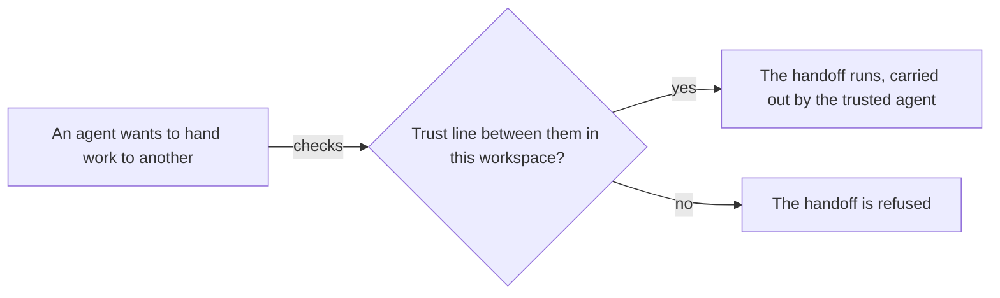

# Workspaces

A workspace is the container your work happens in. The chats, the tasks and their plans, the calendar, the files, and the team of agents who do the work all belong to one workspace. This page explains what a workspace holds, what its tabs do, and how to run more than one.

## What it is

Everything you do in Omnipus happens inside a workspace:

- **Chats.** Every conversation belongs to a workspace. The sidebar lists your workspaces, and each one expands to show its own chats.
- **Work items.** Tasks, plans, and the calendar of scheduled and repeating work are per workspace.
- **Files.** A workspace holds its own library of files and notes.
- **Team.** Each workspace picks its own agents, and sets its own rules for who may hand work to whom.
- **Memory and instructions.** What the team remembers, and the written instructions every agent on the workspace follows, belong to the workspace.

On a fresh install, Omnipus creates one workspace for you, named **My Workspace**, with the built-in agents already on the team. It is the default workspace: it is where Omnipus sends you when no other workspace is chosen, and it cannot be archived or deleted.

## When you would use it

Use more than one workspace when your work splits into contexts that should stay separate. One workspace per client keeps that client's chats, files, and task history inside it; a separate one for internal operations can carry a different team. The rosters can overlap, because the same agent can sit on several workspaces, but each workspace keeps its own chats, tasks, files, memory, and trust lines. A single workspace is a perfectly good way to run everything if you have one context.

## The tabs of a workspace

Open a workspace from the sidebar and it lands on Chat. The top bar carries the tabs.

| Tab | What it is for | Read more |
|---|---|---|
| Chat | Talking with the agents on this workspace's team | [Chatting](using-omnipus-ui.md) |
| Tasks | Tasks as a board, a list, or a graph of dependencies | [tasks](tasks.md) |
| Calendar | Scheduled and repeating work by date | [calendar](calendar.md) |
| Library | The files this workspace holds | [library](library.md) |
| Team | The agents on this workspace, and who may delegate to whom | [agents](agents.md) |

Settings is not a tab. Click the workspace's name in the top bar to rename the workspace, edit its description, write its instructions, and archive or delete it.

The Tasks tab shows three views of the same work, switched with the selector at the top of the screen. Board lays tasks out as cards by status. List is a table. Graph draws each task as a node and each dependency as a line between them, which is where a [plan](plans.md) is easiest to see whole.

## How to create a workspace

1. In the sidebar, find the **Workspaces** section and click the **+** next to its title. A name field appears in the list.
2. Type a name and press **Enter**. The workspace opens on its Chat tab. Press **Escape** to cancel instead.
3. Open the Chat tab and Ava runs a short setup interview: she asks what the workspace is for and adds agents to the team as you describe the work. A new workspace starts with Ava alone; she builds the team with you.
4. To skip the interview, open the **Team** tab yourself and add agents with **Add agent**.

## How to set who may delegate to whom

Delegation is one agent handing work to another: passing a research question to a worker, or creating a task for a builder. Whether that is allowed is decided inside each workspace, on the **Team** tab. There is no global trust setting anywhere in the product.

1. Open the workspace's **Team** tab. Each agent on the team appears as a node in a picture.
2. To grow the team, click **Add agent** and pick from your agents. Membership saves on its own; the indicator in the header shows when it has saved.
3. To trust one agent to delegate to another, drag from the small gold dot on the first agent's node onto the second node. A line appears between them. That line is the trust.
4. Click the line to tune it with the settings in the table below.
5. To take trust away, delete the line. Removing an agent from the team removes every line touching it.

| Setting | What it means |
|---|---|
| Direct | The trusted agent can be handed a request directly, in conversation or in the background |
| Task | The trusted agent can be assigned tasks |
| Depth | How many times the handoff may be passed on. Zero means it stops with that agent |

Leave both modes off and the line allows neither; leave depth unset and the overall limit applies.

A handoff is allowed only when a trust line for that pair exists in the workspace where the work is running; with no line, it is refused. New workspaces arrive with the standard trust lines between the built-in agents already drawn, so delegation works before you configure anything.

The same two agents can be trusted together in one workspace and not in another, because each workspace keeps its own lines. That is deliberate: trust describes a working relationship inside a team, not a property of an agent.

## Limits and things to watch

- **No line, no delegation.** Adding an agent to the team does not trust them for handoffs. Draw the line.
- **Team edits save in two steps.** Membership saves before trust lines. If the trust-line save fails, the message tells you membership landed; only the lines need a retry.
- **Clicking a node edits the agent everywhere.** The profile that opens from a Team tab node is the agent's global definition, used by every workspace it belongs to.
- **The default agent cannot be removed from a team.**
- **Deleting a workspace is permanent.** Archive instead: archived workspaces move to the sidebar's Archive section and can be restored from there. The default workspace can be neither archived nor deleted.
- **A workspace's instructions apply to every agent in it.** Write them in settings, under Workspace / Project Instructions. They layer on top of each agent's own persona.

## Related pages

- [tasks](tasks.md) — the Tasks tab in depth: board, list, and graph views.
- [plans](plans.md) — what a plan is, and how the graph view shows one.
- [calendar](calendar.md) — scheduled and repeating work inside a workspace.
- [agents](agents.md) — who the built-in agents are, and how to add your own.
- [library](library.md) — the files a workspace holds.
- [memory](memory.md) — what a team remembers, per workspace.
