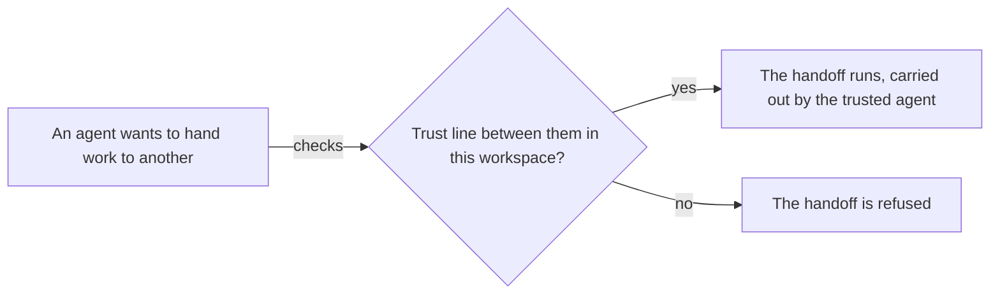

# Workspaces

A workspace is the container your work happens in. The chats, the tasks and their plans, the calendar, the files, and the team of agents who do the work all belong to one workspace. This page explains what a workspace holds, what its panels do, and how to run more than one.

## What it is

Everything you do in Omnipus happens inside a workspace:

- **Chats.** Every conversation belongs to a workspace. The sidebar lists your workspaces, and each one expands to show its own chats.
- **Work items.** Tasks, plans, and the calendar of scheduled and repeating work are per workspace.
- **Files.** A workspace holds its own library of files and notes.
- **Team.** Each workspace picks its own agents, and sets its own rules for who may hand work to whom.
- **Memory and instructions.** What the team remembers, and the written instructions every agent on the workspace follows, belong to the workspace.

On a fresh install, Omnipus creates one workspace for you, named **My Workspace**, with Mia, Jim, Ava, Planner, Researcher and General Purpose on the team. Admin remains available as the standalone operator without team membership. It is the default workspace: it is where Omnipus sends you when no other workspace is chosen, and it cannot be archived or deleted.

### Each agent's own chat, per workspace

Every agent on a workspace has one standing chat of its own — its **main** chat for that workspace. Clicking the agent in the roster opens it, and it is the conversation that agent keeps with you in that workspace. Alongside it you can start extra chats with the same agent; those are ordinary conversations and can be deleted as usual.

Some things about the main chat are fixed:

- **It is kept, not deleted.** The main chat shows no delete control, and asking the API to delete it is refused. If you take an agent off the team, its main chat disappears from the list but is not erased — put that agent back on the same team and the very same chat returns, with its history.
- **It is the workspace's, not a setting's.** Enabling or disabling an agent's heartbeat does not create, replace or delete this chat. Heartbeat runs happen in it — there is no separate heartbeat chat to find or clean up.
- **Admin's main chat lives in the default workspace only.** Admin is not a team member anywhere; in any other workspace Admin has no main chat.
- **Workers and system agents have none.** They are not chat targets, so they have no standing chat.

Each pair of workspace and agent has exactly one main chat, named from the two: `main-session-<workspace>+<agent>`. The name is computed, so it never changes and duplicates cannot appear. Because a chat's name is also its folder on disk, a pair whose combined name would exceed 255 bytes is refused outright, with a message naming the limit — shorten the workspace or agent name if you hit it. Nothing is guessed, shortened or renamed behind your back.

## When you would use it

Use more than one workspace when your work splits into contexts that should stay separate. One workspace per client keeps that client's chats, files, and task history inside it; a separate one for internal operations can carry a different team. The rosters can overlap, because the same agent can sit on several workspaces, but each workspace keeps its own chats, tasks, files, memory, and trust lines. A single workspace is a perfectly good way to run everything if you have one context.

## The panels of a workspace

Open a workspace from the sidebar and it lands on Chat. Chat stays underneath the panels; it is not an entry in the top bar or its compact menu.

The top bar offers these panels, in order:

| Panel | What it is for | Read more |
|---|---|---|
| Tasks | Tasks as a board, a list, or a graph of dependencies | [tasks](tasks.md) |
| Calendar | Scheduled and repeating work by date | [calendar](calendar.md) |
| Library | The workspace's files | [library](library.md) |
| Mail | Configured agent mailboxes | [mail](mail.md) |
| Team | The agents on this workspace, and who may delegate to whom | [agents](agents.md) |

Click an entry to open its panel beside Chat. Click it again to close the panel and reveal Chat, or choose another entry to replace the open panel. The bar adapts to its measured space: first the workspace name and five icon-and-label toggles, then the name and five icons with hover/keyboard-focus labels, then the workspace name with a downward caret opening **Settings** and those same five panels. It keeps room for **Open browser** and adapts when panels, the sidebar, the window size or the font size change. The hamburger is only for showing the sidebar. Mail remains between Library and Team in all three layouts; opening it without a selected mailbox lets you choose one.

For panel resizing and full-screen view, see [panels beside chat](using-omnipus-ui.md#panels-beside-chat). In an installed app or standalone Chrome window, all six panels—Tasks, Calendar, Library, Mail, Team and Browser—expand full screen in the same window. **Back to chat** reopens the panel there. Mail keeps its current mailbox, folder and selected message; Browser keeps its session and agent; Tasks, Calendar and Team keep their workspace. Library returns without reopening the selected file; select it again. If a workspace is selected in Library, it reopens that workspace. If Library is showing the all-workspaces root, returning instead opens Library in the Chat workspace; select the **Library** breadcrumb to show all workspaces again. On wider layouts the reopened panel sits beside Chat; on narrow layouts it takes Chat's place until you use its **Back** or **Close** control. In a normal browser tab, they open full screen in a new tab instead. When Omnipus recognises an existing tab for the same panel and workspace (or Browser session), it focuses that tab or offers to switch instead of opening another; this depends on Omnipus still recognising that tab. If a pop-up is blocked, the docked panel stays open. **Back to chat** tries to close the full-screen tab; a tab Omnipus opened can restore the panel only in its original tab while that tab still owns the expanded panel, when that tab is still available and no different panel is open there. Reloading the original Chat tab releases that ownership, so automatic re-docking there is lost and you may need to reopen the panel. Restoration uses the last context the original tab received, so unavailable cross-tab updates can leave it at an older selection. If the full-screen tab cannot close itself, the button opens workspace Chat with the panel open in that same tab. Settings stays a page, not a panel. Select the workspace name in the full or icon-only row, or open the name menu and choose **Settings** on a narrow row, to rename the workspace, edit its description, write its instructions, and archive or delete it.

The Tasks panel shows three views of workspace work, switched with the selector at the top of the screen. Board lays tasks out as cards by status. List is a table. Graph shows top-level plan members and tasks with dependency relationships, with dependencies drawn as lines between nodes. Unplanned tasks without dependency relationships and nested tasks are not graph nodes. This is where a [plan](plans.md) is easiest to see whole.

## How to create a workspace

1. In the sidebar, find the **Workspaces** section and click the **+** next to its title. A name field appears in the list.
2. Type a name and press **Enter**. The workspace opens on Chat. Press **Escape** to cancel instead.
3. In Chat, Ava runs a short setup interview: she asks what the workspace is for and adds agents to the team as you describe the work. A new workspace starts with Ava alone; she builds the team with you.
4. To skip the interview, open the **Team** panel yourself and add agents with **Add agent**.

## How to set who may delegate to whom

Delegation is one agent handing work to another: passing a research question to a worker, or creating a task for a builder. Whether that is allowed is decided inside each workspace, on the **Team** panel. There is no global trust setting anywhere in the product.

While Team first loads, it shows **Loading team…**. If loading fails before the team is available, it shows a reason and **Retry**; the reason stays visible during a retry. A successful retry shows the normal Team editor without reloading the page.

If Team is already visible and refreshing the workspace fails, the editor stays usable. A notice above it shows the failure reason and **Retry**, and identifies the displayed team as the last known data. The notice stays visible while a retry is waiting; if retries keep failing, it shows the latest reason and still offers **Retry**. A successful retry removes the notice and updates the team in place, without reloading the page. This works both beside Chat and in the full-screen Team panel.

1. Open the workspace's **Team** panel. Each agent on the team appears as a node in a picture.
2. To grow the team, click **Add agent** and pick from your agents. Membership saves on its own; the indicator in the header shows when it has saved.
   If you added an agent in another tab or window, opening the agent picker in this chat refreshes both the agent list and this workspace's team so a newly added ready-to-chat member can appear. Returning to this chat's tab also refreshes the lists used by the picker and the `@` menu; you do not need to reload the page. Once a nonempty team has loaded, both lists offer its ready-to-chat agents, not ordinary agents from outside this workspace's team. Workers and draft agents are not offered, while a ready Admin can appear without team membership. If the workspace/team refresh fails, Chat can be replaced by **Failed to load workspace. Check your connection and try again.** Select **Retry** there.

   If refreshing the agent list fails, the picker shows "Could not refresh the agent list — showing the last known agents." and keeps the cached choices available. Choose Retry in the picker, using the mouse or keyboard, to refresh the agent list without closing the menu. The notice remains visible while Retry is pending and clears only when agent discovery succeeds.
3. To trust one agent to delegate to another, drag from the small gold dot on the first agent's node onto the second node. A line appears between them. That line is the trust.
4. Click the line to tune it with the settings in the table below.
5. To take trust away, delete the line. Removing an agent from the team removes every line touching it.

| Setting | What it means |
|---|---|
| Direct | The trusted agent can be handed a request directly, in conversation or in the background |
| Task | The trusted agent can be assigned tasks |
| Depth | How many times the handoff may be passed on. Zero means it stops with that agent |

The editor requires at least one delegation mode on a line. Delete the line to prevent handoffs in that direction. An untouched depth follows the workspace/global default.

```mermaid
flowchart LR
  A[An agent wants to hand work to another] -->|checks| Q{Trust line between them in this workspace?}
  Q -->|yes| W[The handoff runs, carried out by the trusted agent]
  Q -->|no| R[The handoff is refused]
```

A handoff is allowed only when a trust line for that pair exists in the workspace where the work is running; with no line, it is refused. A workspace you create starts with Ava alone; she also gets her own **self-line** (Ava → Ava), because handing work back to the same agent is an ordinary handoff and follows the same rule. The auto-created first workspace is the exception — it ships with the default team listed above and their standard trust lines.

**A self-line is an ordinary line.** Naming an agent as its own target — handing a fresh piece of work back to the same agent, in a new session — needs a line from that agent to itself, exactly like handing work to any other agent. Every agent normally starts with one. It appears in the Team picture like any other line, and you edit or remove it the same way; removing it stops future self-handoffs, and it stays removed until you draw it again. A new agent added to a team gets its own self-line at the moment it joins.

**Where the default lines come from.** The lines a *new* team member receives are decided by a private bootstrap list in `config.json` (`workspace_seed_defaults.self_edge.exclude_agent_ids`), not by fixed code. That list affects only lines seeded from then on: it never changes the lines a workspace already has, and never brings a removed line back. See [settings](settings.md#which-new-agents-get-a-self-line) for the key, its shipped value, and how to add or remove an exclusion.

The same two agents can be trusted together in one workspace and not in another, because each workspace keeps its own lines. That is deliberate: trust describes a working relationship inside a team, not a property of an agent.

## Sending work to another workspace

An agent can create a task on a DIFFERENT workspace's board by naming that
workspace explicitly (`workspace_id` on `create_task`). The task is delivered,
not run: it lands in the target board's **Inbox** as not-started work, and that
workspace's own team picks it up locally. The sending agent cannot start, run,
re-run or reassign it from outside — running work is what a workspace's own
team does, under that workspace's own delegation rules. A task created in the
agent's own workspace still lands in `next` (ready to run), exactly as before.

The same optional `workspace_id` is accepted by `update_task` and `list_tasks`;
omitting it means "my own current workspace". Reading a workspace other than
your own returns only the read-only status and identity of the tasks you
created or are assigned there — never their content, results or plans.

## Limits and things to watch

- **No line, no delegation.** Adding an agent to the team does not trust them for handoffs. Draw the line.
- **Team saves depend on the edit.** When membership changes, membership and trust lines are sent together in one workspace update. An edit to trust lines alone uses the delegation update. If saving fails, read the save indicator's error; do not assume membership has already landed.
- **Clicking a node edits the agent everywhere.** The profile that opens from a Team panel node is the agent's global definition, used by every workspace it belongs to.
- **The default agent cannot be removed from a team.**
- **Deleting a workspace is permanent.** Archive instead: archived workspaces move to the sidebar's Archive section and can be restored from there. The default workspace can be neither archived nor deleted.
- **A workspace's instructions apply to every agent in it.** Write them in settings, under Workspace / Project Instructions. They layer on top of each agent's own persona.

## Related pages

- [tasks](tasks.md) — the Tasks panel in depth: board, list, and graph views.
- [plans](plans.md) — what a plan is, and how the graph view shows one.
- [calendar](calendar.md) — scheduled and repeating work inside a workspace.
- [agents](agents.md) — who the built-in agents are, and how to add your own.
- [library](library.md) — the files a workspace holds.
- [mail](mail.md) — the agent mailbox associated with this workspace.
- [memory](memory.md) — what a team remembers, per workspace.
